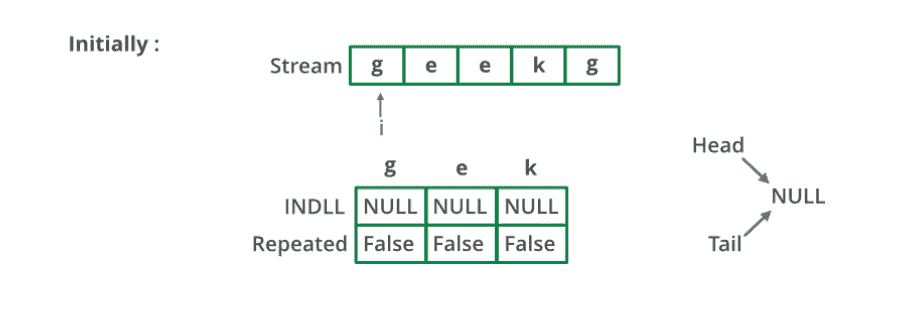
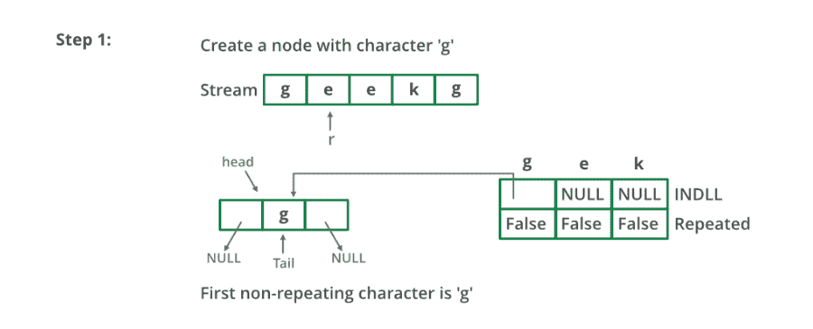
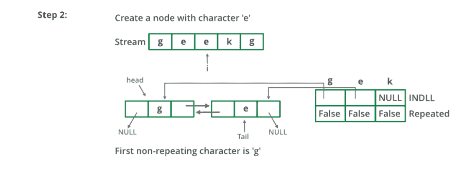
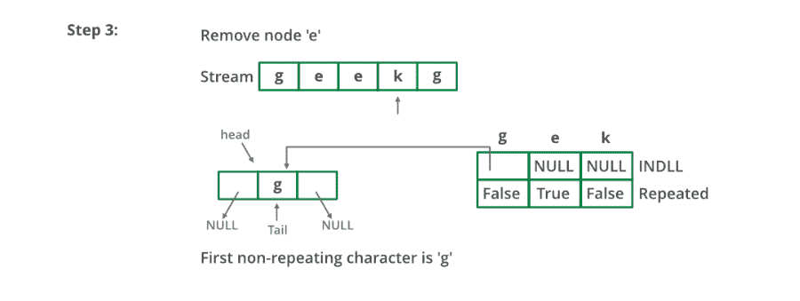
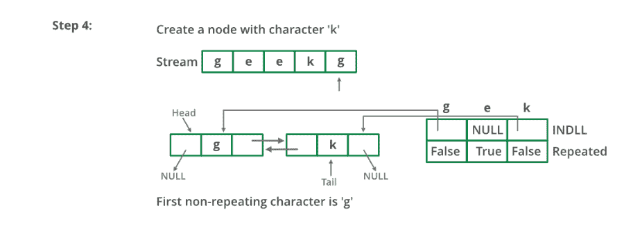

# 从字符流中找到第一个不重复的字符

> 原文:[https://www . geesforgeks . org/find-first-非重复-字符流-characters/](https://www.geeksforgeeks.org/find-first-non-repeating-character-stream-characters/)

给定一个字符流，从该流中找到第一个不重复的字符。你需要随时告诉 O(1)中第一个不重复的字符。

如果我们遵循这里讨论的第一种方法，那么我们需要存储流，以便我们可以再次遍历它，随时找到第一个不重复的字符。如果我们使用在[同一个帖子](https://www.geeksforgeeks.org/given-a-string-find-its-first-non-repeating-character/)中讨论的扩展方法，我们需要在每次查询第一个非重复元素时遍历计数数组。我们可以在任何时刻从流中找到第一个不重复的字符，而无需遍历任何数组。

这个想法是使用一个[动态链接库](https://www.geeksforgeeks.org/doubly-linked-list/) ( **D** 双 **L** 着墨 **L** ist)来有效地从一个流中获取第一个不重复的字符。DLL 按顺序包含所有非重复字符，即 DLL 的头部包含第一个非重复字符，第二个节点包含第二个非重复字符，依此类推。

我们还维护两个数组:一个数组是维护已经被访问两次或更多次的字符，我们称之为 repeated[]，另一个数组是指向链表节点的指针数组，我们称之为 indell[]。两个数组的大小都等于字母大小，通常是 256。

1.  创建一个空的 DLL。此外，创建两个大小为 256 的数组 Indell[]和 repeated[]。在动态链接库中是指向动态链接库节点的指针数组。repeated[]是布尔数组，如果 x 重复两次或更多次，repeated[x]为 true，否则为 false。如果 DLL 中存在字符 x，则 indell[x]包含指向 DLL 节点的指针，否则为空。
2.  将 Indell[]的所有条目初始化为空，将重复的[]初始化为假。
3.  要获取第一个非重复字符，请返回 DLL 开头的字符。
4.  以下是处理流中新字符“x”的步骤。
    *   如果重复[x]为真，则忽略该字符(x 已经在流中重复了两次或更多次)
    *   如果重复的[x]为假，inDLL[x]为空(第一次看到 x)。将 x 追加到 DLL 中，并将新 DLL 节点的地址存储在 Indell[x]中。
    *   如果重复的[x]为假，并且 inDLL[x]不为空(第二次看到 x)。使用 inDLL[x]获取 x 的 DLL 节点，并删除该节点。另外，将 indell[x]标记为空，并将重复的[x]标记为真。

注意，如果我们维护一个尾指针，在 DLL 中追加一个新节点就是 **O(1)** 操作。从 DLL 中移除节点也是 **O(1)** 。所以两个操作，添加新角色和寻找第一个不重复的角色都需要 **O(1)** 时间。

下图是上述方法的模拟运行:

     

下面是上述方法的实现:

## C++

```py
// A C++ program to find first
// non-repeating character
// from a stream of characters
#include <iostream>
#define MAX_CHAR 256
using namespace std;

// A linked list node
struct node {
    char a;
    struct node *next, *prev;
};

// A utility function to append a character x at the end
// of DLL. Note that the function may change head and tail
// pointers, that is why pointers to these pointers are
// passed.
void appendNode(struct node** head_ref,
                struct node** tail_ref, char x)
{
    struct node* temp = new node;
    temp->a = x;
    temp->prev = temp->next = NULL;

    if (*head_ref == NULL) {
        *head_ref = *tail_ref = temp;
        return;
    }
    (*tail_ref)->next = temp;
    temp->prev = *tail_ref;
    *tail_ref = temp;
}

// A utility function to remove a node 'temp' from DLL.
// Note that the function may change the head and tail pointers,
// that is why pointers to these pointers are passed.
void removeNode(struct node** head_ref,
                struct node** tail_ref, struct node* temp)
{
    if (*head_ref == NULL)
        return;

    if (*head_ref == temp)
        *head_ref = (*head_ref)->next;
    if (*tail_ref == temp)
        *tail_ref = (*tail_ref)->prev;
    if (temp->next != NULL)
        temp->next->prev = temp->prev;
    if (temp->prev != NULL)
        temp->prev->next = temp->next;

    delete (temp);
}

void findFirstNonRepeating()
{
    // inDLL[x] contains pointer to
    // a DLL node if x is present
    // in DLL. If x is not present, then inDLL[x] is NULL
    struct node* inDLL[MAX_CHAR];

    // repeated[x] is true if x is repeated two or more
    // times. If x is not seen so far or x is seen only
    // once. then repeated[x] is false
    bool repeated[MAX_CHAR];

    // Initialize the above two arrays
    struct node *head = NULL, *tail = NULL;
    for (int i = 0; i < MAX_CHAR; i++) {
        inDLL[i] = NULL;
        repeated[i] = false;
    }

    // Let us consider following stream and see the process
    char stream[] = "geeksforgeeksandgeeksquizfor";
    for (int i = 0; stream[i]; i++) {
        char x = stream[i];
        cout << "Reading " << x << " from stream \n";

        // We process this character only if it has not
        // occurred or occurred only once. repeated[x] is
        // true if x is repeated twice or more.s
        if (!repeated[x]) {
            // If the character is not in DLL, then add this
            // at the end of DLL.
            if (inDLL[x] == NULL) {
                appendNode(&head, &tail, stream[i]);
                inDLL[x] = tail;
            }
            else // Otherwise remove this character from DLL
            {
                removeNode(&head, &tail, inDLL[x]);
                inDLL[x] = NULL;
                repeated[x]
                    = true; // Also mark it as repeated
            }
        }

        // Print the current first non-repeating character
        // from stream
        if (head != NULL)
            cout << "First non-repeating character so far "
                    "is "
                 << head->a << endl;
    }
}

/* Driver code */
int main()
{
    findFirstNonRepeating();
    return 0;
}
```

## Java 语言(一种计算机语言，尤用于创建网站)

```py
// A Java program to find first non-repeating character
// from a stream of characters

import java.util.ArrayList;
import java.util.List;

public class NonReapeatingC {
    final static int MAX_CHAR = 256;

    static void findFirstNonRepeating()
    {
        // inDLL[x] contains pointer to a DLL node if x is
        // present in DLL. If x is not present, then
        // inDLL[x] is NULL
        List<Character> inDLL = new ArrayList<Character>();

        // repeated[x] is true if x is repeated two or more
        // times. If x is not seen so far or x is seen only
        // once. then repeated[x] is false
        boolean[] repeated = new boolean[MAX_CHAR];

        // Let us consider following stream and see the
        // process
        String stream = "geeksforgeeksandgeeksquizfor";
        for (int i = 0; i < stream.length(); i++) {
            char x = stream.charAt(i);
            System.out.println("Reading " + x
                               + " from stream \n");

            // We process this character only if it has not
            // occurred or occurred only once. repeated[x]
            // is true if x is repeated twice or more.s
            if (!repeated[x]) {
                // If the character is not in DLL, then add
                // this at the end of DLL.
                if (!(inDLL.contains(x))) {
                    inDLL.add(x);
                }
                else // Otherwise remove this character from
                     // DLL
                {
                    inDLL.remove((Character)x);
                    repeated[x]
                        = true; // Also mark it as repeated
                }
            }

            // Print the current first non-repeating
            // character from stream
            if (inDLL.size() != 0) {
                System.out.print(
                    "First non-repeating character so far is ");
                System.out.println(inDLL.get(0));
            }
        }
    }

    /* Driver code */
    public static void main(String[] args)
    {
        findFirstNonRepeating();
    }
}
// This code is contributed by Sumit Ghosh
```

## 蟒蛇 3

```py
# A Python program to find first non-repeating character from
# a stream of characters
MAX_CHAR = 256

def findFirstNonRepeating():

    # inDLL[x] contains pointer to a DLL node if x is present
    # in DLL. If x is not present, then inDLL[x] is NULL
    inDLL = [] * MAX_CHAR

    # repeated[x] is true if x is repeated two or more times.
    # If x is not seen so far or x is seen only once. then
    # repeated[x] is false
    repeated = [False] * MAX_CHAR

    # Let us consider following stream and see the process
    stream = "geekforgeekandgeeksandquizfor"
    for i in range(len(stream)):
        x = stream[i]
        print ("Reading " + x + " from stream")

        # We process this character only if it has not occurred
        # or occurred only once. repeated[x] is true if x is
        # repeated twice or more.s
        if not repeated[ord(x)]:

            # If the character is not in DLL, then add this
            # at the end of DLL
            if not x in inDLL:
                inDLL.append(x)
            else:
                inDLL.remove(x)
                repeated[ord(x)] = True

        if len(inDLL) != 0:
            print ("First non-repeating character so far is ")
            print (str(inDLL[0]))

# Driver program
findFirstNonRepeating()

# This code is contributed by BHAVYA JAIN
```

## C#

```py
// A C# program to find first non-repeating character
// from a stream of characters
using System;
using System.Collections.Generic;

public class NonReapeatingC {
    readonly static int MAX_CHAR = 256;

    static void findFirstNonRepeating()
    {
        // inDLL[x] contains pointer to a DLL node if x is present
        // in DLL. If x is not present, then inDLL[x] is NULL
        List<char> inDLL = new List<char>();

        // repeated[x] is true if x is repeated two or more times.
        // If x is not seen so far or x is seen only once. then
        // repeated[x] is false
        bool[] repeated = new bool[MAX_CHAR];

        // Let us consider following stream and see the process
        String stream = "geeksforgeeksandgeeksquizfor";
        for (int i = 0; i < stream.Length; i++) {
            char x = stream[i];
            Console.WriteLine("Reading " + x + " from stream \n");

            // We process this character only if it has not occurred
            // or occurred only once. repeated[x] is true if x is
            // repeated twice or more.s
            if (!repeated[x]) {
                // If the character is not in DLL, then add this at
                // the end of DLL.
                if (!(inDLL.Contains(x))) {
                    inDLL.Add(x);
                }
                else // Otherwise remove this character from DLL
                {
                    inDLL.Remove((char)x);
                    repeated[x] = true; // Also mark it as repeated
                }
            }

            // Print the current first non-repeating character from
            // stream
            if (inDLL.Count != 0) {
                Console.Write("First non-repeating character so far is ");
                Console.WriteLine(inDLL[0]);
            }
        }
    }

    /* Driver code*/
    public static void Main(String[] args)
    {
        findFirstNonRepeating();
    }
}

// This code has been contributed by 29AjayKumar
```

## java 描述语言

```py
<script>

// A Javascript program to find first
// non-repeating character from a
// stream of characters
let MAX_CHAR = 256;

function findFirstNonRepeating()
{

    // inDLL[x] contains pointer to a DLL
    // node if x is present in DLL. If x
    // is not present, then inDLL[x] is NULL
    let inDLL = [];

    // repeated[x] is true if x is repeated
    // two or more times. If x is not seen
    // so far or x is seen only once.
    // then repeated[x] is false
    let repeated = new Array(MAX_CHAR);
      for(let i = 0; i < MAX_CHAR; i++)
    {
        repeated[i] = false;
    }

    // Let us consider following stream and see the
    // process
    let stream = "geeksforgeeksandgeeksquizfor";
    for(let i = 0; i < stream.length; i++)
    {
        let x = stream[i];
        document.write("Reading " + x +
                       " from stream <br>");

        // We process this character only if it has not
        // occurred or occurred only once. repeated[x]
        // is true if x is repeated twice or more.s
        if (!repeated[x.charCodeAt(0)])
        {

            // If the character is not in DLL, then add
            // this at the end of DLL.
            if (!(inDLL.includes(x)))
            {
                inDLL.push(x);
            }

            // Otherwise remove this character from
            // DLL
            else
            {
                inDLL.splice(inDLL.indexOf(x), 1);

                // Also mark it as repeated
                repeated[x.charCodeAt(0)] = true;
            }
        }

        // Print the current first non-repeating
        // character from stream
        if (inDLL.length != 0)
        {
            document.write("First non-repeating " +
                           "character so far is ");
            document.write(inDLL[0] + "<br>");
        }
    }
}

// Driver code
findFirstNonRepeating();

// This code is contributed by rag2127

</script>
```

**输出:**

```py
Reading g from stream
First non-repeating character so far is g
Reading e from stream
First non-repeating character so far is g
Reading e from stream
First non-repeating character so far is g
Reading k from stream
First non-repeating character so far is g
Reading s from stream
First non-repeating character so far is g
Reading f from stream
First non-repeating character so far is g
Reading o from stream
First non-repeating character so far is g
Reading r from stream
First non-repeating character so far is g
Reading g from stream
First non-repeating character so far is k
Reading e from stream
First non-repeating character so far is k
Reading e from stream
First non-repeating character so far is k
Reading k from stream
First non-repeating character so far is s
Reading s from stream
First non-repeating character so far is f
Reading a from stream
First non-repeating character so far is f
Reading n from stream
First non-repeating character so far is f
Reading d from stream
First non-repeating character so far is f
Reading g from stream
First non-repeating character so far is f
Reading e from stream
First non-repeating character so far is f
Reading e from stream
First non-repeating character so far is f
Reading k from stream
First non-repeating character so far is f
Reading s from stream
First non-repeating character so far is f
Reading q from stream
First non-repeating character so far is f
Reading u from stream
First non-repeating character so far is f
Reading i from stream
First non-repeating character so far is f
Reading z from stream
First non-repeating character so far is f
Reading f from stream
First non-repeating character so far is o
Reading o from stream
First non-repeating character so far is r
Reading r from stream
First non-repeating character so far is a
```

本文由 [**阿米特·贾恩**](http://in.linkedin.com/in/amitjainju) 供稿。如果你发现任何不正确的地方，或者你想分享更多关于上面讨论的话题的信息，请写评论。