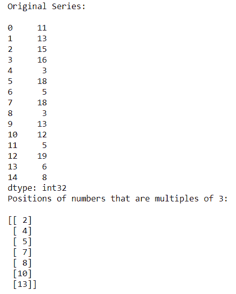

# 找到某个数的倍数的位置

> 原文:[https://www . geeksforgeeks . org/find-the-position-of-number-of-some-number/](https://www.geeksforgeeks.org/find-the-position-of-number-that-is-multiple-of-certain-number/)

在这类问题中，给定一个数，我们必须找到这个数的所有倍数的位置或指数。为了做这个问题，我们使用了一个名为[**numpy . arg where()**](https://www.geeksforgeeks.org/numpy-argwhere-in-python/)**的函数。**

**语法:**

```
numpy.argwhere(array)

```

**例 1:**

有时我们需要找到能被整数或浮点数整除的元素的索引。

## 蟒蛇 3

```
# Importing Pandas and Numpy libraries
import pandas as pd
import numpy as np

# Creating a Series of random numbers
n_series = pd.Series(np.random.randint(1, 25, 15))
print("Original Series:\n")
print(n_series)

# Finding the indexes of numbers divisible by 3
res_index = np.argwhere(n_series % 3==0)
print("Positions of numbers that are multiples of 3:\n")
print(res_index)
```

**输出:**



在上面的例子中，我们找到了所有可被 3 整除的数字的索引。

**例 2:**

## 蟒蛇 3

```
# Importing Pandas and Numpy libraries
import pandas as pd
import numpy as np

# Creating a Series of random numbers
n_series = pd.Series(np.random.randint(1, 20, 10))
print("Original Series:\n")
print(n_series)

# Finding the indexes of numbers divisible by 3.5
res_index = np.argwhere(n_series % 3.5==0)
print("Positions of numbers that are multiples of 3.5:\n")
print(res_index)
```

**输出:**


在上面的例子中，我们找到了可被浮点数 3.5 整除的所有数字的索引