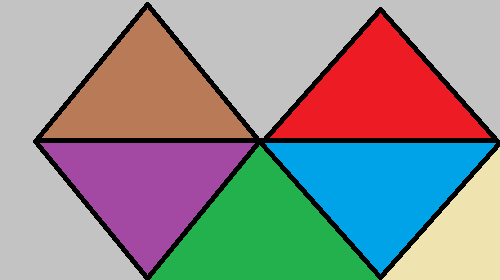
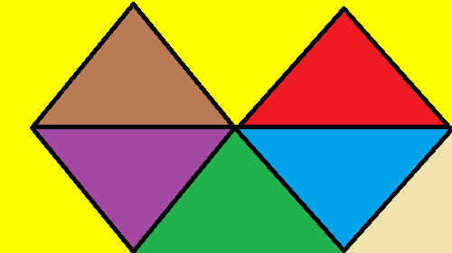

# 使用 Python 填充图像-枕头

> 原文:[https://www . geeksforgeeks . org/flood fill-image-using-python-抱枕/](https://www.geeksforgeeks.org/floodfill-image-using-python-pillow/)

**种子填充**也称为**洪水填充**，是一种用于识别特定封闭区域中连接路径的算法。该算法有一系列实际应用，例如–

*   优化寻路
*   油漆桶工具在几个图像处理包中找到的通用工具，在内部使用该算法
*   Mazesolving 使用 floodfill(与遍历算法(如[广度优先](http://geeksforgeeks.org/breadth-first-search-or-bfs-for-a-graph/)、[深度优先](https://www.geeksforgeeks.org/depth-first-search-or-dfs-for-a-graph/)和寻路算法(如 [A Star](https://www.geeksforgeeks.org/a-search-algorithm/) 、 [Dijkstra](https://www.geeksforgeeks.org/dijkstras-shortest-path-algorithm-greedy-algo-7/) )配对)
*   用于[图像处理](https://www.geeksforgeeks.org/digital-image-processing-basics/)

有多种方法可以实现该算法，例如–

*   扫描线漫填(基于行/列的漫填)
*   四/八向漫滩
*   阈值减漫填(仅使用相同的像素值)

我们将利用洪水填充算法来完成图像处理任务。为此，我们将使用`pillow`库。要安装库，请在命令行中执行以下命令:-

```
pip install pillow

```

**注意:**一些 Linux 发行版倾向于在其中预装 Python 和 Pillow

> **语法:** ImageDraw.floodfill(image，seed_pos，replace_val，border-None，thresh=0)
> 
> **参数:**
> **图像**–打开图像对象(通过 Image.open、Image.fromarray 等获得)。
> **Seed _ pos**–Seed 位置(获取种子值的像素坐标)。
> **replace _ val**–填充颜色(用于替换的颜色值)。
> **边框**–可选边框值(根据边框颜色修改路径选择)
> **阈值**–可选阈值(用于在漫填中提供容差，以包含相似值的像素区域)
> 
> **返回:**无类型(就地修改图像，而不是返回修改后的图像)

**示例:**

**所用图像:**


```
# Importing the pillow library's 
# desired modules
from PIL import Image, ImageDraw

# Opening the image (R prefixed to
# string in order to deal with '\'
# in paths)
img = Image.open(R"sample.png")

# Converting the image to RGB mode
img1 = img.convert("RGB") 

# Coordinates of the pixel whose value
# would be used as seed
seed = (263, 70)

# Pixel Value which would be used for
# replacement 
rep_value = (255, 255, 0)

# Calling the floodfill() function and 
# passing it image, seed, value and 
# thresh as arguments
ImageDraw.floodfill(img, seed, rep_value, thresh=50)

# Displaying the image
img.show()
```

**输出:**


**说明:**

*   导入任务所需的必要模块后，我们首先创建一个图像对象(`'PIL.Image.Image'`)。此图像对象充当图像文件的独立核心副本，可以单独使用。
*   然后为种子变量指定一个坐标值(图像的内部尺寸)。坐标是手动拾取的，即用户应输入有意拾取的坐标值(像素坐标值可通过`img.getpixel(coord)`验证)。
*   从这些坐标获得的像素值将是在图像内部被替换的像素值。
*   Then assign `rep_value` variable with a RGB color value (yellow in this case). The value is being assigned as a RGB Tuple, which is specific for our particular case as our input image is of RGB color space (`img.mode == 'RGB'`).

    **注意:**rep _ value 变量将根据当前图像的图像模式包含值，即如果`img.mode == "L"`那么 rep 值将不是具有 3 个分量的元组，而是整数。

*   然后通过传递 img、seed、rep_value 和 thresh 作为参数来调用`ImageDraw.floodfill()`函数。由于`ImageDraw.floodfill()`函数在原地修改了传递的图像对象，所以我们不需要存储函数的返回值(Nonetype)。
*   最后，我们使用`img.show()` ( *Image.show()* )显示修改后的图像。