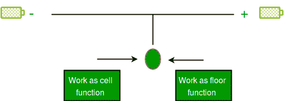

# Python 中的 trunc()

> 原文:[https://www.geeksforgeeks.org/g-fact-35-truncate-in-python/](https://www.geeksforgeeks.org/g-fact-35-truncate-in-python/)

**Python 中的截断**

python 中有很多内置模块。在这些模块中，有一个有趣的模块被称为数学模块，它有几个功能，如天花板，地板，截断，阶乘，晶圆厂等。

在这些函数中，有一个有趣的函数叫做**截尾**，它表现为负数的上限函数和正数的下限函数。

在正数的情况下

```
# Python program to show output of floor(), ceil()
# truncate() for a positive number.
import math
print math.floor(3.5) # floor
print math.trunc(3.5) # work as floor
print math.ceil(3.5)  # ceil
```

输出:

```
3.0
3
4.0
```

在负数的情况下

```
# Python program to show output of floor(), ceil()
# truncate() for a negative number.
import math
print math.floor(-3.5) # floor 
print math.trunc(-3.5) # work as ceil
print math.ceil(-3.5)  # ceil
```

输出:

```
-4.0
-3
-3.0
```

这是因为天花板函数用于向上舍入，即向正无穷大舍入，而地板函数用于向下舍入，即向负无穷大舍入。

但是 truncate 函数用于向上或向下舍入到零。

截断函数的图解表示:-
[](https://media.geeksforgeeks.org/wp-content/uploads/charge.jpg)

本文由 **Arpit Agarwal** 供稿。如果你喜欢极客博客并想投稿，你也可以写一篇文章并把你的文章邮寄到 contribute@geeksforgeeks.org。看到你的文章出现在极客博客主页上，帮助其他极客。

如果您发现任何不正确的地方，或者您想分享更多关于上面讨论的主题的信息，请写评论