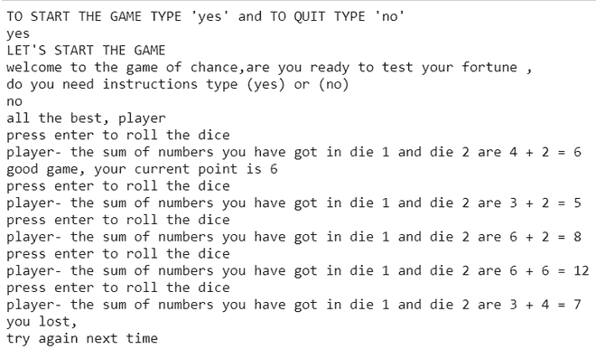

# Python 中的骰子游戏

> 原文:[https://www.geeksforgeeks.org/game-of-craps-in-python/](https://www.geeksforgeeks.org/game-of-craps-in-python/)

在本文中，我们将讨论如何使用 Python 创建骰子游戏。

**游戏规则:**

1.  玩游戏需要两个骰子，一个玩家掷出两个六面骰子，并将掷出的数字相加。
2.  如果在第一次掷骰子时，玩家总共遇到 7 或 11 次，则自动获胜，如果玩家总共掷出 2、3 或 12 次，则自动失败，游戏结束。
3.  如果一个玩家在第一次掷骰子时总共掷出 4、5、6、8、9 或 10，这个数字就成为“点数”。然后，玩家继续再次掷出两个骰子，直到出现以下两种情况之一:他们再次掷出“点”，在这种情况下他们赢了；或者他们掷出 7，在这种情况下他们输了。

**进场:**

*   当你开始运行程序时，你可以选择是开始游戏还是退出游戏，这是通过在你继续玩游戏后导入 *sys* 模块来完成的，你将获得一个查看游戏规则的选项，或者如果你已经熟悉规则，你可以选择不看它们。
*   按回车键进入*随机*模块开始游戏时，随机选择 1 到 6 之间的两个数字。然后通过使用*二进制数()*函数，将两个数相加。
*   现在按照游戏规则，如果你的骰子总数是 7 或 11，你就赢了。如果你的总分是 2，3，12，你将自动输。
*   如果你的总数是 4、5、6、8、9 或 10，这个总数将被保存，程序将循环运行，直到发生两件事 1)你得到和以前一样的分数，或者你得到 7 分。如果你的得分和以前一样多，你就赢了，如果你的总得分是 f 7，你就输了。

**实施:**

## 蟒蛇 3

```py
# import required modules
import random     
import sys

# stat the game
a = input("TO START THE GAME TYPE 'yes' and TO QUIT TYPE 'no'\n")
if a.lower() == "no":
    sys.exit()
else:
    print("LET'S START THE GAME")

# those who need instructions can ask for it,
# others can start the game directly.
a = input("welcome to the game of chance,are you ready to test your fortune ,\ndo you need instructions type (yes) or (no) \n")

if a.lower() == "yes":
    print(''' 1\. player rolls two six-sided dice and adds the numbers rolled together.
              2\. On this first roll, a 7 or an 11 automatically wins, and a 2, 3, or 12automatically loses, and play is over.
                 If a 4, 5, 6, 8, 9, or 10 are rolled on this first roll, that number becomes the 'point.'
              3\. The player continues to roll the two dice again until one of two things happens:
                 either they roll the 'point' again, in which case they win; or they roll a 7, in which case they lose.''')

elif a.lower() == "no":
    print("all the best, player")

# function to generate dice throws   
def diceNumber():

    _ = input("press enter to roll the dice ")

    # this will enable to select a
    # random number from 1 to 6
    die1 = random.randrange(1, 7)
    die2 = random.randrange(1, 7)

    # returns the diceNumber values
    # in the form of tuple
    return (die1, die2) 

# function to get dice sum 
def twoDice(dices):
    die1, die2 = dices
    print("player- the sum of numbers you have got in die 1 and die 2 are {} + {} = {}".format(die1, die2, sum(dices)))

# calling the diceNumber function to get a value
# return the roll and then store that
# value in value.
value = diceNumber()
twoDice(value)

# using the sum function in value to
# find the sum of two outcomes.
sum_of_dices = sum(value)

# find if sum of dices is 7 or 11 to determine the result.
if sum_of_dices in (7, 11):
    result = "congratulations you won"

# find if sum of dices is 2 , 3 , 12 to determine the result.
elif sum_of_dices in (2, 3, 12):
    result = "you lost, \ntry again next time"

# if none of the cases worked above now we will
# play continuously until we win or lose.   
else: 
    result = "continue your game please"
    currentpoint = sum_of_dices
    print("good game, your current point is", currentpoint)

# game continues if you have not scored a
# total of 2 , 3 , 7 , 11 , 12 this will
# enable the game to continue in a loop until
# the outcome is win or lose
while result == "continue your game please":
    value = diceNumber()
    twoDice(value)
    sum_of_dices = sum(value)

    if sum_of_dices == currentpoint:
        result = "congratulations you won"

    elif sum_of_dices == 7:
        result = "you lost,\n try again next time"

# when the outcome is clear,this will produce the
# outcome of the game
if result == "congratulations you won":
    print("congratulations,you won")

else:
    print("you lost, \ntry again next time")
```

**输出:**

