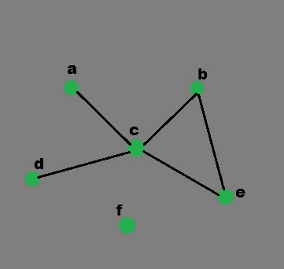

# 使用 Python 中的字典生成图形

> 原文:[https://www . geesforgeks . org/generate-graph-use-dictionary-python/](https://www.geeksforgeeks.org/generate-graph-using-dictionary-python/)

先决条件–[图形](https://www.geeksforgeeks.org/graph-and-its-representations/)
使用内置库绘制图形–[python 中的图形绘制](https://www.geeksforgeeks.org/graph-plotting-in-python-set-1/)
在本文中，我们将看到如何使用 Python 中的[字典](https://www.geeksforgeeks.org/python-set-4-dictionary-keywords-python/)数据结构在 Python 中实现图形。
使用的字典的键是我们的图的节点，对应的值是每个节点的列表，通过一条边连接。
这个简单的图有六个节点(a-f)和五个弧:

```
a -> c
b -> c
b -> e
c -> a
c -> b
c -> d
c -> e
d -> c
e -> c
e -> b

```

它可以用下面的 Python 数据结构来表示。这是一本字典，它的关键字是图的节点。对于每个键，对应的值是一个列表，其中包含从该节点通过直接弧线连接的节点。

```
graph = { "a" : ["c"],
          "b" : ["c", "e"],
          "c" : ["a", "b", "d", "e"],
          "d" : ["c"],
          "e" : ["c", "b"],
          "f" : []
        } 

```

**上述示例的图形表示:**

[](https://media.geeksforgeeks.org/wp-content/uploads/python1.jpg)

[defaultdict](https://docs.python.org/2/library/collections.html#collections.defaultdict) :通常情况下，如果你试图获取一个当前不在字典中的项，Python 字典会抛出一个 KeyError。defaultdict 允许如果在字典中找不到一个键，则创建一个新的条目，而不是抛出一个 KeyError。这个新条目的类型由 defaultdict 参数给出。
**Python 函数生成图:**

```
# definition of function
def generate_edges(graph):
    edges = []

    # for each node in graph
    for node in graph:

        # for each neighbour node of a single node
        for neighbour in graph[node]:
            # if edge exists then append
            edges.append((node, neighbour))
    return edges

```

## 计算机编程语言

```
# Python program for 
# validation of a graph

# import dictionary for graph
from collections import defaultdict

# function for adding edge to graph
graph = defaultdict(list)
def addEdge(graph,u,v):
    graph[u].append(v)

# definition of function
def generate_edges(graph):
    edges = []

    # for each node in graph
    for node in graph:

        # for each neighbour node of a single node
        for neighbour in graph[node]:

            # if edge exists then append
            edges.append((node, neighbour))
    return edges

# declaration of graph as dictionary
addEdge(graph,'a','c')
addEdge(graph,'b','c')
addEdge(graph,'b','e')
addEdge(graph,'c','d')
addEdge(graph,'c','e')
addEdge(graph,'c','a')
addEdge(graph,'c','b')
addEdge(graph,'e','b')
addEdge(graph,'d','c')
addEdge(graph,'e','c')

# Driver Function call 
# to print generated graph
print(generate_edges(graph)) 
```

输出:

```
[('a', 'c'), ('c', 'd'), ('c', 'e'), ('c', 'a'), ('c', 'b'), 
('b', 'c'), ('b', 'e'), ('e', 'b'), ('e', 'c'), ('d', 'c')]

```

由于我们以无向图为例，所以我们将同一条边打印了两次，分别为(' a '，' c ')和(' c '，' a '。我们可以用有向图来克服这个问题。
下面是 python 中更多关于图形的程序:

1.  **生成从一个节点到另一个节点的路径** :
    使用 Python 字典，我们可以在一个图中找到从一个节点到另一个节点的路径。这个想法类似于图中的 [DFS](https://www.geeksforgeeks.org/depth-first-traversal-for-a-graph/) 。
    在函数中，最初，路径是一个空列表。在开始时，如果开始节点与结束节点匹配，函数将返回路径。否则，代码继续前进，命中起始节点的所有值，并使用递归搜索路径。

## 计算机编程语言

```
# Python program to generate the first
# path of the graph from the nodes provided

graph = {
    'a': ['c'],
    'b': ['d'],
    'c': ['e'],
    'd': ['a', 'd'],
    'e': ['b', 'c']
}

# function to find path

def find_path(graph, start, end, path=[]):
    path = path + [start]
    if start == end:
        return path
    for node in graph[start]:
        if node not in path:
            newpath = find_path(graph, node, end, path)
            if newpath:
                return newpath

# Driver function call to print the path
print(find_path(graph, 'd', 'c'))
```

1.  输出:

```
['d', 'a', 'c']

```

2.  **生成从一个节点到另一个节点的所有可能路径的程序。** :
    在上面讨论的程序中，我们生成了第一个可能的路径。现在，让我们生成从开始节点到结束节点的所有可能路径。基本功能与上述代码的功能相同。不同之处在于，它不是立即返回第一个路径，而是将该路径保存在一个名为“path”的列表中，如下例所示。最后，在迭代所有可能的方法之后，它返回路径列表。如果没有从开始节点到结束节点的路径，则返回无。

## 计算机编程语言

```
# Python program to generate the all possible
# path of the graph from the nodes provided
graph ={
'a':['c'],
'b':['d'],
'c':['e'],
'd':['a', 'd'],
'e':['b', 'c']
}

# function to generate all possible paths
def find_all_paths(graph, start, end, path =[]):
  path = path + [start]
  if start == end:
    return [path]
  paths = []
  for node in graph[start]:
    if node not in path:
      newpaths = find_all_paths(graph, node, end, path)
    for newpath in newpaths:
      paths.append(newpath)
  return paths

# Driver function call to print all 
# generated paths
print(find_all_paths(graph, 'd', 'c'))
```

1.  输出:

```
[['d', 'a', 'c'], ['d', 'a', 'c']]

```

2.  **生成最短路径的程序。** :
    为了从所有路径中找到最短的路径，我们使用了一种稍微不同的方法，如下所示。在这种情况下，当我们得到从开始节点到结束节点的路径时，我们将路径的长度与一个名为最短的变量进行比较，该变量用无值初始化。如果生成路径的长度小于最短路径的长度，如果最短路径不是无，则新生成的路径被设置为最短路径的值。同样，如果没有路径，则返回无

## 计算机编程语言

```
# Python program to generate shortest path

graph ={
'a':['c'],
'b':['d'],
'c':['e'],
'd':['a', 'd'],
'e':['b', 'c']
}

# function to find the shortest path
def find_shortest_path(graph, start, end, path =[]):
        path = path + [start]
        if start == end:
            return path
        shortest = None
        for node in graph[start]:
            if node not in path:
                newpath = find_shortest_path(graph, node, end, path)
                if newpath:
                    if not shortest or len(newpath) < len(shortest):
                        shortest = newpath
        return shortest

# Driver function call to print
# the shortest path
print(find_shortest_path(graph, 'd', 'c'))
```

1.  输出:

```
['d', 'a', 'c']

```

本文由[**Shivam Pradhan(anuj _ charm)**](https://www.facebook.com/anuj.charm)和 [**Rishabh Bansal**](https://www.linkedin.com/in/rishabh-bansal-9b4b71108/) 投稿。如果你喜欢 GeeksforGeeks 并想投稿，你也可以用[write.geeksforgeeks.org](https://write.geeksforgeeks.org)写一篇文章或者把你的文章邮寄到 review-team@geeksforgeeks.org。看到你的文章出现在极客博客主页上，帮助其他极客。
如果发现有不正确的地方，或者想分享更多关于上述话题的信息，请写评论。