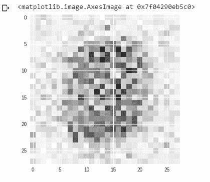
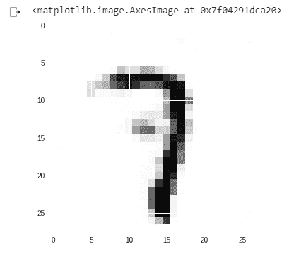

# 生成性对抗网络

> 原文:[https://www . geesforgeks . org/创生-对抗-网络-gan/](https://www.geeksforgeeks.org/generative-adversarial-network-gan/)

生成对抗网络是一类强大的神经网络，用于[无监督学习](https://www.geeksforgeeks.org/supervised-unsupervised-learning/)。它是由伊恩·古德费勒在 2014 年开发和推出的。神经网络基本上是由两个相互竞争的神经网络模型组成的系统，它们相互竞争，能够分析、捕获和复制数据集内的变化。

**当初为什么要开发 GANs？**
人们已经注意到，大多数主流神经网络都很容易被愚弄，通过在原始数据中仅添加少量噪声来对事物进行错误分类。令人惊讶的是，加入噪声后的模型比正确预测时对错误预测的可信度更高。这种对抗的原因是大多数机器学习模型从有限的数据中学习，这是一个巨大的缺点，因为它容易过度拟合。此外，输入和输出之间的映射几乎是线性的。虽然，看起来各种类之间的分离边界是线性的，但实际上，它们是由线性组成的，甚至特征空间中某个点的微小变化都可能导致数据的错误分类。

【GANs 是如何工作的？

生成性对抗网络可以分为三个部分:

*   **创成式:**学习一个创成式模型，用概率模型来描述数据是如何产生的。
*   **对抗性:**模型的训练是在对抗性的环境下进行的。
*   **网络:**使用深度神经网络作为人工智能算法进行训练。

在 GANs 中，有一个**发生器**和一个**鉴别器**。生成器生成假的数据样本(图像、音频等)。)并试图愚弄鉴别器。另一方面，鉴别器试图区分真假样品。生成器和鉴别器都是神经网络，它们都在训练阶段相互竞争。这些步骤重复几次，在这种情况下，每次重复后，生成器和鉴别器在各自的工作中变得越来越好。工作情况可通过下图可视化:


这里，生成模型捕获数据的分布，并以这样一种方式进行训练，即它试图最大化鉴别器出错的概率。另一方面，鉴别器基于一个模型，该模型估计从训练数据而不是从生成器接收到的样本的概率。
GANs 被公式化为一个极小极大游戏，其中鉴别者试图最小化其奖励 **V(D，G)** 而生成器试图最小化鉴别者的奖励或者换句话说，最大化其损失。它可以用下面的公式进行数学描述:


其中，
G =生成器
D =鉴别器
Pdata(x) =真实数据的分布
P(z) =生成器的分布
x =来自 Pdata 的样本(x)
z =来自 P(z)
D(x) =鉴别器网络
G(z) =生成器网络

所以，基本上，训练一个 GAN 有两个部分:

*   **第 1 部分:**在发电机空闲时训练鉴别器。在此阶段，网络仅向前传播，不进行反向传播。鉴别器是在 n 个时期的真实数据上训练的，看看它是否能正确地预测它们是真实的。此外，在这个阶段，鉴别器也在生成器生成的假数据上进行训练，看看它能否正确预测它们是假的。
*   **Part 2:** The Generator is trained while the Discriminator is idle. After the Discriminator is trained by the generated fake data of the Generator, we can get its predictions and use the results for training the Generator and get better from the previous state to try and fool the Discriminator.

    上述方法重复几个时代，然后手动检查假数据，如果它看起来是真的。如果看起来可以接受，那么就停止训练，否则，就让它继续几个时代。

    **不同类型的 GAN:**
    GAN 现在是一个非常活跃的研究课题，并且已经有许多不同类型的 GAN 实现。下面介绍一些目前正在积极使用的重要方法:

    1.  **香草 GAN:** 这是最简单的 GAN 类型。这里，生成器和鉴别器是简单的多层感知器。在香草 GAN 中，算法真的很简单，它试图使用随机梯度下降来优化数学方程。
    2.  **条件 GAN (CGAN):** CGAN 可以描述为一种深度学习方法，其中一些条件参数被放在适当的位置。在 CGAN 中，一个额外的参数“y”被添加到生成器中，用于生成相应的数据。标签也被放入鉴别器的输入中，以便鉴别器帮助区分真实数据和伪生成数据。
    3.  **深度卷积 GAN (DCGAN):** DCGAN 是最流行也是最成功的 GAN 实现之一。它由 ConvNets 代替多层感知器组成。ConvNets 是在没有最大池化的情况下实现的，而最大池化实际上被卷积步长所取代。此外，这些层没有完全连接。
    4.  **拉普拉斯金字塔 GAN (LAPGAN):** 拉普拉斯金字塔是一种线性可逆图像表示，由一组带通图像组成，间隔一个八度，加上一个低频残差。这种方法使用多个生成器和鉴别器网络以及不同级别的拉普拉斯金字塔。这种方法主要是因为它产生非常高质量的图像。首先在金字塔的每一层对图像进行下采样，然后在每一层对图像进行后向放大，在后向放大中，图像从这些层的条件 GAN 中获取一些噪声，直到达到其原始大小。
    5.  **超分辨率 GAN (SRGAN):** SRGAN 顾名思义是一种设计 GAN 的方式，其中深度神经网络与对抗网络一起使用，以产生更高分辨率的图像。这种类型的氮化镓在优化放大原生低分辨率图像以增强其细节方面特别有用，同时最大限度地减少误差。

    **实现生成性对抗网络的示例 Python 代码:**
    GANs 的计算量非常大。它们需要高性能的图形处理器和大量的时间(大量的时代)来产生好的结果。对于我们的示例，我们将使用著名的 MNIST 数据集，并使用它来生成随机数字的克隆。

    ```
    # importing the necessary libraries and the MNIST dataset
    import tensorflow as tf
    import numpy as np
    import matplotlib.pyplot as plt
    from tensorflow.examples.tutorials.mnist import input_data

    mnist = input_data.read_data_sets("MNIST_data")

    # defining functions for the two networks.
    # Both the networks have two hidden layers
    # and an output layer which are densely or 
    # fully connected layers defining the 
    # Generator network function
    def generator(z, reuse = None):
        with tf.variable_scope('gen', reuse = reuse):
            hidden1 = tf.layers.dense(inputs = z, units = 128, 
                                activation = tf.nn.leaky_relu)

            hidden2 = tf.layers.dense(inputs = hidden1,
               units = 128, activation = tf.nn.leaky_relu)

            output = tf.layers.dense(inputs = hidden2, 
                 units = 784, activation = tf.nn.tanh)

            return output

    # defining the Discriminator network function 
    def discriminator(X, reuse = None):
        with tf.variable_scope('dis', reuse = reuse):
            hidden1 = tf.layers.dense(inputs = X, units = 128,
                                activation = tf.nn.leaky_relu)

            hidden2 = tf.layers.dense(inputs = hidden1,
                   units = 128, activation = tf.nn.leaky_relu)

            logits = tf.layers.dense(hidden2, units = 1)
            output = tf.sigmoid(logits)

            return output, logits

    # creating placeholders for the outputs
    tf.reset_default_graph()

    real_images = tf.placeholder(tf.float32, shape =[None, 784])
    z = tf.placeholder(tf.float32, shape =[None, 100])

    G = generator(z)
    D_output_real, D_logits_real = discriminator(real_images)
    D_output_fake, D_logits_fake = discriminator(G, reuse = True)

    # defining the loss function
    def loss_func(logits_in, labels_in):
        return tf.reduce_mean(tf.nn.sigmoid_cross_entropy_with_logits(
                              logits = logits_in, labels = labels_in))

     # Smoothing for generalization
    D_real_loss = loss_func(D_logits_real, tf.ones_like(D_logits_real)*0.9)
    D_fake_loss = loss_func(D_logits_fake, tf.zeros_like(D_logits_real))
    D_loss = D_real_loss + D_fake_loss

    G_loss = loss_func(D_logits_fake, tf.ones_like(D_logits_fake))

    # defining the learning rate, batch size,
    # number of epochs and using the Adam optimizer
    lr = 0.001 # learning rate

    # Do this when multiple networks
    # interact with each other

    # returns all variables created(the two
    # variable scopes) and makes trainable true
    tvars = tf.trainable_variables() 
    d_vars =[var for var in tvars if 'dis' in var.name]
    g_vars =[var for var in tvars if 'gen' in var.name]

    D_trainer = tf.train.AdamOptimizer(lr).minimize(D_loss, var_list = d_vars)
    G_trainer = tf.train.AdamOptimizer(lr).minimize(G_loss, var_list = g_vars)

    batch_size = 100 # batch size
    epochs = 500 # number of epochs. The higher the better the result
    init = tf.global_variables_initializer()

    # creating a session to train the networks
    samples =[] # generator examples

    with tf.Session() as sess:
        sess.run(init)
        for epoch in range(epochs):
            num_batches = mnist.train.num_examples//batch_size

            for i in range(num_batches):
                batch = mnist.train.next_batch(batch_size)
                batch_images = batch[0].reshape((batch_size, 784))
                batch_images = batch_images * 2-1
                batch_z = np.random.uniform(-1, 1, size =(batch_size, 100))
                _= sess.run(D_trainer, feed_dict ={real_images:batch_images, z:batch_z})
                _= sess.run(G_trainer, feed_dict ={z:batch_z})

            print("on epoch{}".format(epoch))

            sample_z = np.random.uniform(-1, 1, size =(1, 100))
            gen_sample = sess.run(generator(z, reuse = True),
                                     feed_dict ={z:sample_z})

            samples.append(gen_sample)

    # result after 0th epoch
    plt.imshow(samples[0].reshape(28, 28))

    # result after 499th epoch
    plt.imshow(samples[49].reshape(28, 28))
    ```

    #### 输出:

    ```
    on epoch0
    on epoch1
    ...
    ...
    ...
    on epoch498
    on epoch499

    ```

    **第 00 纪元后的结果:**
    
    **第 499 纪元后的结果:**
    

    因此，从上面的例子中，我们看到在第 0 个纪元后的第一张图像中，像素分散在各处，我们无法从中找出任何东西。
    但是从第二张图片中，我们可以看到像素组织得更加系统，我们可以发现代码随机选择的是数字‘7’，网络试图克隆它。在我们的示例中，我们将 500 作为纪元的数量。但是您可以增加这个数字来进一步完善您的结果。