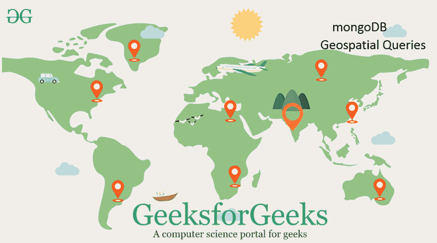
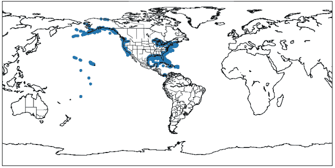

# 使用 Python MongoDB 进行地理空间查询

> 原文:[https://www . geesforgeks . org/geography-query-with-python-MongoDB/](https://www.geeksforgeeks.org/geospatial-queries-with-python-mongodb/)

**先决条件:** [MongoDB 和 Python](https://www.geeksforgeeks.org/mongodb-and-python/)

**GeoJSON** 是包含简单地理特征的开源格式，基于 JavaScript Object notification。它用于格式化坐标空间中的形状，MongoDB 支持多种类型，以允许存储地理空间数据。本文将介绍在 MongoDB 中使用地理空间的各种方法，并解释 GeoJSON 多边形和点类型。



**GeoJSON 格式**

*   一个名为 type 的字段，用于指定 GeoJSON 对象类型和
*   一个名为坐标的字段，用于指定对象的坐标。

**注意:**如果指定经纬度坐标，先列出经度再列出纬度。

**所需模块:**

*   **[皮莫戈](https://www.geeksforgeeks.org/mongodb-and-python/) :** 该模块用于与 MongoDB 交互。要安装它，请在终端中键入以下命令。

    ```
    pip install pymongo
    OR
    condo install pymongo
    ```

*   **[Matplotlib](https://www.geeksforgeeks.org/python-matplotlib-an-overview/) :** 该库用于绘制图形
*   **底图:**该模块用于使用 Python 绘制地图。要安装此模块，请在终端中键入以下命令。

    ```
    conda install basemap
    ```

**使用 MongoDB 图谱的步骤:**

*   从[这里](https://www.mongodb.com/cloud/atlas)打开 MongoDB 图谱云。
*   通过选择适合您的软件包来创建帐户(您也可以选择适合本文和学习目的的免费版本)。
*   单击位于左侧菜单栏的集群视图。
*   点击**椭圆按钮`(...)`** ，选择**加载样本数据集**。
*   添加样本数据集后，单击连接按钮。
    

*   然后将该 IP 地址列入白名单(选择您当前的 IP 地址或键入 0.0.0.0/0 IP 以允许它从任何地方访问。单击下图所示的按钮。
    *   然后单击连接到应用程序按钮。*   Copy the cluster_uri and paste it to a “course_cluster_uri”.

    下面是实现。

    ```
    import pymongo
    import pprint
    import matplotlib.pyplot as plt
    from mpl_toolkits.basemap import Basemap

    course_cluster_uri = 'your_connection_string'

    course_client = pymongo.MongoClient(course_cluster_uri)

    # sample Database
    db = course_client['sample_geospatial']

    # sample Collection
    shipwrecks = db['shipwrecks']

    l = list(shipwrecks.find({}))

    lngs = [x['londec'] for x in l]
    lats = [x['latdec'] for x in l]

    # Clear the figure (this is nice if you
    # execute the cell multiple times)
    plt.clf()

    # Set the size of our figure
    plt.figure(figsize =(14, 8))

    # Set the center of our map with our 
    # first pair of coordinates and set
    # the projection
    m = Basemap(lat_0 = lats[0],
                lon_0 = lngs[0],
                projection ='cyl')

    # Draw the coastlines and the states
    m.drawcoastlines()
    m.drawstates()

    # Convert our coordinates to the system
    # that the projection uses
    x, y = m(lngs, lats)

    # Plot our converted coordinates
    plt.scatter(x, y)

    # Display our beautiful map
    plt.show()
    ```

    **输出:**

    

    沉船阴谋