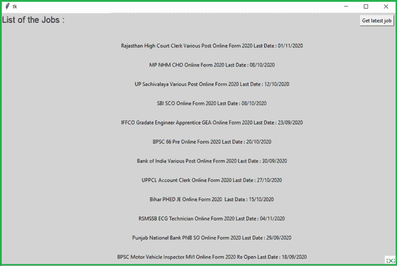

# 使用 Python 获取最新的政府工作信息

> 原文:[https://www . geesforgeks . org/get-latest-government-job-information-use-python/](https://www.geeksforgeeks.org/get-latest-government-job-information-using-python/)

**先决条件:**[Python GUI–tkinter](https://www.geeksforgeeks.org/python-gui-tkinter/)**T5】**

在这些文章中，我们将编写 python 脚本来获取最新的政府工作信息。

### **所需模块**

*   [**【漂亮组】**](https://www.geeksforgeeks.org/implementing-web-scraping-python-beautiful-soup/) **:** 漂亮汤(bs4)是一个从 HTML 和 XML 文件中拉出数据的 Python 库。这个模块没有内置 Python。要安装此软件，请在终端中键入以下命令。

```
pip install bs4
```

*   [**请求**](https://www.geeksforgeeks.org/python-requests-tutorial/) **:** 请求让你发送 HTTP/1.1 请求极其轻松。该模块也没有内置 Python。要安装此软件，请在终端中键入以下命令。

```
pip install requests
```

**进场:**

*   从给定的网址提取数据
*   借助请求和靓汤刮数据
*   将数据转换成 HTML 代码。
*   找到所需的详细信息并进行筛选。

**我们来看看脚本的分步执行**

**第一步:**导入所有依赖

## 蟒蛇 3

```
import requests
from bs4 import BeautifulSoup
```

**步骤 2:** 创建一个 URL 获取函数

## 蟒蛇 3

```
def getdata(url):
    r = requests.get(url)
    return r.text
```

**步骤 3:** 现在将 URL 传递给 getdata 函数，并将该数据转换为 HTML 代码

## 蟒蛇 3

```
# import module
import requests
import pandas as pd
from bs4 import BeautifulSoup

res = ''

# link for extract html data
def getdata(url):
    r = requests.get(url)
    return r.text

htmldata = getdata("https://www.sarkariresult.com/latestjob.php")
soup = BeautifulSoup(htmldata, 'html.parser')

for li in soup.find_all("div", id="post"):
    res += (li.get_text())

print(res)
```

**输出:**


**用**[**Tkit**](https://www.geeksforgeeks.org/python-gui-tkinter/)**申请最新工作信息:**本脚本将上述实现实现到一个图形用户界面中。

## 蟒蛇 3

```
# import module
import requests
import pandas as pd
from bs4 import BeautifulSoup
from tkinter import *
from tkinter import messagebox

res = []

def getdata(url):
    r = requests.get(url)
    return r.text

def getinfo():
    result = ''
    htmldata = getdata("https://www.sarkariresult.com/latestjob.php")
    soup = BeautifulSoup(htmldata, 'html.parser')

    for li in soup.find_all("div", id="post"):
        result += (li.get_text())
    res.set(result)

# object of tkinter
# and background set for light grey
master = Tk()
master.configure(bg='light grey')

# Variable Classes in tkinter
res = StringVar()

# Creating label for each information
# name using widget Label
Label(master, text="List of the Jobs :",
      bg="light grey", font="100").grid(row=0, sticky=W)

# Creating label for class variable
# name using widget Entry
Label(master, text="", textvariable=res, bg="light grey").grid(
    row=3, column=1, sticky=W)

# creating a button using the widget
# Button that will call the submit function
b = Button(master, text="Get latest job", command=getinfo)
b.grid(row=0, column=2, columnspan=2, rowspan=2, padx=5, pady=5)

mainloop()
```

**输出:**

