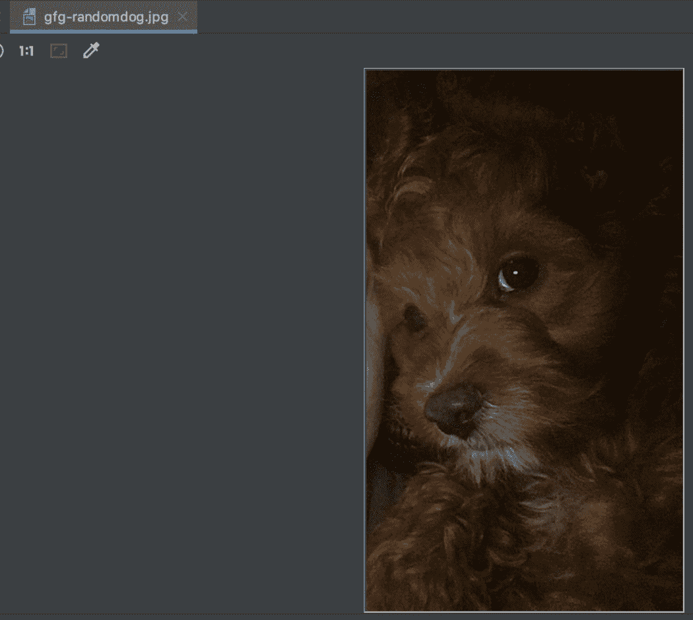

# 获取 Python 中的随机狗图像

> 原文:[https://www . geesforgeks . org/get-random-dog-images-in-python/](https://www.geeksforgeeks.org/get-random-dog-images-in-python/)

在本文中，我们将讨论如何在 Python 中获得随机的狗图像。

## 需要模块

这可以使用随机狗模块来完成。它使用单个 LOC 输出随机狗图像，并从狗首席执行官[应用编程接口](https://dog.ceo/dog-api/)提供的数据集中获取图像。

## 装置

这个模块没有内置 Python。要安装此软件，请在终端中键入以下命令。

```py
pip install random-dog
```

一旦安装了库，就需要导入 dog 模块，需要用需要的参数调用 getDoc()，返回想要的 dog 的随机图像。

**语法:**

> getDog(目录=curr，文件名=random_id)
> 
> **参数:**
> 
> **目录:**保存图像的目录。
> **文件名:**要保存的文件图像的名称。默认为随机生成的标识。

**例 1:**

## 蟒蛇 3

```py
import dog

# saves filename as randog.jpg 
# in current directory
dog.getDog(filename='randog')
```

**输出:**


**从命令行使用**

也可以从命令行执行类似的任务。它需要的命令是。

> $ randomdog【文件】
> **文件**:保存图像的路径，默认为当前。

这将随机生成的狗图像保存到当前或期望的路径(如果提供的话)。


**输出:**

