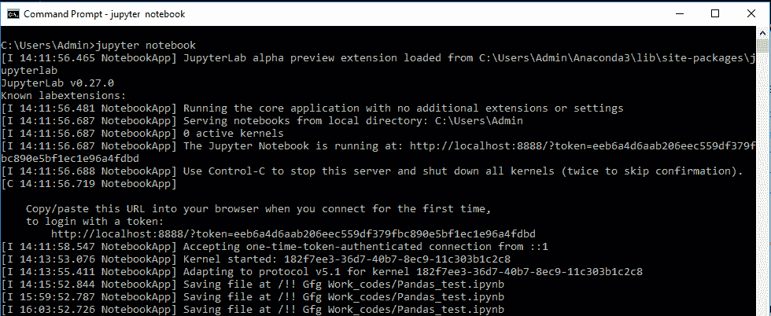
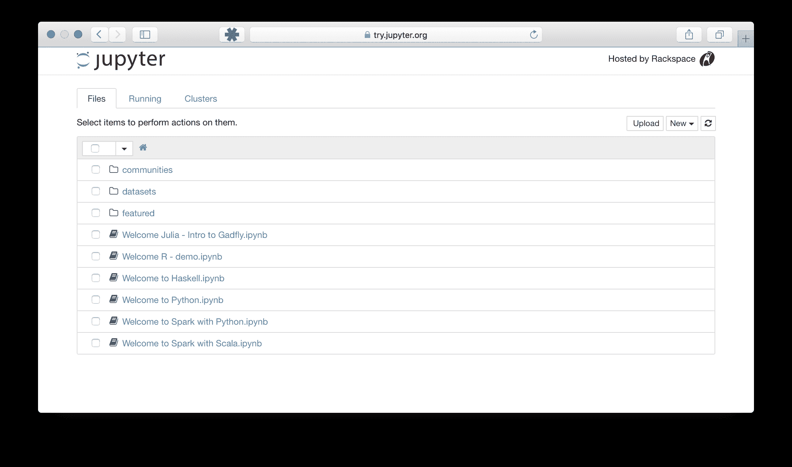

# 【Jupyter 笔记本| Python 入门

> 原文:[https://www . geeksforgeeks . org/入门-jupyter-notebook-python/](https://www.geeksforgeeks.org/getting-started-with-jupyter-notebook-python/)

Jupyter 笔记本是一个开源的网络应用程序，允许您创建和共享包含实时代码、公式、可视化和叙事文本的文档。用途包括数据清理和转换、数值模拟、统计建模、数据可视化、机器学习等等。

Jupyter 支持 40 多种不同的编程语言，Python 就是其中之一。Python 是安装 Jupyter 笔记本本身的要求(Python 3.3 或更高版本，或 Python 2.7)。

**使用 Anaconda 安装 Jupyter:**
使用 Anaconda 发行版安装 Python 和 Jupyter，该发行版包括 Python、Jupyter 笔记本和其他常用的科学计算和数据科学软件包。你可以从[这里](https://www.anaconda.com/download/#linux)下载蟒蛇最新的蟒蛇 3 版本。
现在，安装下载的 Anaconda 版本。

**使用 PIP 安装 Jupyter 笔记本:**

```
python3 -m pip install --upgrade pip
python3 -m pip install jupyter
```

**运行 Jupyter 笔记本的命令:**

```
jupyter notebook
```

这将在您的终端中打印有关笔记本服务器的一些信息，包括 web 应用程序的 URL(默认情况下，http://localhost:8888)，然后打开默认的 web 浏览器访问该 URL。


当笔记本在浏览器中打开时，您将看到笔记本控制面板，其中将显示笔记本服务器启动目录中的笔记本、文件和子目录列表。大多数情况下，您会希望在包含笔记本的最高级别目录中启动笔记本服务器。通常这是你的主目录。


**新建笔记本:**
现在在仪表盘上，可以看到右上角有一个新按钮。单击它打开一个下拉列表，然后如果您单击 Python3，它将打开一个新笔记本。


**很少有用的命令:**

*   命令在当前运行的笔记本服务器中打开笔记本。

    ```
    jupyter notebook notebook_name.ipynb
    ```

*   默认情况下，笔记本服务器从端口 8888 启动。如果端口 8888 不可用或正在使用，笔记本服务器将搜索下一个可用端口。您也可以手动指定端口。在本例中，我们将服务器的端口设置为 9999:

    ```
    jupyter notebook --port 9999
    ```

*   无需打开网页浏览器即可启动笔记本服务器的命令:

    ```
    jupyter notebook --no-browser
    ```

*   The notebook server provides help messages for other command line arguments using the –help flag:

    ```
    jupyter notebook --help
    ```

    **在 Jupyter 运行你的第一个代码:**

    **步骤#1:** 成功安装 Jupyter 后，在终端/命令提示符下写下‘Jupyter 笔记本’。这将在您的网络浏览器上打开一个新的笔记本服务器。
    **第二步:**在左上角，点击新建按钮，选择 python3。这将在您的浏览器中打开一个新的笔记本选项卡，您可以在其中开始编写第一个代码。
    **第三步:**按回车键或点击笔记本中的第一个单元格进入编辑模式。
    **第四步:**现在你可以自由编写任何代码了。
    **第五步:**您可以通过按下`Shift + Enter`或顶部的运行按钮来运行您的代码。示例代码如下:
    

    **一些有用的键盘快捷键:**

    *   要更改模式(编辑，命令):

        ```
        Esc - Change mode to command mode
        Enter - Change mode to edit mode
        ```

    *   更改内容类型(代码或降价)[在命令模式下]

        ```
        m - Change to markdown
        y - Change to code
        ```

    *   执行代码或降价[任何模式]

        ```
        Shift + Enter - Execute and go to next cell
        Ctrl + Enter  - Execute and be in the same cell
        ```

    *   要插入单元格[在命令模式下]

        ```
        a - Create cell in above to the cell
        b - Create cell in below to the cell
        ```

    *   [在命令模式下]剪切复制粘贴

        ```
        x - Cut the cell that can be paste anywhere any number of times
        c - Copy the cell that can be paste anywhere and any number of times
        v - Paste the cell
        ```