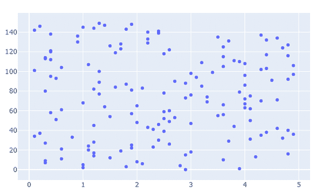
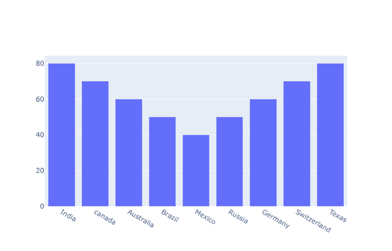
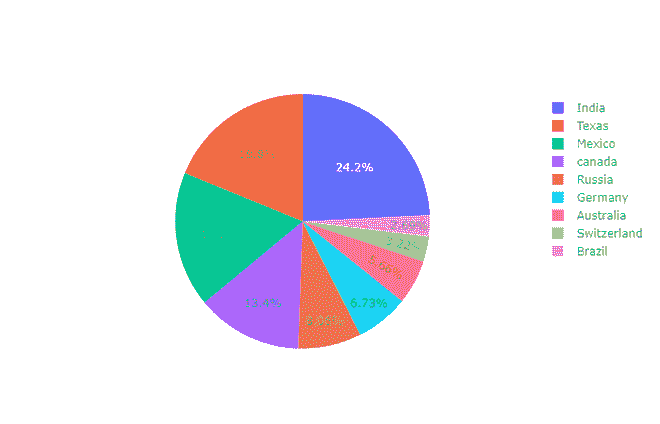
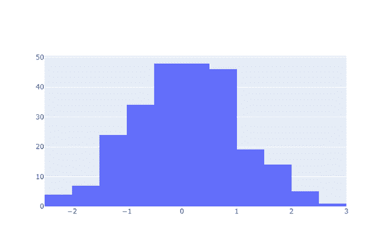
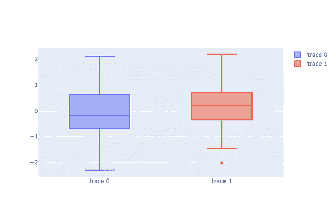

# Plotly-Python 入门

> 原文:[https://www . geeksforgeeks . org/入门-plotly-python/](https://www.geeksforgeeks.org/getting-started-with-plotly-python/)

**Plotly Python**库是一个交互式开源库。这对于数据可视化和简单容易地理解数据是非常有用的工具。plotly graph 对象是易于使用的高级绘图界面。它可以绘制各种类型的图形和图表，如散点图、折线图、条形图、箱线图、直方图、饼图等。

所以你们一定都在想，为什么要比其他可视化工具或库更有情节？答案如下–

*   Plotly 拥有悬停工具功能，允许我们检测大量数据点中的任何异常值或异常情况。
*   它在视觉上很有吸引力，能够被广大观众所接受。
*   它允许我们对我们的图形进行无休止的定制，这使得我们的情节对其他人来说更有意义和可理解。

好了，理论够了，开始吧。

**安装:**

要安装此模块，请在终端中键入以下命令。

```py
pip install plotly
```

### 入门指南

让我们使用这个模块创建不同的图

*   **散点图:**散点图代表两个不同数值变量的值。它们主要用于表示两个变量之间的关系。

## 蟒蛇 3

```py
# import all required libraries
import numpy as np
import plotly
import plotly.graph_objects as go
import plotly.offline as pyo
from plotly.offline import init_notebook_mode

init_notebook_mode(connected=True)

# generating 150 random integers
# from 1 to 50
x = np.random.randint(low=1, high=50, size=150)*0.1

# generating 150 random integers
# from 1 to 50
y = np.random.randint(low=1, high=50, size=150)*0.1

# plotting scatter plot
fig = go.Figure(data=go.Scatter(x=x, y=y, mode='markers'))

fig.show()
```

**输出:**



*   **条形图:**当我们想要比较不同组的数据，并推断哪些组最高，哪些组常见，以及比较一个组与其他组相比的表现时，会使用条形图。

## 蟒蛇 3

```py
# import all required libraries
import numpy as np
import plotly
import plotly.graph_objects as go
import plotly.offline as pyo
from plotly.offline import init_notebook_mode

init_notebook_mode(connected = True)

# countries on x-axis
countries=['India', 'canada',
           'Australia','Brazil',
           'Mexico','Russia',
           'Germany','Switzerland',
           'Texas']

# plotting corresponding y for each
# country in x
fig = go.Figure([go.Bar(x=countries,
                        y=[80,70,60,50,
                           40,50,60,70,80])])

fig.show()
```

**输出:**



*   **饼图:**饼图表示不同变量在总量中的分布。在饼图中，每个切片显示其对总量的贡献。

## 蟒蛇 3

```py
# import all required libraries
import numpy as np
import plotly
import plotly.graph_objects as go
import plotly.offline as pyo
from plotly.offline import init_notebook_mode

init_notebook_mode(connected = True)

# different individual parts in
# total chart
countries=['India', 'canada',
           'Australia','Brazil',
           'Mexico','Russia',
           'Germany','Switzerland',
           'Texas']

# values corresponding to each
# individual country present in
# countries
values = [4500, 2500, 1053, 500,
          3200, 1500, 1253, 600, 3500]

# plotting pie chart
fig = go.Figure(data=[go.Pie(labels=countries,
                      values=values)])

fig.show()
```

**输出:**



*   **直方图:**直方图将变量的连续分布绘制为一系列条形，每个条形表示变量中值出现的频率。为了使用直方图，我们只需要一个取连续数值的变量

## 蟒蛇 3

```py
# import all required libraries
import numpy as np
import plotly
import plotly.graph_objects as go
import plotly.offline as pyo
from plotly.offline import init_notebook_mode

init_notebook_mode(connected = True)

# save the state of random
np.random.seed(42) 

# generating 250 random numbers
x = np.random.randn(250)

# plotting histogram for x
fig = go.Figure(data=[go.Histogram(x=x)])

fig.show()
```

**输出:**



*   **箱线图:**箱线图是统计汇总的表示。最小值、第一个四分位数、中值、第三个四分位数、最大值。

## 蟒蛇 3

```py
# import all required libraries
import numpy as np
import plotly
import plotly.graph_objects as go
import plotly.offline as pyo
from plotly.offline import init_notebook_mode

init_notebook_mode(connected = True)

np.random.seed(42)

# generating 50 random numbers
y = np.random.randn(50)

# generating 50 random numbers
y1 = np.random.randn(50)
fig = go.Figure() 

# updating the figure with y
fig.add_trace(go.Box(y=y))

# updating the figure with y1
fig.add_trace(go.Box(y=y1))

fig.show()
```

**输出:**

