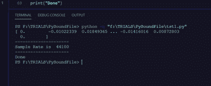

# 开始使用 PySoundFile

> 原文:[https://www . geeksforgeeks . org/入门-pysoundfile/](https://www.geeksforgeeks.org/getting-started-with-pysoundfile/)

**PySoundFile** 是一个 Python 模块，用于**读取**和**写入**音频文件，将音频文件视为包含音高和所有音高的 **NumPy** 数组。该模块可以读取音频文件，即它从音频中提取 NumPy 数组(。wav 文件),也能写

**安装**:运行以下 pip 命令:

```py
pip install PySoundFile 

```

PySoundFile 支持 libsndfile 支持的所有格式，例如 WAV、FLAC、OGG 和 mat 文件

以下是示例中使用的音频文件的链接[链接](https://drive.google.com/drive/folders/1z419FVosdjv2Tqp2MlJ7n5Q8jRBQaO2W?usp=sharing)

**读取音频文件:**

可以使用 **read()** 功能读取音频文件。

> **语法:**读取(文件，帧=-1，开始=0，停止=无，fill _ value =无，采样率=无，通道=无，子类型=无)
> 
> **参数:**
> 
> *   **文件:**音频文件的路径
> *   **帧数**:此参数用于指定要读取的帧数，默认为-1，表示要读取的整个文件
> *   **开始、停止**:指定读取音频文件的开始和结束，默认读取整个文件
> *   **fill_value** :如果文件中剩余的数据比请求的少，则其余的帧用 fill_value 填充。如果未指定 fill_value，则返回较小的数组
> 
> **返回:** 2 个值
> 
> *   **数据:** numpy 数组(长度应为 44，100 个元素)如果返回的是一维 numpy 数组，则音频读取为单声道
> *   **采样率:**采样率(或“采样率”)定义每秒钟对声音采样的次数。从技术上讲，它是数字录音中使用的样本频率。音频光盘使用的标准采样率是 44.1 千赫，这个文件也是一样的

支持的**t1]文件格式:WAV、AIFF、AU、PAF、SVX、NIST、VOC、IRCAM、W64、MAT4、MAT5、PVF、XI、HTK、SDS、AVR、wavex、SD2、FLAC、CAF、WVE、OGG、MPC2K、RF64**

**示例:**我们将读取以下文件:

<audio class="wp-audio-shortcode" id="audio-500215-1" preload="none" style="width:100%" controls=""><source type="audio/wav" src="https://media.geeksforgeeks.org/wp-content/uploads/20201019155155/noice.wav?_=1">[https://media.geeksforgeeks.org/wp-content/uploads/20201019155155/noice.wav](https://media.geeksforgeeks.org/wp-content/uploads/20201019155155/noice.wav)</audio>

## 蟒蛇 3

```py
# import the module
import soundfile as sf

# read the file
data, samplerate = sf.read('noice.wav')

# display the data
print(data)
print("---------------------")
print("Sample Rate is ", samplerate)
print("---------------------")
print("Done")
```

**输出:**



**写文件:**我们可以使用 **write()** 函数写文件。

> **语法:**写(文件，数据，采样率，子类型=无，端序=无，格式=无，closefd =真)
> 
> **参数:**
> 
> *   **文件:**输出文件的路径
> *   **数据:** 待写数据
> *   **采样率:**音频数据采样率
> 
> **返回:**无

要写音频文件，我们需要 NumPy 数组(即数据)，因为采样率有标准值，它以 wb 模式打开文件，即如果存在相同的名称，那么程序将重写它

**示例:**我们将读取以下文件:

<audio class="wp-audio-shortcode" id="audio-500215-2" preload="none" style="width:100%" controls=""><source type="audio/wav" src="https://media.geeksforgeeks.org/wp-content/uploads/20201019155510/Sample.wav?_=2">[https://media.geeksforgeeks.org/wp-content/uploads/20201019155510/Sample.wav](https://media.geeksforgeeks.org/wp-content/uploads/20201019155510/Sample.wav)</audio>

## 蟒蛇 3

```py
# imporintg the module
import soundfile as sf

# reading the file
data, samplerate = sf.read('Sample.wav')

# writing the file
sf.write('writing_file_output.wav', data, samplerate)

# You may compare both audio, link is given in the output
```

**输出:**这是输出文件:

<audio class="wp-audio-shortcode" id="audio-500215-3" preload="none" style="width:100%" controls=""><source type="audio/wav" src="https://media.geeksforgeeks.org/wp-content/uploads/20201019155432/writing_file_output.wav?_=3">[https://media.geeksforgeeks.org/wp-content/uploads/20201019155432/writing_file_output.wav](https://media.geeksforgeeks.org/wp-content/uploads/20201019155432/writing_file_output.wav)</audio>