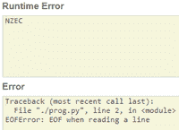

# 在 Python 中处理 EOFError 异常

> 原文:[https://www . geesforgeks . org/handling-eoferror-异常-in-python/](https://www.geeksforgeeks.org/handling-eoferror-exception-in-python/)

**当内置函数 input()或 raw_input()中的一个在不读取任何数据的情况下达到文件结束条件(e of)时，EOFError** 将被引发。使用联机 IDEs 时，有时会遇到此错误。当我们要求用户输入，但没有在输入框中提供任何输入时，就会出现这种情况。除了 Python 中的关键词，我们可以通过使用**尝试**和**来克服这个问题。这称为[异常处理](https://www.geeksforgeeks.org/python-exception-handling/)。**

**示例:**当在线 IDE 没有输入时，该代码将生成一个 EOFError。

## 蟒蛇 3

```
n = int(input())
print(n * 10)
```

**输出:**



此异常可以按以下方式处理:

## 蟒蛇 3

```
try:
    n = int(input())
    print(n * 10)

except EOFError as e:
    print(e)
```

**输出:**

```
EOF when reading a line
```