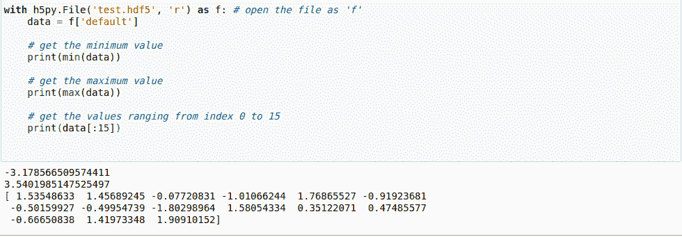
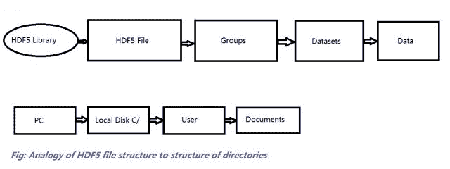

# Python 中的 HDF5 文件

> 原文:[https://www.geeksforgeeks.org/hdf5-files-in-python/](https://www.geeksforgeeks.org/hdf5-files-in-python/)

HDF5 文件代表分层数据格式 5。这是一个开源文件，可以方便地存储大量数据。顾名思义，它在单个文件中以分层结构存储数据。因此，如果我们想快速访问文件的特定部分，而不是整个文件，我们可以使用 HDF5 轻松实现。这种功能在普通文本文件中是看不到的，因此 HDF5 看似流行，实际上是一个新概念。要使用 HDF5，需要导入 numpy。一个重要的特性是，它可以将 metaset 附加到文件中的每个数据，从而提供强大的搜索和访问。让我们开始将 HDF5 安装到计算机上。
要安装 HDF5，请在您的终端中键入:

```py
pip install h5py
```

我们将使用一个名为 HDF5 Viewer 的特殊工具以图形方式查看这些文件并对其进行处理。要安装 HDF5 查看器，请键入以下代码:

```py
pip install h5pyViewer
```

由于 HDF5 在 numpy 上工作，我们也需要 numpy 安装在我们的机器上。

```py
python -m pip install numpy
```

所有安装完成后，让我们看看如何写入 HDF5 文件。
**注意:**使用 HDF5 需要对 numpy 及其属性有基本的了解，因此必须熟悉 numpy 才能理解本文中的以下代码。要了解更多关于 numpy [的信息，请点击此处](https://www.geeksforgeeks.org/python-numpy/)。
我们将创建一个文件，并在其中保存 numpy 的随机数组:

## 蟒蛇 3

```py
# Python program to demonstrate
# HDF5 file

import numpy as np
import h5py

# initializing a random numpy array
arr = np.random.randn(1000)

# creating a file
with h5py.File('test.hdf5', 'w') as f:
    dset = f.create_dataset("default", data = arr)
```

**输出:**


在上面的代码中，我们首先导入之前安装的模块。然后我们将变量 arr 初始化为一个随机的 numpy 数组，范围直到 1000。
因此，我们可以说这个数组由大量数据组成。接下来，我们以“只写”属性打开文件。这意味着如果没有任何名为 **test.hdf5** 的文件，它将创建一个，否则它将删除(覆盖)现有文件的内容。打开文件时，我们使用了而不是 open，因为与 open()方法相比，它占了上风。如果使用打开文件，我们不需要关闭文件。create_dataset()将变量*数据集*设置为之前创建的数组。
我们现在将阅读我们在上面写的文件:

## 蟒蛇 3

```py
# open the file as 'f'
with h5py.File('test.hdf5', 'r') as f:
    data = f['default']

    # get the minimum value
    print(min(data))

    # get the maximum value
    print(max(data))

    # get the values ranging from index 0 to 15
    print(data[:15])

```

**输出:**



在这里，我们再次打开文件，但这一次我们通过“只读”属性打开它，因此不能对文件进行任何更改。我们将变量数据设置为之前文件中存储的数据。我们来看看输出:
看起来好像没有什么新东西。它只是一个数组，我们打印出来的数字就像在一个数组中一样。但是，**变量数据不是数组**。它实际上与数组非常不同。这是数据集。它不是将数据存储在内存中，而是将其保存在计算机的硬盘中，从而像目录一样维护一个层次结构:


当使用下面的线时

```py
data = f['default']
```

在前面的代码中，我们没有直接访问文件的内容，而是创建了一个指向我们内容的指针。我们来看看这个的一个优势:

## 蟒蛇 3

```py
import numpy as np
import h5py

arr1 = np.random.randn(10000)
arr2 = np.random.randn(10000)

with h5py.File('test_read.hdf5', 'w') as f:
    f.create_dataset('array_1', data = arr1)
    f.create_dataset('array_2', data = arr2)
```

我们创建了两个数据集，但整个过程与之前相同。使用“w”属性创建名为**“test _ read . hdf 5”**的文件，该文件包含两个随机数数据集(**数组 1** 和**数组 2** )。现在假设我们只想读取**数组 2** 的选择部分。例如，我们想读取**数组 2** 中对应于**数组 1** 的值大于 *1* 的部分。如果我们使用传统的文本文件而不是 HDF5 文件，这几乎是不可能实现的。这正是我们看到的 HDF5 文件的力量:

## 蟒蛇 3

```py
with h5py.File('test_read.hdf5', 'r') as f:
    d1 = f['array_1']
    d2 = f['array_2']

    data = d2[d1[:]>1]
```

我们使用 **[:]** 将数据集 **d1** 复制到内存中。我们这样做是因为数据集(硬盘中的数据)不能与整数进行比较。
**输出:**


因此，我们得出结论，当我们处理大文件时，HDF5 文件是我们最好的工具，因为它允许我们选择性地读写文件，否则会消耗大量内存和时间。

