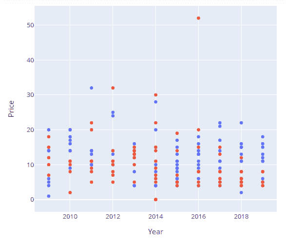

# 用 Python 用剧情表达隐藏传说？

> 原文:[https://www . geesforgeks . org/hide-legend-in-plotly-express-in-python/](https://www.geeksforgeeks.org/hide-legend-in-plotly-express-in-python/)

在本文中，我们将讨论如何使用 Python 在 plotly express 中隐藏图例。

**使用中的数据集:[畅销书 4](https://media.geeksforgeeks.org/wp-content/cdn-uploads/20211115164236/bestsellers4.csv)**

**当一个对象的变化必须参照另一个对象来描述时，默认情况下会出现图例。图例使图形更容易阅读，因为它包含所用颜色代码或键的描述。**

 **### 创建一个规则的图，这样区别就很明显了

这里我们将使用数据框创建一个散点图。为此，我们将从给定的数据集创建数据帧。

## 蟒 3

```py
# import libraries
import plotly.express as px
import pandas as pd

# read dataset
data = pd.read_csv("bestsellers.csv")

fig = px.scatter(data, x="Year", y="Price", 
                 color="Genre")

fig.show()
```** 

**输出:**


## 在 plotly express 中隐藏图例

现在，要隐藏图例， **update_layout()** 函数在 showlegend 参数设置为 false 的情况下调用。这个简单的陈述足以完成工作。

> **语法:**
> 
> update_layout(showlegend=false)

## 蟒蛇 3

```py
# import libraries
import plotly.express as px
import pandas as pd

# read dataset
data = pd.read_csv("bestsellers.csv")

fig = px.scatter(data, x="Year", y="Price",
                 color="Genre")
fig.update_layout(showlegend = False)

fig.show()
```

**输出:**

