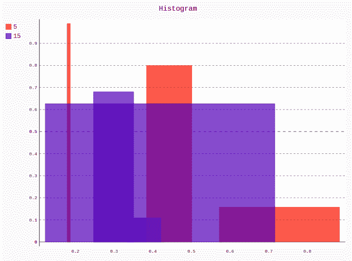
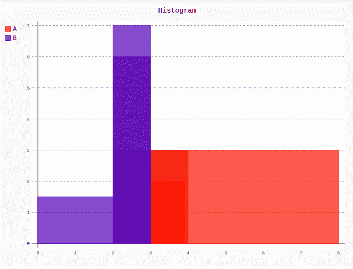

# Pygal 中的直方图

> 原文:[https://www.geeksforgeeks.org/histogram-in-pygal/](https://www.geeksforgeeks.org/histogram-in-pygal/)

**Pygal** 是一个 Python 模块，主要用于构建 SVG(标量矢量图形)图形和图表。SVG 是一种基于矢量的 XML 格式的图形，可以在任何编辑器中编辑。Pygal 可以用最少的代码行创建图表，这些代码行易于理解和编写。

## 柱状图

**直方图**是使用不同高度的条的数据的图形显示，它类似于条形图，但是直方图将组的数量呈现为范围，并以段列的形式呈现。直方图仅用于绘制连续数据集中分数出现的频率，该数据集中的分数被划分为多个类别，称为箱。直方图是一种特殊的条形，它对一个条形取 3 个值:

*   纵坐标高度
*   横坐标开始
*   横坐标末端

**语法:**

```py
hist = pygal.Histogram()
```

**例 1:**

```py
# importing pygal
import pygal
import numpy

# creating the chart object
histogram = pygal.Histogram()

# naming the title
histogram.title = 'Stacked Bar Chart'        

# Random data
for i in range(5, 20, 10):
    data = list(zip(numpy.random.rand(i),
                    numpy.random.rand(3), 
                    numpy.random.rand(i)))
    histogram.add(str(i), data)

histogram
```

**输出:**



**例 2:**

```py
# importing pygal
import pygal
import numpy

# creating the chart object
histogram = pygal.Histogram()

# naming the title
histogram.title = 'Histogram'        

histogram.add('A', [(2, 2, 3.9), (3, 2, 8), (3, 4, 2.4)])
histogram.add('B', [(1.5, 0, 2), (6, 2, 3), (7, 3, 2)])

histogram
```

**输出:**

