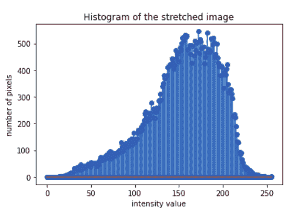

# Python 中的直方图绘制和拉伸(不使用内置函数)

> 原文:[https://www . geeksforgeeks . org/不使用内置函数的 python 直方图绘制和拉伸/](https://www.geeksforgeeks.org/histogram-plotting-and-stretching-in-python-without-using-inbuilt-function/)

**先决条件:** [使用直方图](https://www.geeksforgeeks.org/opencv-python-program-analyze-image-using-histogram/)分析图像的 OpenCV Python 程序

亮度水平在 0 到 1 范围内的数字图像直方图是一个离散函数–

```py
h(rk) = nk
where rk = kth intensity value
and no = number of pixels in the image with rk intensity value.
```

如果图像有 M 行 N 列，那么图像中的像素总数为 MN。归一化直方图如下获得:

```py
p(rk) = nk/MN
```

有时，如果图像是暗的、亮的或低对比度的，则该图像的直方图可能没有分别具有最小强度(0)或最大强度(255)或两者的像素。在这种情况下，可以通过应用以下变换来拉伸该图像的直方图。

```py
Let a= maximum intensity level in the image
Let b= minimum intensity level in the image
Let rk= pixel value in the original image
Let sk= pixel value in the stretched image
constant= (255-0)/(a-b)

Then
sk= constant*rk
```

**直方图绘制算法**

*   阅读图片
*   获取图像的大小。设 m =行，n =列
*   对于所有强度等级，rk= 0 到 255
*   遍历所有行“m”和列“n”
*   计算每个强度级别的像素数
*   绘制强度值与每个强度值中像素数量的关系图

**拉伸直方图的算法**

*   找出图像中的最小强度值，比如“a”，最大强度值，比如“b”
*   获得常数 c= (255-0)/(a-b)
*   将此常数与图像中的每个像素相乘，以获得直方图拉伸。

**观察**
观察到暗输入图像在对比度拉伸后有所改善。

下面是实现。

**输入图像:**


```py
# import cv2, numpy, matplotlib
import cv2
import numpy as np
import matplotlib.pyplot as plt

# function to obtain histogram of an image
def hist_plot(img):

    # empty list to store the count 
    # of each intensity value
    count =[]

    # empty list to store intensity 
    # value
    r = []

    # loop to traverse each intensity 
    # value
    for k in range(0, 256):
        r.append(k)
        count1 = 0

        # loops to traverse each pixel in 
        # the image 
        for i in range(m):
            for j in range(n):
                if img[i, j]== k:
                    count1+= 1
        count.append(count1)

    return (r, count)

img = cv2.imread('food.jpeg', 0)

# To ascertain total numbers of rows and 
# columns of the image, size of the image
m, n = img.shape
r1, count1 = hist_plot(img)

# plotting the histogram
plt.stem(r1, count1)
plt.xlabel('intensity value')
plt.ylabel('number of pixels')
plt.title('Histogram of the original image')

# Transformation to obtain stretching
constant = (255-0)/(img.max()-img.min())
img_stretch = img * constant
r, count = hist_plot(img_stretch)

# plotting the histogram
plt.stem(r, count)
plt.xlabel('intensity value')
plt.ylabel('number of pixels')
plt.title('Histogram of the stretched image')

# Storing stretched Image
cv2.imwrite('Stretched Image 4.png', img_stretch)
```

**输出:**



