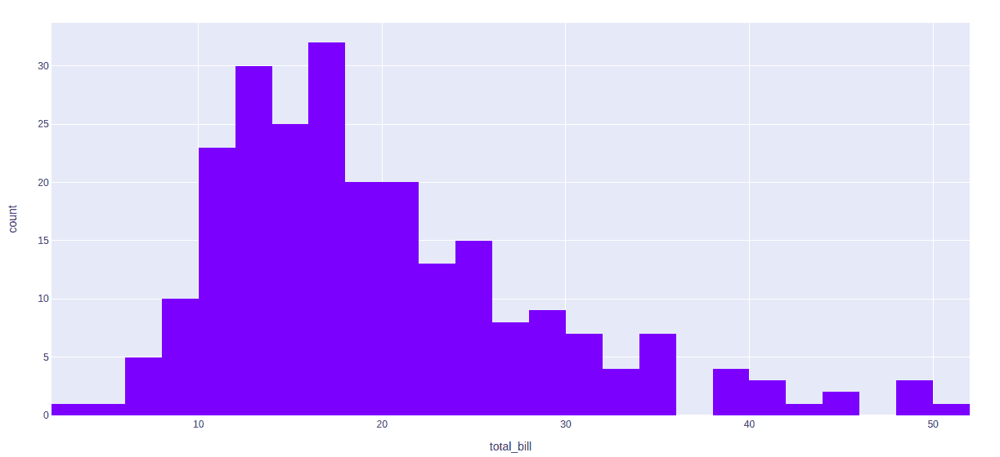

# Python 中使用 Plotly 的直方图

> 原文:[https://www . geesforgeks . org/直方图-使用-plotly-in-python/](https://www.geeksforgeeks.org/histogram-using-plotly-in-python/)

**Plotly** 是一个 Python 库，用来设计图形，尤其是交互图形。它可以绘制各种图形和图表，如直方图、条形图、箱线图、展开图等。它主要用于数据分析以及财务分析。plotly 是一个交互式可视化库。

## 图表中的直方图

直方图是一个图表，其中存储了数据，并对每个存储的数据进行了计数和表示。更广泛地说，在 plotly 中，直方图是一个累积条形图，具有几个可能的累积函数。要储存的数据可以是数字数据，也可以是分类数据或日期数据。它通常用于处理大数据集。

> **语法:**plot . express .直方图(data_frame=None，x=None，y=None，color=None，facet_row=None，facet_col=None，facet_col_wrap=0，hover_name=None，hover_data=None，animation_frame=None，animation_group=None，category_orders={}，labels={}，color_discrete_sequence=None，color_discrete_map={}，marginal=None，不透明度=None，方向=None，barmode='relative '，barnorm
> 
> **参数:**
> **data_frame:** 需要为列名传递 DataFrame 或类似数组的名称
> **x:** 或者 data_frame 中的列名，或者 pandas Series 或类似数组的对象。此列或 array_like 中的值用于在笛卡尔坐标中沿 x 轴定位标记。
> **y:**data _ frame 中列的名称，或者 pandas Series 或 array_like 对象。此列或 array_like 中的值用于在笛卡尔坐标中沿 y 轴定位标记。
> **颜色:**data _ frame 中列的名称，或者 pandas Series 或 array_like 对象。

**示例:**使用提示数据集

## 蟒蛇 3

```
import plotly.express as px

df = px.data.tips()

fig = px.histogram(df, x="total_bill")
fig.show()
```

**输出:**



## 标准化类型

默认情况下，表示容器的模式是样本计数。我们可以使用 Plotly 更改此模式。Ir=t 可以使用 histnorm 参数完成。使用此参数可以传递的不同值有-

*   **百分比或概率:**给定箱的 histfunc 输出除以所有箱的 histfunc 输出之和。
*   **密度:**给定仓位的 histfunc 输出除以仓位大小。
*   **概率密度:**给定仓的 histfunc 的输出被归一化，使得它对应于随机

**例 1:**

## 蟒蛇 3

```
import plotly.express as px

df = px.data.tips()

fig = px.histogram(df, x="total_bill",
                   histnorm='probability density')
fig.show()
```