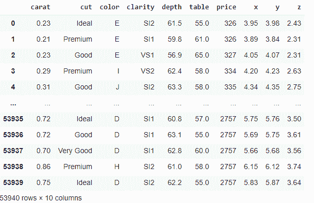
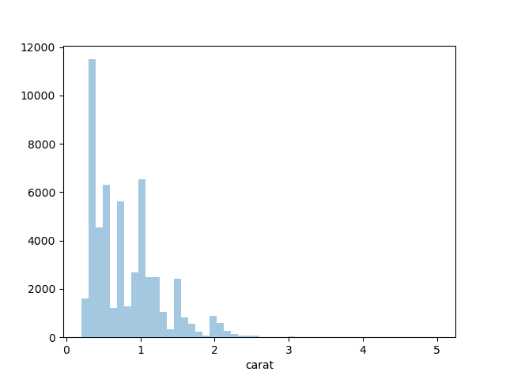
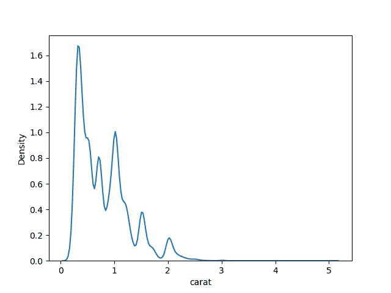
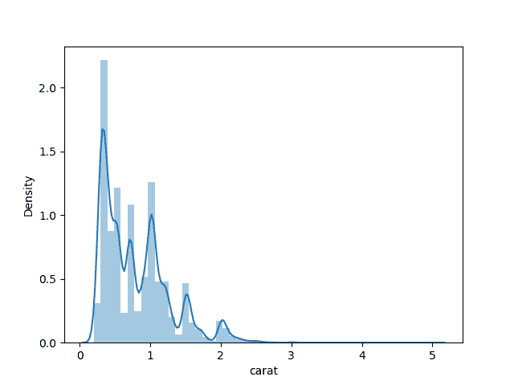
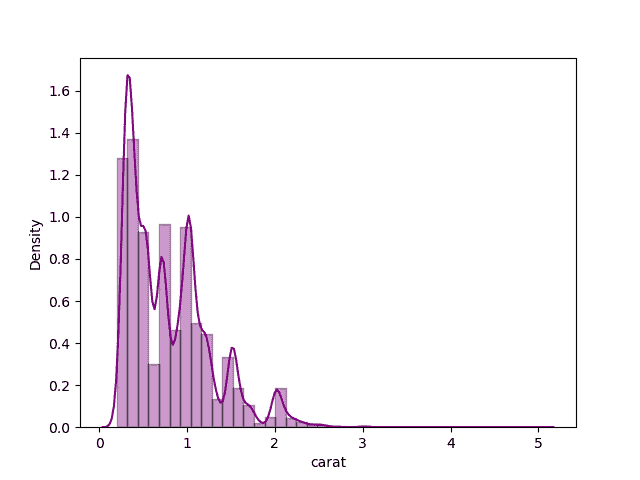
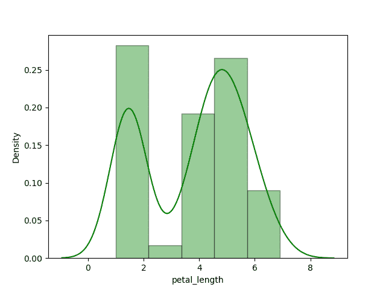
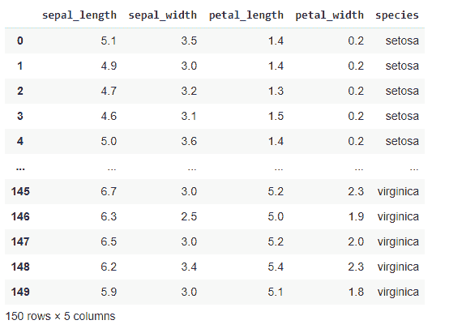

# Python 中的直方图和密度图

> 原文:[https://www . geesforgeks . org/python 中的直方图和密度图/](https://www.geeksforgeeks.org/histograms-and-density-plots-in-python/)

**先决条件:** [海伯恩](https://www.geeksforgeeks.org/introduction-to-seaborn-python/#:~:text=Seaborn%20is%20an%20amazing%20visualization,the%20data%20structures%20from%20pandas.)

**直方图**是将一组数据点组织到指定范围内的图形表示。创建直方图提供了数据分布的可视化表示。通过使用直方图，我们可以表示大量数据及其频率。

**密度图**是根据数据估计的直方图的连续和平滑版本。通过*核密度估计进行估计。*

在这种方法中，在每个单独的数据点绘制内核(连续曲线)，然后将所有这些曲线加在一起，进行单一平滑密度估计。当我们想要比较单个变量在多个类别中的数据分布时，直方图会失败，因为密度图对于可视化数据非常有用。

### 方法:

*   导入必要的库。
*   从*海底*库中创建或导入数据集。
*   选择我们要绘图的列。
*   为了制作图，我们使用了*海底*库提供的*距离图()*函数来绘制直方图和密度图，其中我们必须传递数据集列。
*   我们也可以根据需要使用 *distplot()* 功能分别制作直方图和密度图。
*   为了单独创建直方图，我们必须将 *hist=False* 作为参数传递到*distpract()*函数中。
*   为了单独创建密度图，我们必须将 *kde=False* 作为参数传递给 distplot()函数。
*   现在在制作好剧情之后，我们必须要可视化，所以为了可视化，我们必须使用 *matplotlib.pyplot* 库提供的 *show()* 功能。

为了一起绘制直方图和密度图，我们使用了由*海伯恩*图书馆提供的[钻石](https://www.kaggle.com/shivam2503/diamonds)和[虹膜](https://www.kaggle.com/uciml/iris)数据集。

**示例 1:** 导入数据集并打印。

## 计算机编程语言

```
# importing seaborn library
import seaborn as sns

# importing dataset from the library
df = sns.load_dataset('diamonds')

# printing the dataset
df
```

**输出:**



**示例 2:** 在默认设置下，使用*海鸟*库绘制直方图。

## 计算机编程语言

```
# importing necessary libraries
import seaborn as sns
import matplotlib.pyplot as plt

# importing diamond dataset from the library
df = sns.load_dataset('diamonds')

# plotting histogram for carat using distplot()
sns.distplot(a=df.carat, kde=False)

# visualizing plot using matplotlib.pyplot library
plt.show()
```

**输出:**



**示例 3:** 在默认设置下使用*海底*库绘制密度。

## 计算机编程语言

```
# importing libraries
import seaborn as sns
import matplotlib.pyplot as plt

# importing diamond dataset from the library
df = sns.load_dataset('diamonds')

# plotting density plot for carat using distplot()
sns.distplot(a=df.carat, hist=False)

# visualizing plot using matplotlib.pyplot library
plt.show()
```

**输出:**



**示例 4:** 在默认设置下同时绘制直方图和密度图。

## 计算机编程语言

```
# importing libraries
import seaborn as sns
import matplotlib.pyplot as plt

# importing diamond dataset from the library
df = sns.load_dataset('diamonds')

# plotting histogram and density
# plot for carat using distplot()
sns.distplot(a=df.carat)

# visualizing plot using matplotlib.pyplot library
plt.show()
```

**输出:**



**示例 5:** 通过设置箱和颜色，一起绘制直方图和密度图。

## 计算机编程语言

```
# importing libraries
import seaborn as sns
import matplotlib.pyplot as plt

# importing diamond dataset from the library
df = sns.load_dataset('diamonds')

# plotting histogram and density plot
# for carat using distplot() by setting color
sns.distplot(a=df.carat, bins=40, color='purple',
             hist_kws={"edgecolor": 'black'})

# visualizing plot using matplotlib.pyplot library
plt.show()
```

**输出:**



**示例 6:** 使用 Iris 数据集一起绘制直方图和密度图。

## 计算机编程语言

```
# importing libraries
import seaborn as sns
import matplotlib.pyplot as plt

# importing iris dataset from the library
df2 = sns.load_dataset('iris')

# plotting histogram and density plot for
# petal length using distplot() by setting color
sns.distplot(a=df2.petal_length, color='green',
             hist_kws={"edgecolor": 'black'})

# visualizing plot using matplotlib.pyplot library
plt.show()
```

**输出:**



我们还可以通过添加一行代码来打印虹膜数据集，即 print(df2)，数据集看起来像。



**实施例 7:** 在萼片长度上一起绘制直方图和密度图。

## 计算机编程语言

```
# importing libraries
import seaborn as sns
import matplotlib.pyplot as plt

# importing iris dataset from the library
df2 = sns.load_dataset('iris')

# plotting histogram and density plot for
# sepal width using distplot() by setting color
sns.distplot(a=df2.sepal_width, color='red',
             hist_kws={"edgecolor": 'white'})

# visualizing plot using matplotlib.pyplot library
plt.show()
```

**输出:**


这样，我们可以根据需要在任何数据集列上一起绘制直方图和密度图。