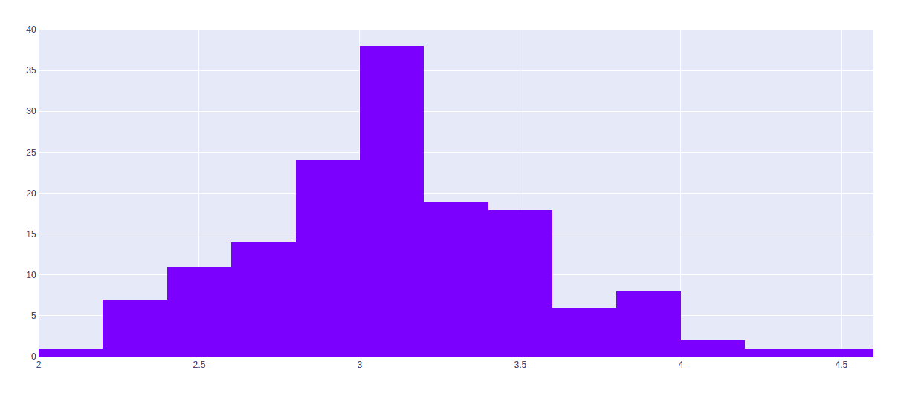

# 使用 graph_objects 类绘制直方图

> 原文:[https://www . geeksforgeeks . org/直方图-in-plot-use-graph _ objects-class/](https://www.geeksforgeeks.org/histograms-in-plotly-using-graph_objects-class/)

**Plotly** 是一个 Python 库，用来设计图形，尤其是交互图形。它可以绘制各种图形和图表，如直方图、条形图、箱线图、展开图等。它主要用于数据分析以及财务分析。plotly 是一个交互式可视化库。

## 使用 graph_objects 类的直方图

Plotly 提供了更通用的 go。plotly.graph_objects 中的直方图类。但是让我们首先了解什么是宿主图。直方图很少有重要部分，如下所述:

*   **标题:**标题起到描述直方图中承认的信息的作用。
*   **X 轴:**X 轴是显示测量值范围的间隔。
*   **Y 轴:**Y 轴显示数值在 X 轴设定的间隔内出现的次数。
*   **横条:**横条的高度表示数值在区间内出现的次数，而横条的宽度表示被覆盖的区间。对于具有相同条的直方图，所有条的宽度应该相同。

> **语法:【plotly.graph _ objects 类。直方图(arg =无，alignmentgroup =无，autobinx =无，autobiny =无，bingroup =无，累积=无，customdata =无，customdatasrc =无，error _ x =无，error _ y =无，histfunc =无，histnorm =无，气垫信息=无，气垫信息 src =无，气垫标签=无，气垫模板=无，气垫模板 src =无，气垫文本=无，气垫文本 src =无，ids =无，idssrc =无，legendgroup =无，标记**

**参数:**

<figure class="table">

| 名字 | 描述 |
| --- | --- |
| 银 | 与此构造函数或 plotly.graph_objects 实例兼容的属性字典。柱状图 |
| 对齐组 | 将链接到同一位置轴或匹配轴的多个轨迹设置为同一对齐组。这控制条是独立还是独立计算它们的位置范围。 |
| 自传 | 过时:由于 v1.42 每个 bin 属性都是单独自动确定的，因此不需要 autobinx。但是，我们接受 autobinx: true 或 false，并将在从跟踪中删除 autobinx 之前相应地更新 xbins。 |
| 自传 | 过时:由于 v1.42 每个 bin 属性都是单独自动确定的，不需要自传。但是，我们接受 auto bony:true 或 false，并将在从跟踪中删除 auto bony 之前相应地更新 ybins。 |
| 宾鲁普 | 设置一组直方图轨迹，这些轨迹将具有兼容的 bin 设置。请注意，在相同的子图上并且在酒吧代码“stack”下具有相同“方向”的轨迹，“relative”和“group”被强制到相同的 bingroup 中。使用 bingroup，酒吧代码“overlay”下和不同轴(相同轴类型)上的轨迹可以具有兼容的 bin 设置。请注意，直方图和组织图 2d*轨迹可以共享同一个并集 |
| 累积的 | plotly.graph_objects .直方图.具有兼容属性的累积实例或字典 |
| customsata(自定义 sata) | 为每个数据分配额外的数据。这在收听悬停、点击和选择事件时可能很有用。请注意，“分散”跟踪还会在标记 DOM 元素中追加自定义数据项 |
| customsatasrc | 为自定义数据设置 Chart Studio 云上的源引用。 |
| 错误 _x | plotly.graph_objects .直方图. ErrorX 实例或具有兼容属性的 dict |
| 错误 _y | plotly.graph_objects .直方图. ErrorY 实例或具有兼容属性的 dict |
| histfunc | 指定用于此直方图跟踪的宁滨函数。如果是“计数”，直方图值是通过计算位于每个箱内的值的数量来计算的。如果“总和”、“平均值”、“最小值”、“最大值”，则直方图值分别使用位于每个箱内的值的总和、平均值、最小值或最大值来计算。 |
| histnorm | 指定用于此直方图跟踪的规范化类型。如果为“”，则每个条的跨度对应于出现的次数(即位于箱内的数据点的数量)。如果是“百分比”/“概率”，则每个条的跨度对应于相对于样本点总数的出现百分比/分数(这里，所有 bin HEIGHTS 的总和等于 100% / 1)。如果是“密度”，每个条的跨度对应于一个面元中出现的次数除以面元间隔的大小(这里，所有面元区域的总和等于样本点的总数)。如果是概率密度，则每个条的面积对应于一个事件落入对应的 bin 的概率(这里，所有 bin AREAS 的和等于 1)。 |
| 徘徊 | 确定悬停时显示哪些跟踪信息。如果设置了无或跳过，悬停时不会显示任何信息。但是，如果没有设置，点击和悬停事件仍然会触发。 |
| 悬停信息 src | 为悬停信息设置 Chart Studio 云上的源引用。 |
| 气垫标签 | plotly.graph_objects .直方图.气垫标签实例或具有兼容属性的 dict |
| 悬停模板 | 用于呈现悬停框上显示的信息的模板字符串。请注意，这将覆盖气垫信息。使用%{variable}插入变量，例如“y: %{y}”。数字使用 d3 格式的语法% {变量:d3-format}进行格式化，例如“价格:%{y:$.2f}”。有关格式化语法的详细信息，请参见 https://github.com/d3/d3-3.x-api-引用/blob/master/formatting . MD # D3 _ format。日期使用 d3-time-format 的语法%{variable&#124;d3-time- format}进行格式化，例如“Day: %{2019-01-01&#124;%A}”。有关日期格式语法的详细信息，请参见 https://github.com/d3/d3-3.x-api-参考/blob/master/Time-formatting . MD #格式。此外，每个可以按点指定的属性(array yok:true)都是可用的。变量 binNumber 标签<extra>中包含的任何内容都会显示在辅助框中，例如“ <extra>{fullData.name}</extra> ”。要完全隐藏副箱，请使用空标签 <extra></extra> 。</extra> |
| 气垫模板 stc | 为悬停模板设置 Chart Studio 云上的源引用 |
| 悬停文本 | 与文本相同 |
| 悬停文本 src | 为悬停文本设置 Chart Studio 云上的源引用。 |
| 本能冲动 | 为每个基准指定 id 标签。这些 id 用于动画期间数据点的对象恒定性。应该是字符串数组，而不是数字或任何其他类型。 |
| idssrc | 为 id 设置 Chart Studio 云上的源引用。 |
| legendgroup | 为此跟踪设置图例组。切换图例项时，同时跟踪同一图例组的隐藏/显示部分。 |
| 标记 | plotly.graph_objects .直方图.具有兼容属性的标记实例或 dict |
| 自指的 | 分配与此跟踪相关联的额外元信息，这些信息可用于各种文本属性。跟踪名称、图形、轴和颜色条标题、文本、注释文本范围选择器、更新菜单和滑块标签文本等属性都支持 meta。要访问同一跟踪中属性的跟踪元值，只需使用%{meta[i]}，其中 I 是所讨论的元项的索引或键。要访问布局属性中的跟踪元，请使用% { data[n]。meta[i]}其中 I 是 meta 的索引或键，n 是跟踪索引。 |
| metasrc | 为元设置 Chart Studio 云上的源引用。 |
| 名字 | 设置跟踪名称。跟踪名称显示为图例项，悬停时 |
| nbinsx | 指定所需箱的最大数量。该值将用于一种算法，该算法将决定最佳的箱大小，以便直方图最好地可视化数据的分布。如果提供了 xbins.size，则忽略。 |
| 笨蛋 | 指定所需箱的最大数量。该值将用于一种算法，该算法将决定最佳的箱大小，以便直方图最好地可视化数据的分布。如果提供了 ybins.size，则忽略。 |
| 偏移组 | 将链接到同一位置轴或匹配轴的多个轨迹设置到同一偏移组，在该偏移组中，同一位置坐标的条将对齐。 |
| 不透明 | 设置跟踪的不透明度。 |
| 方向 | 设置条形的方向。用“v”(“h”)，每个条的值沿垂直(水平)跨越。 |
| 挑选 | plotly.graph_objects .直方图.具有兼容属性的选定实例或字典 |
| 选择的点 | 包含所选点的整数索引的数组。仅对支持选择的跟踪有效。请注意，空数组意味着空选择，其中所有点都打开了未选择，而任何其他非数组值意味着没有选择所有选定和未选定的样式没有影响。 |
| 炫耀 | 确定图例中是否显示与此跟踪对应的项目。 |
| 溪流 | plotly.graph_objects .直方图.流实例或具有兼容属性的 dict |
| 文本 | 设置与每个栏关联的悬停文本元素。如果是单个字符串，则相同的字符串会出现在所有条上。如果是一个字符串数组，这些项将按照这个轨迹的坐标进行映射。 |
| textsrc | 为文本设置 Chart Studio 云上的源引用。 |
| 用户界面设计（User Interface Design 的缩写） | 为该轨迹分配一个 id，使用该 id 在动画和过渡期间提供轨迹之间的对象恒定性。 |
| firevision | 控制某些用户驱动的跟踪更改的持久性:parcoords 跟踪中的 constraintrange，以及一些可编辑的:真实的修改，如名称和 colorbar.title .默认为 layout . uir vision .注意，其他用户驱动的跟踪属性更改由布局属性控制:trace.visible 由 layout . legend . uir vision 控制，selectedpoints 由 layout.selectionrevision 和 colorbar 控制。(x&#124;y)(可通过配置访问:{可编辑:true})由 layout.editrevision 控制。跟踪更改由 uid 跟踪，只有在未提供 uid 的情况下，uid 才会返回跟踪索引。因此，如果您的应用程序可以在数据数组结束之前添加/删除跟踪，从而使同一跟踪具有不同的索引，那么如果您为每个跟踪提供一个在移动时保持不变的 uid，您仍然可以保留用户驱动的更改。 |
| 未经选择的 | plotly.graph_objects .直方图.具有兼容属性的未选定实例或 dict |
| 看得见的 | 确定此跟踪是否可见。如果是“图例”，则不会绘制轨迹，但可以显示为图例项(前提是图例本身可见)。 |
| x | 设置要在 x 轴上入库的样本数据。 |
| xaxis | 设置该轨迹的 x 坐标和 2D 笛卡尔 x 轴之间的参考。如果是“x”(默认值)，则 x 坐标指的是 layout.xaxis，如果是“x2”，则 x 坐标指的是 layout.xaxis2，依此类推。 |
| xbins | plotly.graph_objects .直方图. XBins 实例或具有兼容属性的 dict |
| 日历 | 设置用于 x 日期数据的日历系统。 |
| xsrc | 在图表工作室云上为 x 设置源引用 |
| y | 设置要在 y 轴上入库的样本数据。 |
| 亚克斯 | 设置此轨迹的 y 坐标和 2D 笛卡尔 y 轴之间的参考。如果是“y”(默认值)，y 坐标指的是 layout.yaxis，如果是“y2”，y 坐标指的是 layout.yaxis2，依此类推。 |
| ybins | plotly.graph_objects .直方图. YBins 实例或具有兼容属性的 dict |
| 日历 | 设置用于 y 日期数据的日历系统。 |
| ysrc | 在图表工作室云上为 y 设置源引用。 |

</figure>

**示例:**

## 蟒蛇 3

```py
import plotly.express as px
import plotly.graph_objects as go

df = px.data.iris()

fig = go.Figure(data=[go.Histogram(x=df['sepal_width'])])
fig.show()
```

**输出:**



## 水平直方图

水平直方图是一种直方图，其中数据水平显示在图中的条中。数据根据它们的值和箱的范围被分组到类别或箱中。应使用 y 参数代替 x 参数来制作水平直方图。

**示例:**

## 蟒蛇 3

```py
import plotly.express as px
import plotly.graph_objects as go

df = px.data.iris()

fig = go.Figure(data=[go.Histogram(y=df['sepal_width'])])
fig.show()
```