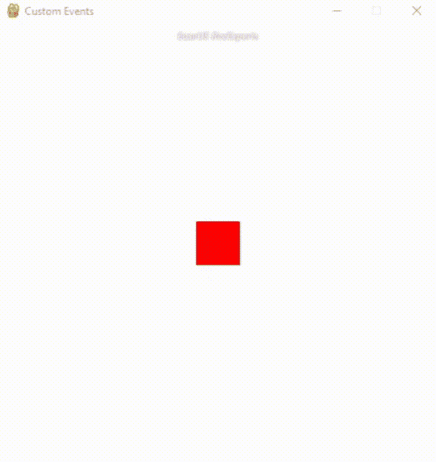

# 如何在 Pygame 中添加自定义事件？

> 原文:[https://www . geesforgeks . org/how-add-custom-events-in-pygame/](https://www.geeksforgeeks.org/how-to-add-custom-events-in-pygame/)

在本文中，我们将看到如何在 [PyGame](https://www.geeksforgeeks.org/introduction-to-pygame/) 中添加自定义事件。

### 装置

可以使用以下命令安装 PyGame 库:

```py
pip install pygame
```

虽然 PyGame 自带一组事件(如:KEYDOWN 和 KEYDOWN)，但它允许我们根据自己游戏的要求创建自己的附加自定义事件。自定义事件增加了我们对游戏的控制和灵活性。自定义事件与创建用户定义的事件相同。

**语法:**

> <event_name>=游戏。USEREVENT + 1</event_name>

**示例:**

> #这里加减是事件名称
> 
> 加法= pygame。USEREVENT + 1
> 
> 减法= pygame。USEREVENT + 2

现在，一旦创建了自定义事件，我们如何发布它们？这可以通过两种方式实现:

*   使用 **pygame.event.post()** 方法。
*   使用 **pygame.time.set_timer()** 方法。

### 使用 pygame.event.post()方法

我们可以使用 **pygame.event.post()** 方法直接发布我们的事件。此方法将我们的事件添加到队列事件的末尾。为了执行这个，我们需要将我们的事件转换为 Pygame 的事件类型，以便匹配 post 方法的属性并避免错误。

**语法:**

> #步骤 1–将事件转换为 pygame 的事件数据类型
> 
> ADD_event = pygame.event.Event(事件)
> 
> #第 2 步–发布活动
> 
> pygame . event . post(ADD _ event)# event _ name 作为参数

### 使用 pygame.time.set_timer()方法

使用 PyGame 计时器定期广播事件。这里，我们将使用另一种方法通过使用 **set_timer()** 函数来发布事件，该函数采用两个参数，一个用户事件名称和以毫秒为单位的时间间隔。

**语法:**

> # event_name，时间(毫秒)
> 
> pygame.time.set_timer(事件，持续时间)

**注意:**在这种情况下，我们不需要将用户定义的事件转换为 PyGame 事件数据类型。

现在要创建一个带有自定义事件的图，首先应该根据需要设置屏幕的属性。然后创建一个事件，并将其转换为 PyGame 事件数据类型。现在为您的操作添加将生成自定义事件的代码。

在给定的实现中，这两种方法都得到了处理。

**程序:**

## 蟒蛇 3

```py
# Python program to add Custom Events
import pygame

pygame.init()

# Setting up the screen and timer
screen = pygame.display.set_mode((500, 500))
timer = pygame.time.Clock()

# set title
pygame.display.set_caption('Custom Events')

# defining colours
WHITE = (255, 255, 255)
RED = (255, 0, 0)
GREEN = (0, 255, 0)
BLUE = (0, 0, 255)

# Keep a track of active variable
bg_active_color = WHITE
screen.fill(WHITE)

# custom user event to change color
CHANGE_COLOR = pygame.USEREVENT + 1

# custom user event to inflate defalte
# box
ON_BOX = pygame.USEREVENT + 2

# creating Rectangle
box = pygame.Rect((225, 225, 50, 50))
grow = True

# posting a event to switch color after 
# every 500ms
pygame.time.set_timer(CHANGE_COLOR, 500)

running = True
while running:

    # checks which all events are posted
    # and based on that perform required
    # operations
    for event in pygame.event.get():

        # switching colours after every
        # 500ms
        if event.type == CHANGE_COLOR:
            if bg_active_color == GREEN:
                screen.fill(GREEN)
                bg_active_color = WHITE
            elif bg_active_color == WHITE:
                screen.fill(WHITE)
                bg_active_color = GREEN

        if event.type == ON_BOX:

            # to inflate and deflate box
            if grow:
                box.inflate_ip(3, 3)
                grow = box.width < 75
            else:
                box.inflate_ip(-3, -3)
                grow = box.width < 50

        if event.type == pygame.QUIT:

            # for quitting the program
            running = False

    # Posting event when the cursor is on top 
    # of the box
    if box.collidepoint(pygame.mouse.get_pos()):
        pygame.event.post(pygame.event.Event(ON_BOX))

    # Drawing rectangle on the screen
    pygame.draw.rect(screen, RED, box)

    # Updating Screen
    pygame.display.update()

    # Setting Frames per Second
    timer.tick(30)

pygame.quit()
```

**输出:**



在上面的实现中，我们使用了**。post()** 当光标位于盒子顶部和**时，给盒子充气/放气的方法。set_timer()** 方法每 500ms 后切换背景色。