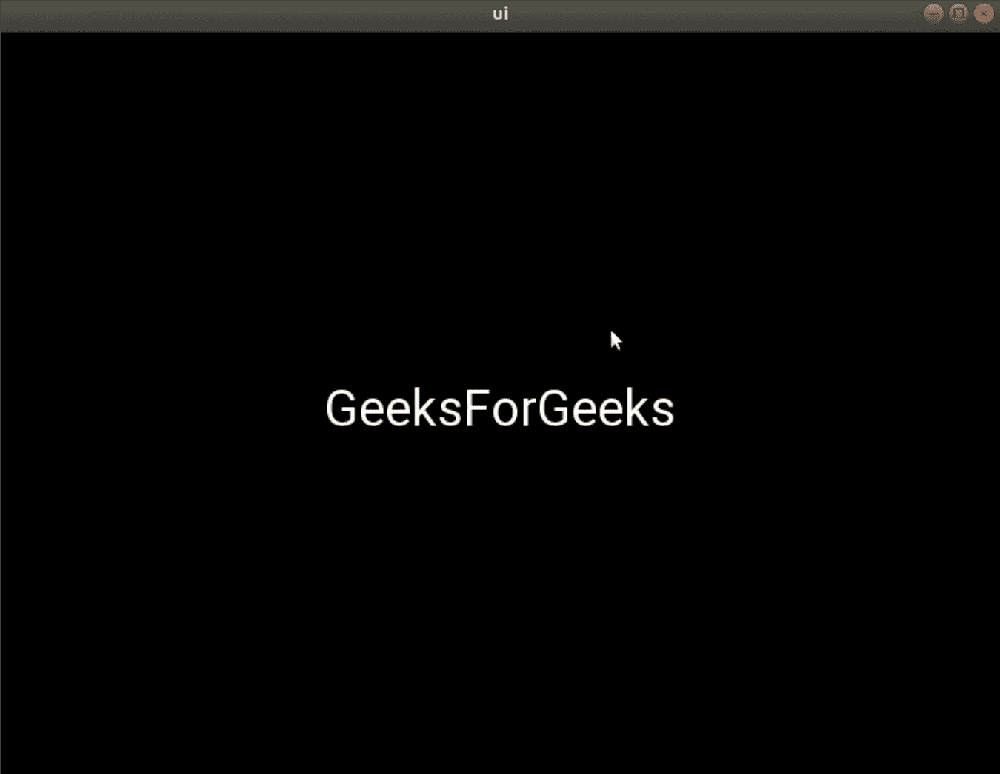

# 如何在 kivy widget 中添加拖拽行为？

> 原文:[https://www . geesforgeks . org/如何在 kivy-widget 中添加拖动行为/](https://www.geeksforgeeks.org/how-to-add-drag-behavior-in-kivy-widget/)

在本文中，我们将使用 python 的 kivy 框架开发一个 GUI 窗口，并且我们将在这个窗口上添加一个具有拖动行为的标签

**注意:**您也可以遵循相同的模式在其他小部件上实现拖动事件。

### 方法:

实际上我们正在做的是，我们正在使用的只是使用继承的概念，我们正在通过结合 Kivy Label 小部件和 Kivy 的 DragBehaviour 类的属性来制作一个新的小部件(DraggableLabel)。从代码中，您可以看到我们定义了三个属性

*   **drag_rectangle:** 这是我们想要启用拖动的区域，您可以从代码中看到我们使用了这个属性值，因为我们想要在整个布局中启用拖动。
*   **drag_timeout:** 它指定如果标签没有被拖动，拖动将从标签中禁用的时间，但是如果我们开始拖动，它将再次发挥作用。
*   **拖动距离:**拖动拖动行为前要移动的距离，以像素为单位。一旦移动了距离，DragBehavior 就会开始拖动，并且不会向孩子发送任何触摸事件。

在定义属性之后，我们只是像使用其他小部件一样使用新创建的小部件。

以下是实施情况:

## 蟒蛇 3

```
from kivy.app import App
from kivy.uix.label import Label

# importing builder from kivy
from kivy.lang import Builder
from kivy.uix.behaviors import DragBehavior

# using this class we will combine
# the drag behaviour to our label widget
class DraggableLabel(DragBehavior, Label):
    pass

# this is the main class which
# will render the whole application
class uiApp(App):

    # method which will render our application
    def build(self):
        return Builder.load_string("""
<DraggableLabel>:
    drag_rectangle: self.x, self.y, self.width, self.height
    drag_timeout: 10000
    drag_distance: 0
DraggableLabel:
    text:"[size=40]GeeksForGeeks[/size]"
    markup:True
                                   """)

# running the application
uiApp().run()
```

**输出:**

