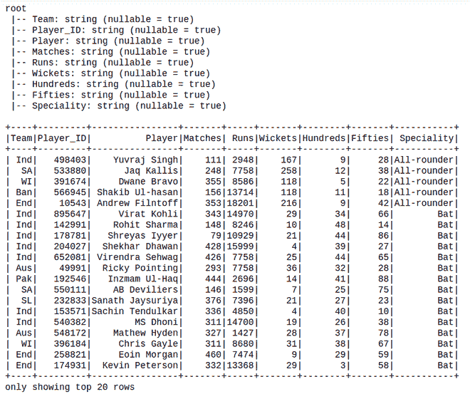

# 如何在 PySpark 数据框中添加多列？

> 原文:[https://www . geesforgeks . org/how-add-multi-columns-in-py spark-data frames/](https://www.geeksforgeeks.org/how-to-add-multiple-columns-in-pyspark-dataframes/)

在本文中，我们将看到在 PySpark 数据框中添加多列的不同方式。

让我们创建一个示例数据框进行演示:

**使用的数据集:** [蟋蟀 _ 数据集 _ 奥迪](https://media.geeksforgeeks.org/wp-content/cdn-uploads/20210628161151/Cricket_data_set_odi.csv)

## 蟒蛇 3

```py
# import pandas to read json file
import pandas as pd

# importing module
import pyspark

# importing sparksession from pyspark.sql
# module
from pyspark.sql import SparkSession

# creating sparksession and giving an app name
spark = SparkSession.builder.appName('sparkdf').getOrCreate()

# create Dataframe
df=spark.read.option(
    "header",True).csv("Cricket_data_set_odi.csv")

# Display Schema
df.printSchema()

# Show Dataframe
df.show()
```

**输出:**



### **方法 1:使用 withColumn()**

withColumn()用于在数据框中添加新列或更新现有列

> **语法:** df.withColumn(colName，col)
> 
> **通过添加一列或替换同名的现有列，返回:**一个新的:类:` DataFrame '。

**代码:**

## 蟒蛇 3

```py
df.withColumn(
    'Avg_runs', df.Runs / df.Matches).withColumn(
    'wkt+10', df.Wickets+10).show()
```