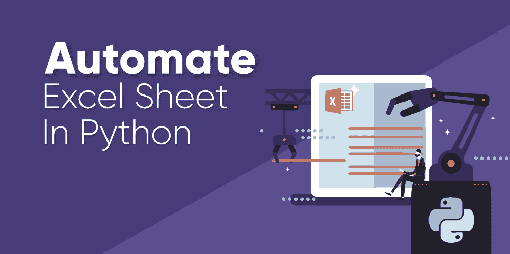
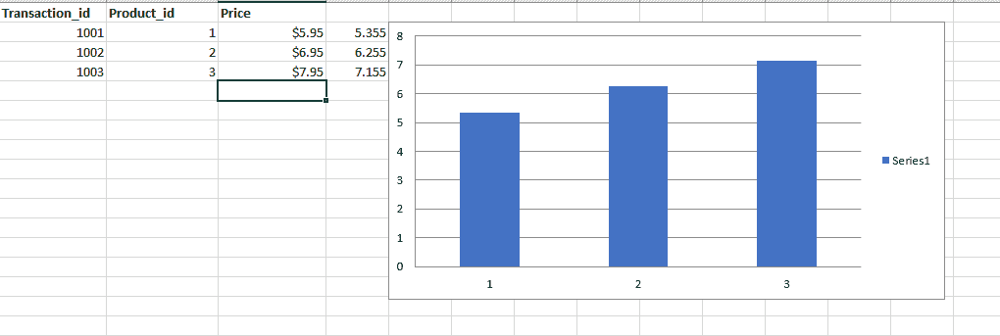

# 如何用 Python 自动生成 Excel 工作表？

> 原文:[https://www . geesforgeks . org/如何在 python 中自动生成 excel 表单/](https://www.geeksforgeeks.org/how-to-automate-an-excel-sheet-in-python/)

在您阅读本文并学习 Python 中的自动化之前。我们来看一段 Christian Genco (一位才华横溢的程序员和企业家)的[视频，以自动化为例说明编码的重要性。](https://www.youtube.com/watch?v=xfBWk4nw440&t=11s&ab_channel=TEDxTalks)

看完这个视频，你可能会笑得很大声，你肯定也会明白自动化在现实生活中的重要性。现在让我们进入主题…

我们都知道 Python 统治着全世界，我们也知道[**【Python】**](https://www.geeksforgeeks.org/python-programming-language/)是初学者友好的，和其他语言相比很容易学会。使用 Python 可以做的最好的事情之一是自动化。



考虑一个场景，要求你在一个网站上为 30，000 名员工创建一个帐户。你会有什么感觉？你肯定会因为手动重复做这个任务而感到沮丧。此外，这将花费太多时间，这不是一个明智的决定。

现在想象一下从事数据输入工作的员工的生活。他们的工作是从 Excel 或 Google Sheet 等表格中获取数据，并将其插入其他地方。他们浏览不同的网站和杂志，从那里收集数据，然后插入数据库。他们还需要对条目进行计算。

一般来说，收入是基于这份工作的表现。参赛作品越多，薪水越高(*当然每个人都希望自己的工作* *薪水更高*)。

*但是你不觉得重复做同样的事情很无聊吗？*

现在的问题是…”*我怎么做得快？*”、“*如何实现工作自动化？*”

与其手动完成这些任务，不如花一个小时编码并自动化这些事情，让你的生活更轻松。只需用 Python 编写更少的代码行，就可以自动完成繁琐的任务。

在这个博客中，我们将创建一个小项目来学习 Python 中的自动化。 ***如果你是一个初学者，那么你可能更喜欢看一些视频来学习 Python 中的自动化，阅读这个博客对你来说可能是一项无聊的任务，但是在这里我们将一步一步地详细解释一切，并让事情变得更容易。**T3】*

如果你已经知道 Python 的核心概念，那就太好了。我们将举一个带有一些条目的 Excel 表格的例子，我们将学习自动化过程。我们将编写一个 Python 程序，可以在一秒钟内处理数千个电子表格。兴奋吗？？？让我们开始吧…

### 任务简介

手动处理或更新成千上万的电子表格将花费太多时间。这可能需要几小时、几天甚至几个月的时间。我们将编写一个 Python 程序来自动完成这项任务。我们将制作下图中给出的电子表格。


在这个电子表格中，我们有各种交易的记录，但是假设由于一个错误(人为错误或系统错误)，第三列所列产品的**价格**是错误的。假设我们需要将价格降低 10%(将价格乘以 0.9 并重新计算价值)。您可以通过使用第四列中的数学公式手动完成这项任务，但是如果有成千上万条记录，这将花费太多时间(可能需要 1 周或两周)。

我们将编写一个 python 程序来自动化这个过程。此外，我们将向其中添加一个图表。我们的 python 程序将在几秒钟内为我们完成这项任务。

### 让我们进入编码区

为了处理这张 Excel 表格，我们将使用一个库 **openpyxl。**在你的目录中创建一个文件夹，给它一个名称，并通过在你的终端中执行以下命令来安装 **openpyxl** 包。

```py
pip install openpyxl
```

现在我们可以导入这个包来处理我们的电子表格。在此之前，将电子表格添加到项目文件夹中。现在在你的文件夹中创建一个文件 app.py，并写下下面给出的代码。

## 计算机编程语言

```py
import openpyxl as xl
from openpyxl.chart import BarChart, Reference

wb = xl.load_workbook('python-spreadsheet.xlsx')
sheet = wb['Sheet1']

for row in range(2, sheet.max_row + 1):
    cell = sheet.cell(row, 3)
    corrected_price = float(cell.value.replace('{content}apos;,'')) * 0.9
    corrected_price_cell = sheet.cell(row, 4)
    corrected_price_cell.value = corrected_price

values = Reference(sheet, min_row=2, max_row=sheet.max_row, min_col=4, max_col=4)
chart = BarChart()
chart.add_data(values)
sheet.add_chart(chart, 'e2')

wb.save('python-spreadsheet2.xlsx')
```

### 让我们理解上面的代码

我们将逐步解释上面编写的代码，以了解完整的过程。

**第一步。**为了处理我们的电子表格导入 **openpyxl** 包(我们使用了 xl 别名来使我们的代码更简洁)。此外，为了给我们的电子表格添加图表，我们需要导入两个类:条形图和引用。

```py
import openpyxl as xl
from openpyxl.chart import BarChart, Reference
```

**第二步。**现在我们需要加载 Excel 工作簿**python-spreadhssheet . xlsx .**写下下面给出的代码。wb 返回该对象，使用该对象，我们可以从工作簿中访问 **Sheet1** 。

```py
wb = xl.load_workbook('python-spreadsheet.xlsx')
sheet = wb['Sheet1']
```

**第三步。**要访问第三列第 2 行到第 4 行的条目(价格列的条目)，我们需要在其中添加一个 for 循环。我们将此条目保存在可变单元格中。

```py
for row in range(2, sheet.max_row + 1):
    cell = sheet.cell(row, 3)
```

**第四步。**现在我们需要计算修正后的价格。因此，我们将保存在**单元**变量中的值乘以 **0.9** 。一旦计算完成，我们需要在一个新的列(第 4 列)中添加所有的修正价格。要添加新列，我们将在给定行的第四列中获取对单元格的引用。一旦创建了单元格，我们就需要在这个单元格(第四列)中设置正确的价格值。

```py
corrected_price = float(cell.value.replace('{content}apos;,'')) * 0.9
corrected_price_cell = sheet.cell(row, 4)
corrected_price_cell.value = corrected_price
```

**第五步。**工作完成了一半。我们已经计算了更新后的价格，并在第四列中添加了该价格。现在我们需要在当前工作表中添加一个图表。要创建图表，我们需要选择一个数值范围。

在这个项目中，我们将选择第四列(更新后的价格)中的值，并在我们的图表中使用这些值(我们只需要一堆数字来创建图表，因此我们以第四列为例。该值可以是根据要求的任何值)。

我们需要使用引用类来选择一个值范围。我们将向这个构造函数添加五个参数。第一个论点是我们正在做的表格。接下来的两个参数 min_row = 2，max_row= sheet.max_row 将选择第 2 行到第 4 行的单元格。要仅从第四列中选择条目，我们需要传递另外两个参数 min_col=4 和 max_col=4。将结果存储在变量“值”中。

```py
values = Reference(sheet, min_row=2, max_row=sheet.max_row, min_col=4, max_col=4)
```

**第六步。**现在我们准备创建一个图表。我们将为类条形图创建一个实例“图表”。创建后，在此图表中添加值。之后，将该图表添加到工作表的第 2 行和第 5 列(e2)。

```py
chart = BarChart()
chart.add_data(values)
sheet.add_chart(chart, 'e2')
```

**第七步。**现在我们需要保存所有更新的条目和我们在上面代码中创建的图表。我们将把它保存在一个新的文件 **python-spreadsheet2.xlsx** 中，因为我们不想在程序有错误的情况下不小心覆盖原始文件。

运行你的程序，你就可以开始了。一个新更新的文件**python-spreadhsheet 2 . xlsx**将为您创建更新的价格和图表。下面是同样的截图。



**第八步。**我们的程序是完整的，但是如果您使用上面的代码，那么它不会自动处理成千上万的电子表格。这个程序只依赖于一个特定的文件，即 python-电子表格. xlsx。

为了使它适用于几个电子表格，我们将重新组织这段代码，并将代码移入一个函数中。该函数将文件名作为输入，并执行该过程。下面是相同的更新代码。

## 计算机编程语言

```py
import openpyxl as xl
from openpyxl.chart import BarChart, Reference

def process_workbook(filename):
    wb = xl.load_workbook(filename)
    sheet = wb['Sheet1']

    for row in range(2, sheet.max_row + 1):
        cell = sheet.cell(row, 3)
        corrected_price = float(cell.value.replace('{content}apos;, '')) * 0.9
        corrected_price_cell = sheet.cell(row, 4)
        corrected_price_cell.value = corrected_price

    values = Reference(sheet, min_row=2, max_row=sheet.max_row, min_col=4, max_col=4)
    chart = BarChart()
    chart.add_data(values)
    sheet.add_chart(chart, 'e2')
    wb.save(filename)
```

**带有电子表格的代码 Github 链接:** [Python 自动化](https://github.com/anuupadhyay/python-automation)

### 最终想法

这只是使用 Python 来自动化重复无聊任务的一个例子。但是请记住，自动化不仅仅是 Excel 电子表格。我们可以自动化很多事情。你可以在各种网站上搜索，比如 Github，你可以用 Python 自动化很多事情。