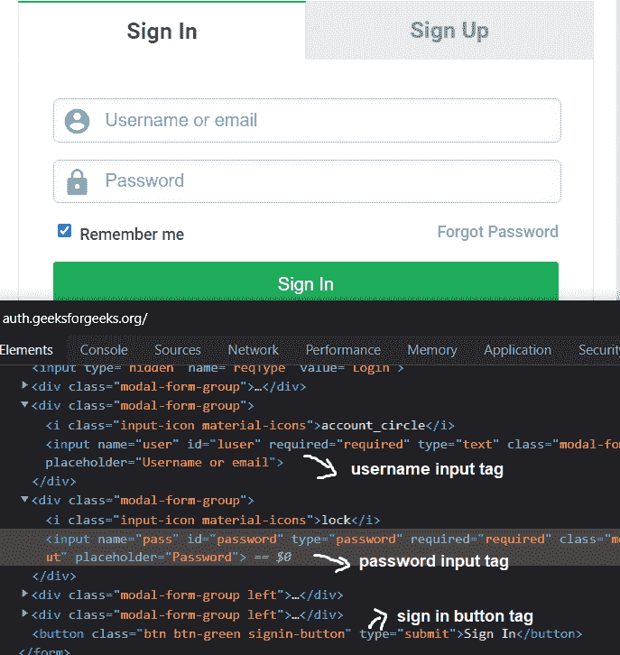
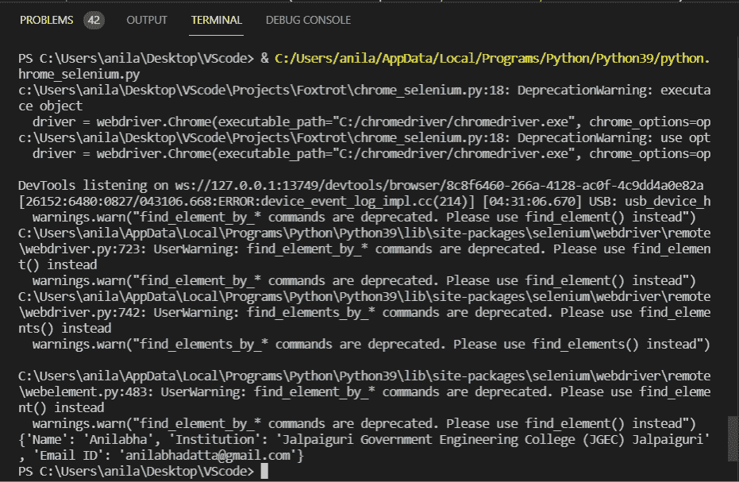
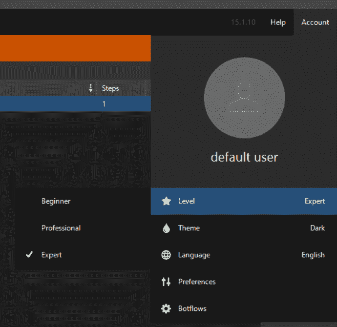
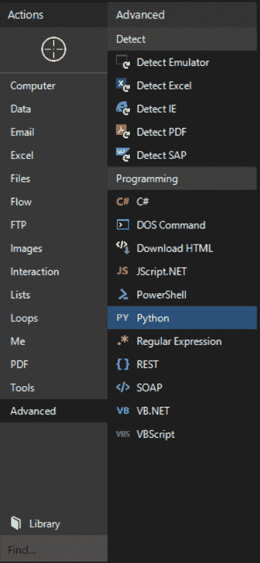
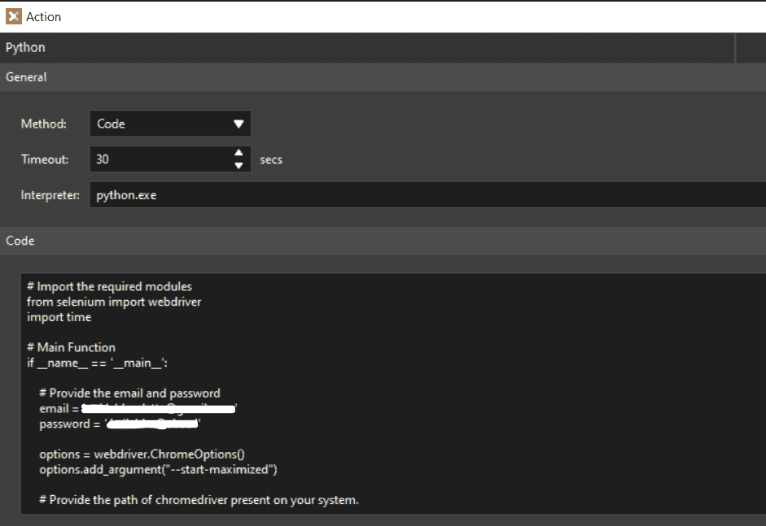
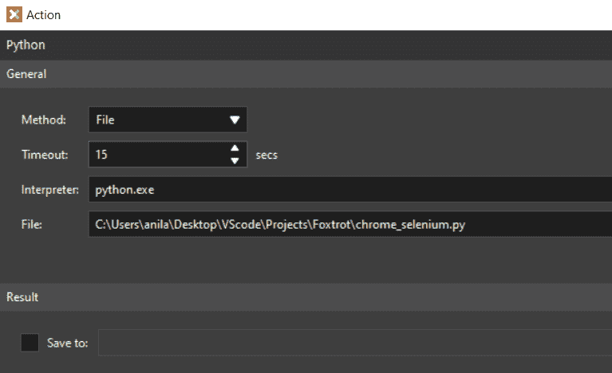
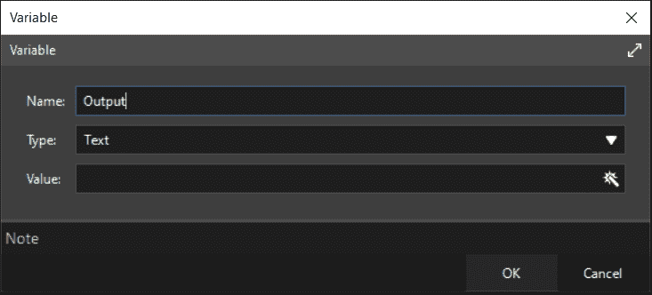
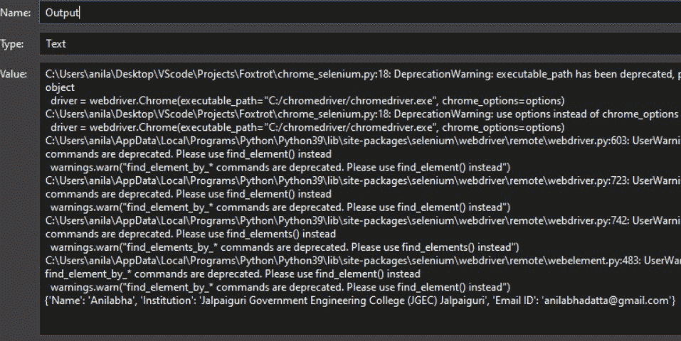

# 如何使用狐步舞和 Python 实现谷歌 Chrome 的自动化

> 原文:[https://www . geeksforgeeks . org/如何自动化-Google-chrome-using-foxtrot-and-python/](https://www.geeksforgeeks.org/how-to-automate-google-chrome-using-foxtrot-and-python/)

在本文中，我们将看到如何使用 Foxtrot & Python 来自动化谷歌 chrome。

## 什么是狐步舞 RPA？

机器人流程自动化(RPA)通过自动化流程中重复、大量的步骤来减少员工的工作量。像狐步舞 RPA 这样的软件机器人模拟人类工作者的动作，通过用户界面在应用程序中执行任务。

## **先决条件:**

*   安装最新版本的狐步舞 RPA。
*   通过在终端中运行以下命令来安装 python selenium 包。
*   安装最新的谷歌 Chrome 及其 Chrome 网络驱动程序。

我们需要创建一个简单的 python 脚本，使用 [selenium](https://www.geeksforgeeks.org/browser-automation-using-selenium/) 和 chrome webdriver 在 Google Chrome 中自动完成一项工作。在这里，我们将在“https://auth.geeksforgeeks.org”自动进行授权，并从登录的配置文件中提取名称、电子邮件、机构名称。

首先，我们通过运行 python 文件来测试它，然后我们将在 Foxtrot python Actions 僵尸流中添加这个 Python 脚本并运行僵尸流。

## **使用网络驱动程序提取信息:**

首先，我们需要使用 selenium 启动 webdriver 并向 [url](https://auth.geeksforgeeks.org) 发送 get 请求，然后识别 HTML 文档并找到接受用户名/电子邮件、密码和登录按钮的输入标签和按钮标签。



**将用户给定的电子邮件和密码分别发送到输入标签:**

```py
driver.find_element_by_name('user').send_keys(email)
driver.find_element_by_name('pass').send_keys(password)
```

**通过 selenium 网络驱动程序使用 CSS 选择器识别按钮标签并点击:**

> driver . find _ element _ by _ CSS _ selector(' button . BTN . BTN-green . sign in-button ')。点击()

点击登录后，将会加载一个包含姓名、机构名称和电子邮件 id 的新页面。

**识别包含上述数据的标签并选择它们:**

> container = driver . find _ elements _ by _ CSS _ selector(' div . MDL-cell . MDL-cell–9-col . MDL-cell–12-col-phone . textbold ')


**从所选 CSS 选择器的返回列表中获取每个标签的文本:**

```py
name = container[0].text
try:
    institution = container[1].find_element_by_css_selector('a').text
except:
    institution = container[1].text
email_id = container[2].text
```

**最后打印输出:**

> 打印({“姓名”:姓名，“机构”:机构，“电子邮件 ID”:电子邮件})

#### 下面是实现:

## 蟒蛇 3

```py
# Import the required modules
from selenium import webdriver
import time

# Main Function
if __name__ == '__main__':

    # Provide the email and password
    email = ''
    password = ''

    options = webdriver.ChromeOptions()
    options.add_argument("--start-maximized")

    # Provide the path of chromedriver
    # present on your system.
    driver = webdriver.Chrome(
        executable_path="C:/chromedriver/chromedriver.exe", 
      chrome_options=options)
    driver.set_window_size(1920, 1080)

    # Send a get request to the url
    driver.get('https://auth.geeksforgeeks.org/')
    time.sleep(5)

    # Finds the input box by name
    # in DOM tree to send both
    # the provided email and password in it.
    driver.find_element_by_name('user').send_keys(email)
    driver.find_element_by_name('pass').send_keys(password)

    # Find the signin button and click on it.
    driver.find_element_by_css_selector(
        'button.btn.btn-green.signin-button').click()
    time.sleep(5)

    # Returns the list of elements
    # having the following css selector.
    container = driver.find_elements_by_css_selector(
        'div.mdl-cell.mdl-cell--9-col.mdl-cell--12-col-phone.textBold')

    # Extracts the text from name,
    # institution, email_id css selector.
    name = container[0].text
    try:
        institution = container[1].find_element_by_css_selector('a').text
    except:
        institution = container[1].text
    email_id = container[2].text

    # Output
    print({"Name": name, "Institution": institution,
           "Email ID": email})

    # Quits the driver
    driver.quit()
```

**输出:**



## **使用狐步舞自动化脚本**

在这里，我们将使用狐步舞来自动化脚本。

**第一步:**打开狐步舞 App，确保在账户设置中选择级别为专家:



**第二步:**新建一个僵尸流，点击动作面板的高级选项卡，选择 Python。



**步骤 3:** 将出现一个新窗口，您可以在其中选择方法作为代码，并在提供的代码框中复制粘贴之前的脚本。



**或者，可以选择包含脚本的 python 文件的方法:**



**第 4 步:**要在 Foxtrot 中显示上述脚本的输出，我们需要创建一个变量。单击保存到旁边的复选框，并选择右侧的魔法按钮。


创建变量

**步骤 5:** 应该会出现一个名为“表达式”的新窗口，在“项目”中选择变量，然后单击窗口右上角的“+”按钮。


**第 6 步:**提供一个名称，选择类型为文本，点击确定。



再次单击确定，然后在保存到框中键入变量的名称。下图表示执行上述步骤后的最终状态。

**点击确定运行机器人:**


**第 7 步:**要查看输出，在僵尸流中选择变量，然后点击先前选择的变量的铅笔按钮。


**输出和我们之前在终端上运行脚本时看到的一样:**



这就是我们如何通过使用 Selenium、Python 和 Foxtrot 实现谷歌 Chrome 的自动化。