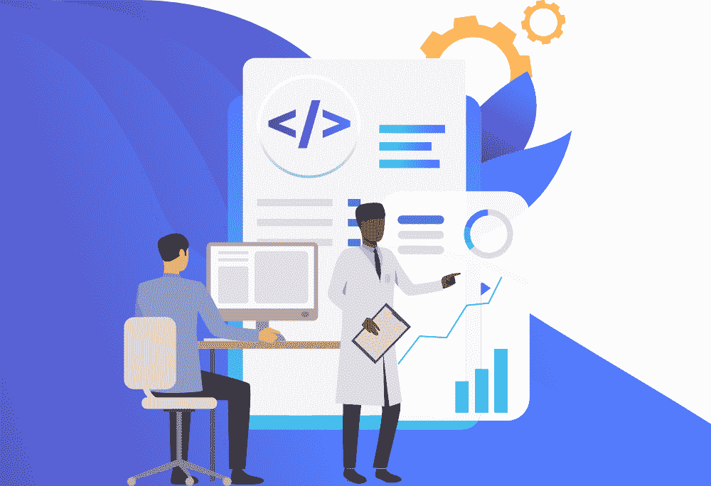

# 2019 年如何成为数据科学家:完整指南

> 原文:[https://www . geesforgeks . org/如何成为 2019 年数据科学家-完整指南/](https://www.geeksforgeeks.org/how-to-become-a-data-scientist-in-2019-a-complete-guide/)

**从文明的黎明到 2003 年，有 5 艾字节的信息被创造出来，但是现在每 2 天就有这么多信息被创造出来。**

这是数据时代。在这个时代，数据科学家是上帝！！！他们拥有从数据管理到机器学习等多种多样的技能。这些多才多艺的魔术师主要负责根据公司要求，通过使用自己创建的预测模型和定制分析，将数据转化为可操作的见解。

换句话说，在当前的数据时代，成为一名数据科学家是一项极其重要的工作。以至于《哈佛商业评论》的一篇文章甚至称之为“T2 21 世纪最性感的工作”(这就是成为其中一员的动力！！).作为一名数据科学家，平均年薪为 [**1，022K**](https://www.glassdoor.co.in/Salaries/india-data-scientist-salary-SRCH_IL.0, 5_IN115_KO6, 20.htm?countryRedirect=true) ，这并没有什么坏处。这就是为什么这篇文章是 2019 年成为数据科学家的完整指南。如果您有兴趣了解更多关于数据科学的知识，这是您可以遵循的路线图。

但是在数据分析师和数据科学家的角色差异之间仍然有很多混淆，所以我们将从这一点开始我们的文章，并继续讨论其他主题，如成为数据科学家的教育要求和技能要求。

### 数据分析师和数据科学家的区别

很明显，数据分析师和数据科学家都有与数据相关的工作描述。但是什么？！！对于数据分析师和数据科学家之间的区别，很多人都有这样的疑问。所以让我们在这里澄清这个疑问！

A **数据分析师**利用数据解决各种问题，为公司获取可操作的见解。这是通过在定义明确的数据集上使用各种工具来回答企业问题来实现的，如“为什么营销活动在某些地区更有效”或“为什么产品销量在当前季度有所下降”等。为此，数据分析师具备的基本技能有**数据挖掘、R、SQL、统计分析、数据分析**等。事实上，许多数据分析师获得了所需的额外技能，成为了数据科学家。

另一方面，一个**数据科学家**可以为数据建模设计新的流程和算法，创建预测模型，并根据公司要求对数据进行定制分析。因此，主要的区别在于，数据科学家可以利用繁重的编码来设计数据建模过程，而不是像数据分析师那样使用预先存在的过程从数据中获得答案。为此，数据科学家具备的基本技能有*数据挖掘、R、SQL、机器学习、Hadoop、统计分析、数据分析、OOPS* 等。所以数据科学家比数据分析师工资高的原因是他们的高技能水平加上高需求和低供给！

### 成为数据科学家的教育要求

作为一名数据科学家，有许多途径可以实现你的目标，你可以遵循其中的任何一条！但请记住，这些路径大多要经过一所大学，因为四年制学士学位是最低要求(硕士和博士当然没坏处！！！)

最直接的途径是完成数据科学学士学位，因为这显然会教会你收集、分析和解释大量数据所需的技能。你会学到所有关于*统计，分析技术，编程语言*等。这只会对你作为数据科学家的工作有所帮助。

你可以走的另一条迂回的道路是完成任何有助于你成为数据科学家的技术学位。其中一些是计算机科学、统计学、数学、经济学等。完成学位后，你将拥有*编码、数据处理、定量问题解决*等技能。可以应用于数据科学。然后你可以找一份入门级的工作，或者完成硕士和博士学位，获得更专业的知识。

### 成为数据科学家的技能要求

每个数据科学家忍者都必须有他们的工具！因此，数据科学家需要跨不同领域的多种技能。其中大部分提到如下:

**1。统计分析:**作为数据科学家，您的主要工作是收集、分析和解释大量数据，并为公司提供可操作的见解。所以很明显，统计分析是工作描述的一大部分！！！
这意味着你至少应该熟悉统计分析的基础知识，包括**统计测试、分布、线性回归、概率论、最大似然估计等。**这还不够！虽然了解哪些统计技术是解决给定数据问题的有效方法很重要，但了解哪些不是更重要。此外，作为数据科学家，有许多分析工具对统计分析非常有帮助。其中最受欢迎的有 [SAS](https://www.geeksforgeeks.org/introduction-to-sas-programming/) 、 [Hadoop](https://www.geeksforgeeks.org/hadoop-an-introduction/) 、 [Spark](https://www.geeksforgeeks.org/introduction-pyspark-distributed-computing-apache-spark/) 、[蜂巢](https://www.geeksforgeeks.org/apache-hive/)、[小猪](https://www.geeksforgeeks.org/introduction-to-apache-pig/)等。所以对他们有一个彻底的了解是很重要的。

**2。编程技能:**编程技能是你作为数据科学家的必备工具！那是因为如果你能根据你的需要使用某些算法，那么研究和理解数据以便得出有用的结论就容易得多。
一般来说， [Python](https://www.geeksforgeeks.org/python-programming-language/) 和 [R](https://www.geeksforgeeks.org/simple-linear-regression-using-r/) 是最常用的语言。使用 Python 是因为它的统计分析能力和易于阅读。Python 还有各种机器学习、数据可视化、数据分析等软件包。(比如 Scikitlearn)这使得它适合数据科学。借助 e1071、rpart 等软件包，r 还可以非常容易地解决数据科学中的几乎任何问题。

**3。机器学习:**如果你与科技行业有任何联系，你很可能听说过[机器学习](https://www.geeksforgeeks.org/machine-learning/)！它基本上使机器能够从经验中学习一项任务，而无需对它们进行专门编程。这是通过使用各种机器学习模型使用数据和不同的算法来训练机器来完成的。
所以你需要熟悉机器学习中的监督和非监督学习算法，比如**线性回归、逻辑回归、K-means 聚类、决策树、K 最近邻、**等。幸运的是，大多数机器学习算法都可以使用 R 或 Python 库来实现(如上所述！)所以你不需要成为它们的专家。您需要的专业知识是能够根据您拥有的数据类型和您试图自动化的任务来理解需要哪种算法。

**4。数据管理和数据争论:**数据在数据科学家的生活中扮演着重要角色(显然！).因此，您需要精通涉及数据提取、转换和加载的数据管理。这意味着您必须从各种来源提取数据，然后将其转换为分析所需的格式，最后将其加载到数据仓库中。为了处理这些数据，有各种各样的框架可用，如 [Hadoop](https://www.geeksforgeeks.org/hadoop-an-introduction/) 、 [Spark](https://www.geeksforgeeks.org/introduction-pyspark-distributed-computing-apache-spark/) 等。
既然已经完成了数据管理的流程，还需要熟悉数据扯皮。现在，你问什么是数据争论？嗯，这基本上意味着仓库中的数据需要以连贯的方式进行清理和统一，然后才能进行分析，以获得任何可操作的见解。

**5。数据直觉:**不要低估数据直觉的力量！事实上，这是将数据科学家与数据分析师区分开来的主要非技术技能。数据直觉基本上包括在没有模式的数据中寻找模式！这几乎就像大海捞针，这是巨大的未开发数据堆中的实际潜力。
数据直觉不是一种可以轻易教你的技能。相反，它来自于**的经验和持续的练习**。反过来，这也让你在数据科学家的角色中更有效率和价值。

**6。沟通技巧:**要成为数据科学家专家，你必须在沟通技巧方面也很出色！这是因为，虽然你比任何人都更了解数据，但你需要将你的数据发现转化为量化的见解，以便非技术团队协助决策。
这还可以涉及到**数据讲故事**！因此，你应该能够以讲故事的形式展示你的数据，并给出具体的结果和价值，这样其他人就能理解你在说什么。这是因为最终，数据分析不如从数据中获得可操作的见解重要，而这些见解反过来又会导致业务增长。