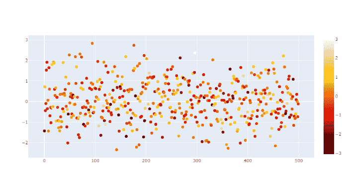
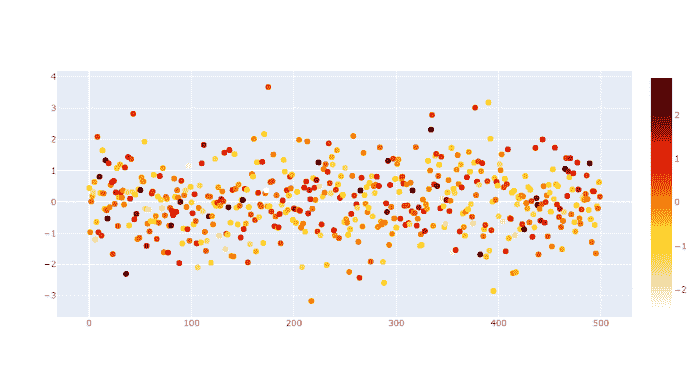
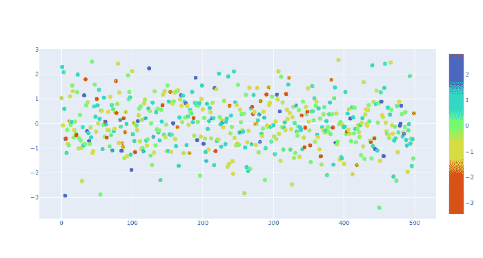

# 如何在 Python 中 Plotly 更改颜色条

> 原文:[https://www . geeksforgeeks . org/如何更改 python 中的颜色条/](https://www.geeksforgeeks.org/how-to-change-a-color-bar-in-plotly-in-python/)

在本文中，我们将学习如何在 Plotly Python 中更改颜色条。

## Plotly 的不同类型色阶名称

<figure class="table">

| 精氨酰 | 城 | 地狱 | 血浆 | rdpu(消歧义) | ylgnbu | 物质 | 间歇泉 |
| 日落 | 伯格尔 | 喷气式飞机 | plotly3 | 绕圈圈圈圈圈圈圈圈圈圈圈圈圈圈圈圈圈圈圈圈圈圈圈圈圈圈圈圈圈圈圈圈圈圈圈圈圈圈 | ylorbr | 太阳的 | 皮尤 |
| 黑体 | 公民炎 | 品红 | 酒馆 | 红色 | ylorrd | 速度 | 野餐 |
| 布鲁斯音乐 | 深色薄荷 | 岩浆 | 普云 | 日落 | 海藻 | 拍子 | 波特兰 |
| 蓝色红色 | 电的 | 铸造 | purd | 日落时分 | 安培 | 热的 | 要执行以下操作 |
| blugrn | 告诉我 | orrd | 狗 | 水鸭 | 深的 | 混乱的 | rdgy |
| 布鲁里 | gnbu(地名) | 橙 | 紫色 | tealgrn | 稠密的 | armyrose | rdylbu |
| 冰片基 | 绿叶蔬菜 | 奥瑞尔 | 紫色 | 涡轮 | 灰色 | brbg | rdylgn |
| -今天 | 灰色衣服 | 桃子 | 彩虹 | 翠绿色 | 哈利恩 | 地球 | 光谱的 |
| 布布布布布布布布布布布布布布布布布布布布布布布布布布布布布布布布布布布布布布布 | 热的 | 小指 | 这是 RDB | ylgn | 冰 | 秋天 | 香水月季 |
| temperatures 温度 | 热带 | 平衡 | 卷曲 | 三角洲 | 含氧的 | 边缘 | hsv 色彩模型 |
| 冰火 | 阶段 | 黄昏 | mrybm | mygbm |   |   |   |

</figure>

**语法:**

我们可以通过使用色标来改变颜色。

```
fig = go.Figure(data=go.Scatter(
    y=np.random.randn(500),
    mode='markers',
    marker=dict(
        size=8,

        # set color equal to a variable
        color=np.random.randn(500),

        # one of plotly colorscales
        colorscale='hot',

        # enable color scale
        showscale=True
    )
))
```

**例 1:**

## 蟒蛇 3

```
# import the modules
import plotly.graph_objects as go
import numpy as np

# create figure
# from the data using numpy random method
fig = go.Figure(data=go.Scatter(
    y=np.random.randn(500),
    mode='markers',
    marker=dict(
        size=8,

        # set color equal to a variable
        color=np.random.randn(500),

        # one of plotly colorscales
        colorscale='hot',

        # enable color scale
        showscale=True
    )
))

# display figure
fig.show()
```

**输出:**



**例 2:**

将颜色设置为热

## 蟒蛇 3

```
import plotly.graph_objects as go
import numpy as np

fig = go.Figure(data=go.Line(
    y = np.random.randn(500),
    mode='markers',
    marker=dict(
        size=8,
        color=np.random.randn(500), #set color equal to a variable
        colorscale='hot_r', # one of plotly colorscales
        showscale=True  # enable color scale
    )
))

fig.show()
```

**输出:**



**例 3:**

将颜色设置为 turbo_r

## 蟒蛇 3

```
import plotly.graph_objects as go
import numpy as np

fig = go.Figure(data=go.Scatter(
    y=np.random.randn(500),
    mode='markers',
    marker=dict(
        size=8,

        # set color equal to a variable
        color=np.random.randn(550),

        # one of plotly colorscales
        colorscale='turbo_r',

        # enable color scale
        showscale=True
    )
))
# display
fig.show()
```

**输出:**

