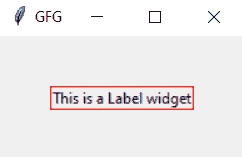
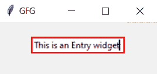

# 如何在 Tkinter 小部件中更改边框颜色？

> 原文:[https://www . geesforgeks . org/如何更改边框颜色-in-tkinter-widget/](https://www.geeksforgeeks.org/how-to-change-border-color-in-tkinter-widget/)

**先决条件:**[**Tkinter GUI**](https://www.geeksforgeeks.org/python-gui-tkinter/)**[**Tkinter Widgets**](https://www.geeksforgeeks.org/what-are-widgets-in-tkinter/)**

**Tkinter 是 Python 的标准图形用户界面包，它为我们提供了各种常见的图形用户界面元素，如按钮、菜单和各种输入字段和显示区域，我们可以使用它们来构建界面。这些元素被称为 Tkinter Widgets。**

**在小部件的所有颜色选项中，没有直接的方法来更改小部件的边框颜色。由于小部件的边框颜色与小部件的背景颜色相关联，因此无法单独设置。但是，我们确实有一些给小部件边框上色的方法，这些方法将在下面讨论。**

### ****方法 1:使用框架小部件****

**我们可以使用 Frame 小部件作为替代边框，而不是使用小部件的默认边框，在这里我们可以将 Frame 小部件的背景颜色设置为我们想要的任何颜色。这个方法适用于每个小部件。**

*   **导入 Tkinter module**
*   **创建窗口**
*   **使用以背景色为属性的框架小部件创建边框变量**
*   **创建任何以边框变量为属性的小部件**
*   **将小部件放在创建的窗口上**

****示例:****

## **蟒蛇 3**

```
# import tkinter
from tkinter import *

# Create Tk object
window = Tk()

# Set the window title
window.title('GFG')

# Create a Frame for border
border_color = Frame(window, background="red")

# Label Widget inside the Frame
label = Label(border_color, text="This is a Label widget", bd=0)

# Place the widgets with border Frame
label.pack(padx=1, pady=1)
border_color.pack(padx=40, pady=40)

window.mainloop()
```

****输出:****

****

### **方法 2:使用荧光笔背景和荧光笔颜色**

**我们还可以使用突出显示的背景和突出显示的颜色来获得我们的小部件的边框颜色。我们甚至可以使用高光厚度属性来调整边框的厚度。这种方法只适用于一些小部件，如输入、缩放、文本等**

*   **导入 Tkinter module**
*   **创建窗口**
*   **创建一个将高光厚度设置为所需边框厚度的小部件**
*   **将 highlightbackground 和 highlightcolor 属性配置为所需的边框颜色**
*   **将小部件放在创建的窗口上**

****示例:****

## **蟒蛇 3**

```
# import tkinter
from tkinter import *

# Create Tk object
window = Tk()

# Set the window title
window.title('GFG')

# Entry Widget
# highlightthickness for thickness of the border
entry = Entry(highlightthickness=2)

# highlightbackground and highlightcolor for the border color
entry.config(highlightbackground = "red", highlightcolor= "red")

# Place the widgets in window
entry.pack(padx=20, pady=20)

window.mainloop()
```

****输出:****

****

****注意:**建议使用方法 1 设置小部件的边框颜色，因为方法 2 对某些小部件可能有效，也可能无效。但是方法 1 在任何小部件上都通用。**