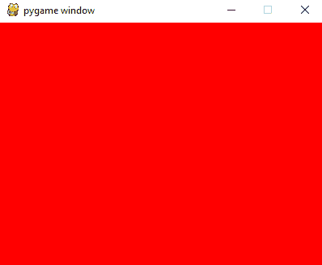
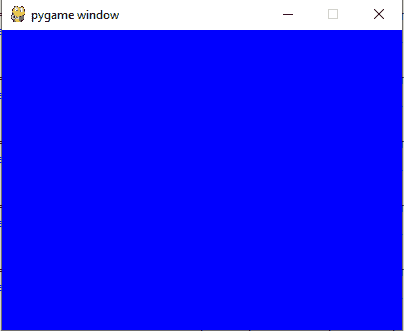

# 如何在 Pygame 中更改屏幕背景颜色？

> 原文:[https://www . geesforgeks . org/如何更改屏幕-背景色-in-pygame/](https://www.geeksforgeeks.org/how-to-change-screen-background-color-in-pygame/)

[Pygame](https://www.geeksforgeeks.org/introduction-to-pygame/) 是一个专为开发视频游戏而设计的 Python 库。Pygame 在优秀的 SDL 图书馆的基础上增加了功能。这允许你用 python 语言创建功能齐全的游戏和多媒体程序。

**使用的功能:**

*   **pygame.init():** 该函数用于初始化所有 pygame 模块。
*   **pygame . display . set _ mode():**此功能用于初始化屏幕进行显示。
*   **填充():**此方法用于用指定的颜色填充显示。

**示例 1:** 本示例将屏幕背景颜色设置为红色。

## 蟒蛇 3

```
# Importing the library
import pygame

# Initializing Pygame
pygame.init()

# Initializing surface
surface = pygame.display.set_mode((400,300))

# Initialing RGB Color 
color = (255,0, 0)

# Changing surface color
surface.fill(color)
pygame.display.flip()
```

**输出:**



**示例 2:** 本示例使用 RGB 颜色将屏幕颜色设置为蓝色。

## 蟒蛇 3

```
# Importing the library
import pygame

# Initializing Pygame modules
pygame.init()

# Initializing surface
surface = pygame.display.set_mode((400,300))

# Initialing RGB Color 
color = (0, 0, 255)

# Changing surface color
surface.fill(color)
pygame.display.flip()
```

**输出:**

