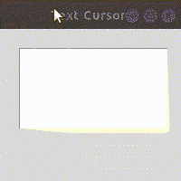

# 如何改变 Tkinter 中光标的颜色和符号？

> 原文:[https://www . geeksforgeeks . org/如何更改 tkinter 中光标的颜色和符号/](https://www.geeksforgeeks.org/how-to-change-the-color-and-symbol-of-the-cursor-in-tkinter/)

[**Tkinter**](https://www.geeksforgeeks.org/python-gui-tkinter/) 是 Python 的标准 GUI 库。它为图形用户界面开发提供了各种小部件。我们可以根据选择给小部件添加背景色。但是，有时背景颜色会影响鼠标指针的可见性。在这种情况下，更改光标颜色会使鼠标指针变得可识别。可以通过用光标类型指定颜色来更改光标的颜色。这些值可以在创建小部件时在光标属性中指定，也可以使用该小部件的*配置()*方法指定。如果没有为小部件定义光标类型和光标颜色，则从父窗口继承。光标颜色可以用它们的标准名称或十六进制 RGB 值来指定。例如*光标=“加红”*或*光标=“加# ff 0000”*，将提供红色的加光标图标。

对于某些光标，可以提供 2 种颜色，填充颜色和边框颜色。例如*光标=“点红蓝”*，将提供一个红色边框蓝色的点光标图标。

**步骤:**

*   创建 Tkinter 窗口
*   使用光标参数为窗口指定光标图标和颜色
*   为其他小部件指定光标图标和颜色，同时为该小部件创建或使用配置方法。

下面的程序演示了光标颜色的变化，以及顶层窗口和其他小部件的光标变化。

## 蟒蛇 3

```
# Import library
import tkinter as tk

# Create Tkinter window
frame = tk.Tk()
frame.title('GFG Cursors')
frame.geometry('200x200')

# Specify dot cursor with blue color for frame
frame.config(cursor="dot blue")

# Specify various cursor icons with colors
# for label and buttons
tk.Label(frame, text="Text cursor",
         cursor="xterm #0000FF").pack()

tk.Button(frame, text="Circle cursor",
          cursor="circle #FF00FF").pack()

tk.Button(frame, text="Plus cursor",
          cursor="plus red").pack()

# Specify cursor icon and color using
# config() method
a = tk.Button(frame, text='Exit')
a.config(cursor="dot green red")
a.pack()

frame.mainloop()
```

**输出:**


**注意**:Windows 不支持在 Tkinter 中更改光标颜色。可用光标列表可参考这里的。

我们可以使用文本小部件 insertbackground 参数来更改文本光标颜色。下面的程序演示了文本光标颜色的变化。

## 蟒蛇 3

```
# Import library
import tkinter as tk

# Create top level window
frame = tk.Tk()
frame.title("Text Cursor")
frame.geometry('200x200')

# Create Text widget with "red" text cursor
inputtxt = tk.Text(frame, height=5, width=20, 
                   insertbackground="red")
inputtxt.place(x=20, y=20)

frame.mainloop()
```

**输出:**

