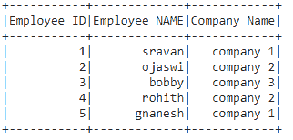

# 如何检查 PySpark DataFrame 的架构？

> 原文:[https://www . geesforgeks . org/how-check-schema-of-py spark-data frame/](https://www.geeksforgeeks.org/how-to-check-the-schema-of-pyspark-dataframe/)

在本文中，我们将检查 pyspark dataframe 的模式。我们将使用下面的数据框进行演示。



**方法 1:使用 df.schema**

架构用于返回列和类型。

> **语法**:数据框架.模式
> 
> 其中，数据帧是输入数据帧

**代码:**

## 蟒蛇 3

```
# importing module
import pyspark

# importing sparksession from pyspark.sql module
from pyspark.sql import SparkSession

# creating sparksession and giving an app name
spark = SparkSession.builder.appName('sparkdf').getOrCreate()

# list  of employee data with 5 row values
data = [["1", "sravan", "company 1"],
        ["2", "ojaswi", "company 2"],
        ["3", "bobby", "company 3"],
        ["4", "rohith", "company 2"],
        ["5", "gnanesh", "company 1"]]

# specify column names
columns = ['Employee ID', 'Employee NAME', 'Company Name']

# creating a dataframe from the lists of data
dataframe = spark.createDataFrame(data, columns)

# display dataframe columns
dataframe.schema
```

**输出:**

```
StructType(List(StructField(Employee ID,StringType,true),
StructField(Employee NAME,StringType,true),
StructField(Company Name,StringType,true)))
```

**方法 2:使用模式.字段**

它用于返回列的名称

> **语法:**data frame . schema . field
> 
> 其中 dataframe 是数据帧的名称

**代码:**

## 蟒蛇 3

```
# importing module
import pyspark

# importing sparksession from pyspark.sql module
from pyspark.sql import SparkSession

# creating sparksession and giving an app name
spark = SparkSession.builder.appName('sparkdf').getOrCreate()

# list  of employee data with 5 row values
data = [["1", "sravan", "company 1"],
        ["2", "ojaswi", "company 2"],
        ["3", "bobby", "company 3"],
        ["4", "rohith", "company 2"],
        ["5", "gnanesh", "company 1"]]

# specify column names
columns = ['Employee ID', 'Employee NAME', 'Company Name']

# creating a dataframe from the lists of data
dataframe = spark.createDataFrame(data, columns)

# display dataframe columns
dataframe.schema.fields
```

**输出:**

```
[StructField(Employee ID,StringType,true),
StructField(Employee NAME,StringType,true),
StructField(Company Name,StringType,true)]
```

**方法 3:使用 printchema()**

它用于返回带有列名的模式

> **语法:** dataframe.printSchema()
> 
> 其中数据帧是输入 pyspark 数据帧

## 蟒蛇 3

```
# importing module
import pyspark

# importing sparksession from pyspark.sql module
from pyspark.sql import SparkSession

# creating sparksession and giving an app name
spark = SparkSession.builder.appName('sparkdf').getOrCreate()

# list  of employee data with 5 row values
data = [["1", "sravan", "company 1"],
        ["2", "ojaswi", "company 2"],
        ["3", "bobby", "company 3"],
        ["4", "rohith", "company 2"],
        ["5", "gnanesh", "company 1"]]

# specify column names
columns = ['Employee ID', 'Employee NAME', 'Company Name']

# creating a dataframe from the lists of data
dataframe = spark.createDataFrame(data, columns)

# display dataframe columns
dataframe.printSchema()
```

**输出:**

```
root
 |-- Employee ID: string (nullable = true)
 |-- Employee NAME: string (nullable = true)
 |-- Company Name: string (nullable = true)
```