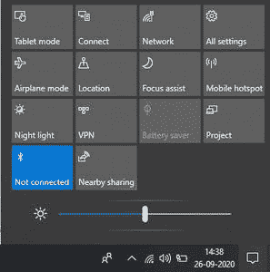

# 如何用 Python 控制笔记本电脑屏幕亮度？

> 原文:[https://www . geesforgeks . org/如何控制-笔记本电脑-屏幕-亮度-使用-python/](https://www.geeksforgeeks.org/how-to-control-laptop-screen-brightness-using-python/)

为了控制屏幕的亮度，我们使用**屏幕-亮度-控制**库。屏幕亮度控制库只有一个类，功能很少。最有用的功能如下:

1.  get _ brightness()
2.  set _ 亮度()
3.  fade _ 亮度()
4.  list_monitors()

**安装:**我们可以通过运行以下 pip 命令来安装软件包:

```
pip install screen-brightness-control
```

**示例 1:** 如何获得屏幕亮度

**get_brightness()** 方法返回当前亮度级别。

> **语法:** get_brightness(显示=无，方法=无，verbose_error=False)
> 
> **参数:**
> 
> *   **显示-:** 您希望调整的具体显示。这可以是显示器的名称、型号、序列号或索引
> *   **方法-:** 要使用的 OS 特定方法。在 Windows 上，这可以是“wmi”(用于笔记本电脑显示器)或“vcp”(用于台式机显示器)。在 Linux 上，这可以是“light”、“xrandr”、“ddcutil”或“xbacklight”。
> *   **verbose_error -:** 一个布尔值，用于控制任何错误消息应该包含多少细节
> 
> **返回**:当前亮度等级

## 蟒蛇 3

```
# importing the module
import screen_brightness_control as sbc

# get current brightness  value
current_brightness = sbc.get_brightness()
print(current_brightness)

# get the brightness of the primary display
primary_brightness = sbc.get_brightness(display=0)
print(primary_brightness)
```

**输出:**假设亮度是这样的:



那么输出将是:

```
50
50
```

根据检测到的监视器数量，输出可以是列表或整数。

**示例 2:** 如何设置屏幕亮度

**set_brightness()** 方法改变屏幕亮度。

> **语法:** set_brightness(值，显示=无，方法=无，强制=假，verbose _ error =假，no _ return =假)
> 
> **参数:**
> 
> *   **值:**设置亮度的级别。可以是整数或字符串。
> *   **显示:**您希望调整的具体显示。这可以是显示器的名称、型号、序列号或索引
> *   **方法:**具体要用的 OS 方法。在 Windows 上，这可以是“wmi”(用于笔记本电脑显示器)或“vcp”(用于台式机显示器)。在 Linux 上，这可以是“light”、“xrandr”、“ddcutil”或“xbacklight”。
> *   **force(仅限 Linux):**如果设置为 False，则亮度永远不会设置为小于 1，因为在 Linux 上，这通常会关闭屏幕。如果设置为真，它将绕过此检查
> *   **verbose_error:** 一个布尔值，用于控制任何错误消息应该包含多少细节
> *   **no_return:** 如果为 False，该功能将返回亮度设置值。如果为真，此函数不返回任何内容，这稍微快一些

## 蟒蛇 3

```
# importing the module
import screen_brightness_control as sbc

# get current brightness value
print(sbc.get_brightness())

#set brightness to 50%
sbc.set_brightness(50)

print(sbc.get_brightness())

#set the brightness of the primary display to 75%
sbc.set_brightness(75, display=0)

print(sbc.get_brightness())
```

**输出:**

```
100
50
75
```

根据检测到的监视器数量，输出可以是列表或整数。

**例 3:** 如何淡化亮度

**fade_brightness()** 方法会将亮度逐渐淡入一个值。

> **语法:** fade_brightness(完成，开始=无，间隔=0.01，增量=1，阻塞=真)
> 
> 参数:
> 
> *   **完成:**要渐变到的亮度值
> *   **开始:**开始的值。如果未指定，则默认为当前亮度
> *   **间隔:**亮度每一步之间的时间间隔
> *   **增量:**每一步改变亮度的量
> *   **阻塞:**如果设置为假，它会在新线程中淡化亮度

## 蟒蛇 3

```
# importing the module
import screen_brightness_control as sbc

# get current brightness value
print(sbc.get_brightness())

# fade brightness from the current brightness to 50%
sbc.fade_brightness(50)
print(sbc.get_brightness())

# fade the brightness from 25% to 75%
sbc.fade_brightness(75, start = 25)
print(sbc.get_brightness())

# fade the brightness from the current
# value to 100% in steps of 10%
sbc.fade_brightness(100, increment = 10)
print(sbc.get_brightness())
```

**输出:**

```
75
50
75
100
```

**示例 4:** 如何列出可用的显示器

list_monitors()方法返回所有检测到的监视器的名称列表

> **语法:** list_monitors(方法=无)
> 
> 参数:
> 
> *   **方法:**具体要用的 OS 方法。在 Windows 上，这可以是“wmi”(用于笔记本电脑显示器)或“vcp”(用于台式机显示器)。在 Linux 上，这可以是“light”、“xrandr”、“ddcutil”或“xbacklight”。

## 蟒蛇 3

```
# import the library
import screen_brightness_control as sbc

# get the monitor names
monitors = sbc.list_monitors()
print(monitors)

# now use this to adjust specific screens by name
sbc.set_brightness(25, display=monitors[0])
```

**输出:**

```
["BenQ GL2450H", "Dell U2211H"]
```

显示器的名称和数量会因插入电脑的设备而异。