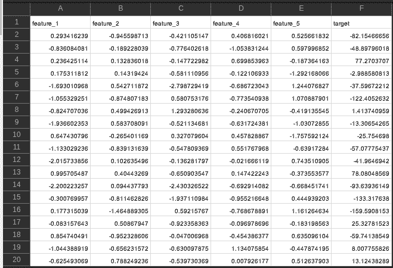
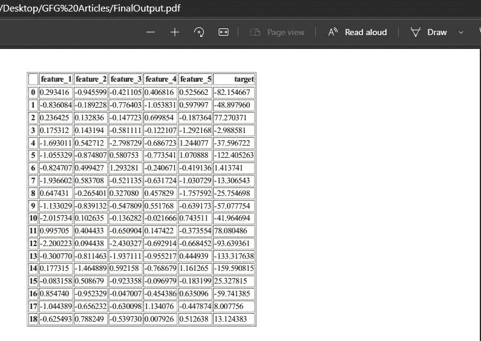

# 如何用 Python 将 CSV 文件转换成 PDF 文件？

> 原文:[https://www . geesforgeks . org/how-convert-CSV-file-to-pdf-file-use-python/](https://www.geeksforgeeks.org/how-to-convert-csv-file-to-pdf-file-using-python/)

在本文中，我们将学习如何将 CSV 转换为 PDF 文件格式。这个简单的任务可以通过两个步骤轻松完成:

1.  首先，我们使用 [**熊猫**](https://www.geeksforgeeks.org/python-data-analysis-using-pandas/) 将我们的 CSV 文件转换为 HTML
2.  在第二步中，我们使用 PDFkit Python API 将我们的 HTML 文件转换为 PDF 文件格式。

**进场:**

**1。** [**使用熊猫框架将 CSV 文件转换为 HTML。**](https://www.geeksforgeeks.org/convert-csv-to-html-table-in-python/)

Pandas 是一个快速、强大、灵活且易于使用的开源数据分析和操作工具，构建在 Python 编程语言之上。

**使用的 CSV 文件:**



对于教程的这一部分，我们将使用:

1.  [**pandas . read _ csv():**](https://www.geeksforgeeks.org/python-read-csv-using-pandas-read_csv/)read _ CSV 是 pandas 读取 CSV 文件并对其进行操作的重要功能。我们将使用它来读取我们的输入 CSV 文件。
2.  [**。to_html():**](https://www.geeksforgeeks.org/python-pandas-dataframe-to_html-method/) 借助 DataFrame.to_html()方法，我们可以通过使用 DataFrame.to_html()方法得到一个 DataFrame 的 html 格式。这个函数接收一个 CSV 文件作为输入，转换它，并以 HTML 文件格式保存在本地。

> **使用熊猫将 CSV 转换为 HTML 的语法:**
> 
> 进口熊猫作为 pd
> 
> CSV = pd.read_csv("MyCSV.csv ")
> 
> CSV.to_html("MyCSV.html ")

**使用的 HTML 文件:** [MyCSV](https://media.geeksforgeeks.org/wp-content/cdn-uploads/20210315192112/MyCSV.html)

**2。** [**使用 PDFKit Python API 将 HTML 文件转换为 CSV**](https://www.geeksforgeeks.org/python-convert-html-pdf/)

在 python 中有许多生成 PDF 的方法。pdfkit 是更好的方法之一，因为它将 HTML 呈现为具有各种图像格式、HTML 表单和其他复杂的可打印文档的 PDF。

我们可以通过 3 种方式用 pdfkit 创建一个 PDF 文档。它们是:

*   来自网址
*   从一个超文本标记语言文件
*   从绳子上。

2.1.从网址生成 pdf:下面的脚本给了我们一个网站网址的 PDF 文件。

```
import pdfkit
pdfkit.from_url('https://www.geeksforgeeks.org', 'Output.pdf')
```

2.2.从文件生成 pdf:下面的脚本给我们从一个 HTML 文件生成 PDF 文件。

```
import pdfkit
pdfkit.from_file('LocalHTMLFile.html', 'Output.pdf')
```

2.3.从字符串生成 pdf:下面的脚本给出了一个字符串的 PDF 文件。

```
import pdfkit
pdfkit.from_string('Geeks For Geeks', 'Output.pdf')
```

由于我们已经将我们的 CSV 文件转换为 HTML，我们将使用第一种方法，即从网址生成 PDF，其中我们可以给出任何网站的地址或任何本地 HTML 文件。

如果机器上已经安装了 wkhtmltopdf，我们可以直接使用以下语法:

> **使用 PDFKit 将 HTML 转换为 PDF 的语法:**
> 
> 导入 pdfkit
> 
> pdfkit.from_url("MyCSV.html "，" FinalOutput.pdf ")

否则，我们还需要安装 wkhtmltopdf，让脚本在我们的电脑上运行，并将安装的文件 wkhtmltopdf.exe 的路径设置为我们电脑的[环境变量](https://www.geeksforgeeks.org/how-to-setup-anaconda-path-to-environment-variable/)，现在我们可以跳过脚本中的配置部分。

或者

我们也可以为已安装的 wkhtmltopdf.exe 文件设置配置，并将配置变量传递给:

**路径配置**

path _ wkhtmltopdf = r ' d:\ software \ wkhtmltopdf \ bin \ wkhtmltopdf . exe '

config = pdf kit . configuration(wkhtmltopdf = path _ wkhtmltopdf)

**用 pdfkit 将 HTML 文件转换为 PDF**

pdfkit.from_url("MyCSV.html "，" FinalOutput.pdf "，configuration=config)

**实施:**

**文件夹中的初始文件**


文件夹中的初始文件

## 计算机编程语言

```
import pandas as pd
import pdfkit

# SAVE CSV TO HTML USING PANDAS
csv = 'MyCSV.csv'
html_file = csv_file[:-3]+'html'

df = pd.read_csv(csv_file, sep=',')
df.to_html(html_file)

# INSTALL wkhtmltopdf AND SET PATH IN CONFIGURATION
# These two Steps could be eliminated By Installing wkhtmltopdf -
# - and setting it's path to Environment Variables
path_wkhtmltopdf = r'D:\Softwares\wkhtmltopdf\bin\wkhtmltopdf.exe'
config = pdfkit.configuration(wkhtmltopdf=path_wkhtmltopdf)

# CONVERT HTML FILE TO PDF WITH PDFKIT
pdfkit.from_url("MyCSV.html", "FinalOutput.pdf", configuration=config)
```

**在 Python 脚本上面运行后:**


运行 PYTHON 脚本后同一目录中的文件

**最终输出:**

