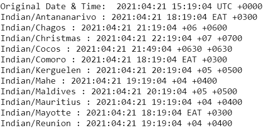

# 如何在 Python 中用不同时区转换日期和时间？

> 原文:[https://www . geeksforgeeks . org/如何用 python 中的不同时区转换日期和时间/](https://www.geeksforgeeks.org/how-to-convert-date-and-time-with-different-timezones-in-python/)

在本文中，我们将讨论如何在 Python 中用不同的时区转换日期和时间。为此，我们将使用 python 的一个模块 *pytz* 。该模块将奥尔森 tz 数据库引入 Python，该库允许使用 Python 进行精确的跨平台时区计算。方法 **pytz.timezone()** 生成特定区域的当前时区。

**语法:**

> pytz.timezone(“时区名称”)
> 
> **Ex:** pytz.timezone(“亚洲/加尔各答”)

**例 1:**

在下面的程序中，当前世界协调时时间根据亚洲/加尔各答时区进行转换。

## 蟒蛇 3

```
from datetime import datetime
import pytz

# get the standard UTC time
UTC = pytz.utc

# it will get the time zone
# of the specified location
IST = pytz.timezone('Asia/Kolkata')

# print the date and time in
# standard format
print("UTC in Default Format : ",
      datetime.now(UTC))

print("IST in Default Format : ",
      datetime.now(IST))

# print the date and time in
# specified format
datetime_utc = datetime.now(UTC)
print("Date & Time in UTC : ",
      datetime_utc.strftime('%Y:%m:%d %H:%M:%S %Z %z'))

datetime_ist = datetime.now(IST)
print("Date & Time in IST : ",
      datetime_ist.strftime('%Y:%m:%d %H:%M:%S %Z %z'))
```

**输出:**


**例 2:**

这是另一个程序，其中当前的亚洲/加尔各答时区被转换为美国/东方时区。

## 蟒蛇 3

```
from datetime import datetime
import pytz

# get the standard UTC time
original = pytz.timezone('Asia/Kolkata')

# it will get the time zone
# of the specified location
converted = pytz.timezone('US/Eastern')

# print the date and time in
# specified format
dateTimeObj = datetime.now(original)
print("Original Date & Time: ",
      dateTimeObj.strftime('%Y:%m:%d %H:%M:%S %Z %z'))

# converted
dateTimeObj = datetime.now(converted )
print("Converted Date & Time: ",
      dateTimeObj.strftime('%Y:%m:%d %H:%M:%S %Z %z'))
```

**输出:**


通过执行以下代码，可以获得 pytz 中存在的所有时区值:

```
for timezone in pytz.all_timezones:
     print(timezone) 
```

下面是一个将特定时区转换为印度地区多个时区的程序:

## 蟒蛇 3

```
from datetime import datetime
import pytz

# get the standard UTC time
original = pytz.utc

# create datetime object
dateTimeObj = datetime.now(original)
print("Original Date & Time: ",
      dateTimeObj.strftime('%Y:%m:%d %H:%M:%S %Z %z'))

# it will get the time zone
# of the specified location
for timeZone in pytz.all_timezones:
    if 'Indian/' in timeZone:
        dateTimeObj = datetime.now(pytz.timezone(timeZone))
        print(timeZone,":",dateTimeObj.strftime('%Y:%m:%d %H:%M:%S %Z %z'))
```

**输出:**

