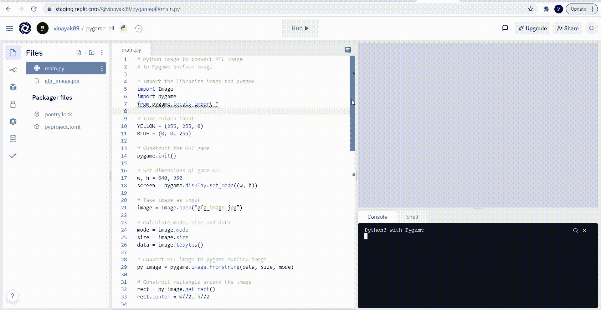

# 如何将 PIL 影像转换成 pygame 曲面影像？

> 原文:[https://www . geesforgeks . org/how-convert-pil-image-to-pygame-surface-image/](https://www.geeksforgeeks.org/how-to-convert-pil-image-into-pygame-surface-image/)

在本文中，我们将了解如何将 PIL 图像转换为 pygame 表面图像。

**Pygame Surface Image:** 一个既有固定分辨率和像素格式，又能代表 Pygame 中图像的曲面称为 Pygame Surface Image。

您是否在 Pygame 中构建了任何只使用 Pygame Surface Image 作为输入的游戏？由于用户输入的大多数图像都是 PIL 图像格式，因此您需要在使用之前将 PIL 图像转换为 Pygame 表面图像。不知道怎么转换成 Pygame Surface Image 吗？别担心，这样做太容易了。您需要做的只是在将 PIL 图像作为用户输入后，使用 **fromstring()** 功能。阅读下面的文章，了解更多细节。

### 方法:

**第一步:**首先，导入库 Image 和 Pygame。

```
import Image
import pygame
from pygame.locals import *
```

**第二步:**现在，把你想在游戏中使用的颜色作为输入。

```
color_1 = #RGB value of color 1
color_2 = #RGB value of color 2
color_n = #RGB value of color n
```

**第三步:**然后，构建 GUI 游戏。

```
pygame.init()
```

**第四步:**进一步，设置你的 GUI 游戏的维度。

```
w, h = #width of game, #height of game
screen = pygame.display.set_mode((w, h))
```

**第五步:**接下来，将你想要转换成 Pygame Surface Image 的 PIL 图像作为输入。

```
image = Image.open("#Enter the image")
```

**步骤 6:** 计算将 PIL 图像转换为 pygame 表面图像时将使用的模式值。

```
mode = image.mode
```

**步骤 7:** 进一步，计算将 PIL 图像转换为 pygame 表面图像时将使用的大小值。

```
size = image.size
```

**步骤 8:** 计算将 PIL 图像转换为 pygame 表面图像时将使用的数据值。

```
data = image.tobytes()
```

**步骤 9:** 此外，将 PIL 图像转换为 Pygame 表面图像。

```
py_image = pygame.image.fromstring(data, size, mode)
```

**步骤 10:** 稍后，围绕转换后的图像构建矩形。

```
rect = py_image.get_rect()
rect.center = w//2, h//2
```

**步骤 11:** 设置运行游戏的运行值。

```
running=True
```

**第 12 步:**设置你希望你的游戏在运行状态下要做的事情。

```
while running:
   for event in pygame.event.get():
```

**步骤 12.1:** 一旦 app 处于运行状态，如果用户想退出，就让其退出。

```
      if event.type == pygame.QUIT:
          running = False
```

**步骤 12.2:** 此外，设置你希望在应用中看到的背景颜色。

```
   screen.fill(color_1)
   screen.blit(py_image, rect)
```

**步骤 12.3:** 进一步，构建图像周围的边界。

```
pygame.draw.rect(screen, color_2, rect, 2)
```

**第 12.4 步:**然后，让你的应用在运行状态下做你想让它做的任何事情。

**第 12.5 步:**在做了所有你想做的事情之后，更新完成的更改。

```
  pygame.display.update()
```

**第十三步:**最后，退出 GUI 游戏

```
pygame.quit()
```

### 实施:

## 计算机编程语言

```
# Python image to convert PIL image
# to Pygame Surface Image

# Import the libraries image and pygame
import Image
import pygame
from pygame.locals import *

# Take colors input
YELLOW = (255, 255, 0)
BLUE = (0, 0, 255)

# Construct the GUI game
pygame.init()

# Set dimensions of game GUI
w, h = 640, 350
screen = pygame.display.set_mode((w, h))

# Take image as input
image = Image.open("gfg_image.jpg")

# Calculate mode, size and data
mode = image.mode
size = image.size
data = image.tobytes()

# Convert PIL image to pygame surface image
py_image = pygame.image.fromstring(data, size, mode)

# Construct rectangle around the image
rect = py_image.get_rect()
rect.center = w//2, h//2

# Set value of running variable
running=True

# Setting what happens when game is in running state
while running:
    for event in pygame.event.get():

      # Close if the user quits the game
        if event.type == QUIT:
            running = False

    # Set the background color
    screen.fill(YELLOW)
    screen.blit(py_image, rect)

    # Construct the border to the image
    pygame.draw.rect(screen, BLUE, rect, 2)

    # Update the GUI pygame
    pygame.display.update()

# Quit the GUI game
pygame.quit()
```

**输出:**

