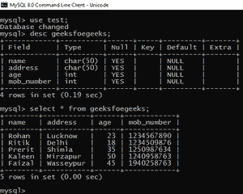
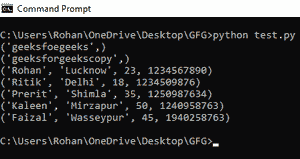
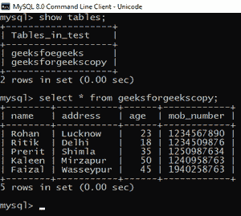
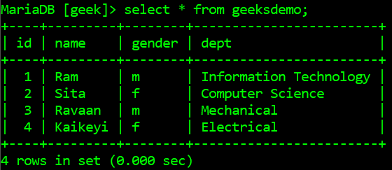
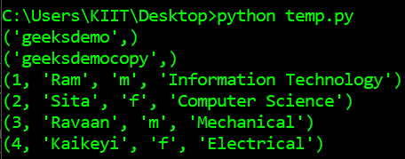
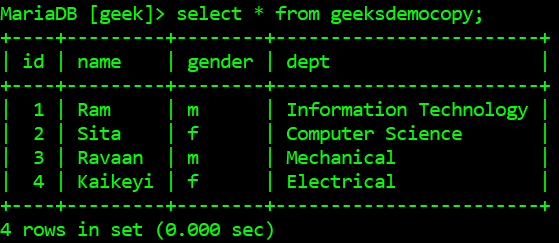

# 如何用 Python 复制 MySQL 中的表？

> 原文:[https://www . geeksforgeeks . org/如何使用 python 复制 mysql 中的表/](https://www.geeksforgeeks.org/how-to-copy-a-table-in-mysql-using-python/)

在本文中，我们将在 MySQL 中创建一个表，并将使用 Python 创建该表的副本。我们将复制整个表，包括所有列和列的定义，以及表中的所有数据行。

[要使用 python](https://www.geeksforgeeks.org/connect-to-mysql-using-pymysql-in-python/) 连接 MySQL 数据库，我们需要 *PyMySql* 模块。游标类允许 python 执行 SQL 命令。游标是通过 *connection_name.cursor()* 方法创建的，其中 *connection_name* 是到 SQL 数据库的链接。一旦建立了连接，cursor.execute()就被用来运行 SQL 语句。

让我们举个例子来理解上面的内容。假设，在 MySQL 中，我们创建了一个数据库*测试*，它包含一个名为*极客*的表，并具有以下模式和以下数据:



SQL 数据库

要在 MySQL 中复制一个表，我们使用下面的查询:

```
CREATE TABLE table-name SELECT * FROM table-name;

```

下面是使用 python 复制整个表的程序:

## 蟒蛇 3

```
# import required modules
import pymysql

# establish connection to SQL database
connection = pymysql.connect(

    # specify hostname
    host="localhost",

    # specify user of mysql database
    user="root",

    # specify password for above user
    password="1234",

    # default port number for mysql is 3306
    port=3306,

    # specify database name on which you want to work
    db="test"
)

# make a cursor
mycursor = connection.cursor()

# create a new table geeksforgeekscopy and copy all 
# records from geeksfoegeeks into the newly created table
mycursor.execute("create table geeksforgeekscopy select * from geeksfoegeeks")

# list all the tables
mycursor.execute("Show tables")

# fetchall() will store all the names 
# of tables into query1
query1 = mycursor.fetchall()

# print name of tables
for i in query1:
    print(i)

# read all records from copy table
mycursor.execute("Select * from geeksforgeekscopy")

# fetchall() will store all the records 
# of copy table into query2
query2 = mycursor.fetchall()

# print all records
for i in query2:
    print(i)
```

**输出:**



Python 输出

在上图中，我们可以看到表格列表，后面是来自*geekforgeekforegeviews*表格的所有记录。上述输出也通过提供 MySQL 数据库的输出得到了证实。



MySQL 输出

下面是另一个示例，它描述了如何从先前表的数据和模式创建新表。下面是以前存在的表格:



现在，使用下面的脚本在数据库中创建上表的副本:

## 蟒蛇 3

```
# import required modules
import pymysql

# connect python with mysql with your hostname, 
# username, password and database
connection= pymysql.connect("localhost", "root", "", "geek")

# make a cursor
mycursor = connection.cursor()

# create a new table and copy all records from 
# previous table into the newly created table
mycursor.execute("create table geeksdemocopy select * from geeksdemo")

# list all the tables
mycursor.execute("Show tables")

# fetchall() will store all the names of tables into query1
query1 = mycursor.fetchall()

# print name of tables
for i in query1:
    print(i)

# read all records from copy table
mycursor.execute("Select * from geeksdemocopy")

# fetchall() will store all the records of copy table into query2
query2 = mycursor.fetchall()

# print all records
for i in query2:
    print(i)
```

**输出:**



下面是新表，它的数据和模式是从前一个表复制而来的:

