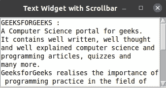

# 如何用 Tkinter 创建多行条目？

> 原文:[https://www . geesforgeks . org/how-create-a-multiline-entry-with-tkinter/](https://www.geeksforgeeks.org/how-to-create-a-multiline-entry-with-tkinter/)

[**【Tkinter】**](https://www.geeksforgeeks.org/python-gui-tkinter/)是 Python 中开发 GUI 的库。它为开发图形用户界面提供了各种小部件。tkinter 中的 Entry 小部件有助于接受用户输入，但它收集的输入仅限于一行文本。因此，在 tkinter 中创建 Multiline 条目文本有多种方法。

**用 tkinter 创建多行条目的方法:**

1.  使用文本小部件
2.  使用 ScrolledText 小部件

**方法 1:** 使用 [Tkinter 文本](https://www.geeksforgeeks.org/python-tkinter-text-widget/)小工具

文本小部件为用户提供多行文本区域。文本小部件实例是在文本类的帮助下创建的。它还用于显示文本行，并允许编辑文本。

**语法:**

```
Text( root, optional parameters, ... )
```

**例 1:**

## 蟒蛇 3

```
import tkinter as tk
from tkinter import ttk

window = tk.Tk()
window.title("Text Widget Example")
window.geometry('400x200')

ttk.Label(window, text="Enter your comment :",
          font=("Times New Roman", 15)).grid(
  column=0, row=15, padx=10, pady=25)

# Text Widget
t = tk.Text(window, width=20, height=3)

t.grid(column=1, row=15)

window.mainloop()
```

**输出:**


该示例的上述输出允许用户多行输入文本。但是它没有显示用户输入的超出文本小部件高度的所有文本，即高度=3。由于它只显示 3 行文本，因此对这种多行文本使用滚动条可以解决这个问题。

**示例 2:** 将[滚动条添加到文本](https://www.geeksforgeeks.org/scrollable-frames-in-tkinter/)小部件

## 蟒蛇 3

```
import tkinter as tk

window = tk.Tk()
window.title("Text Widget with Scrollbar")

text = tk.Text(window, height=8, width=40)
scroll = tk.Scrollbar(window)
text.configure(yscrollcommand=scroll.set)
text.pack(side=tk.LEFT)

scroll.config(command=text.yview)
scroll.pack(side=tk.RIGHT, fill=tk.Y)

insert_text = """GEEKSFORGEEKS :
A Computer Science portal for geeks.
It contains well written, well thought
and well explained computer science and
programming articles, quizzes and
many more.
GeeksforGeeks realises the importance of programming practice in the field of
Computer Science.
That is why, it also provides an option of practicing problems.
This huge database of problems is created by programming experts.
The active team of GeeksforGeeks makes the learning process
interesting and fun.
"""

text.insert(tk.END, insert_text)
tk.mainloop()
```

**输出:**



**方法 2:** 使用[滚动文本 tkinter](https://www.geeksforgeeks.org/python-tkinter-scrolledtext-widget/) 小工具

我们可以直接使用 ScrolledText tkinter 小部件进行用户的多行输入，而不是像示例 2 中那样向文本小部件添加滚动条。当文本增加到超过 scrolledText 小部件的高度时，该小部件会自动添加滚动条。

**示例:**

## 蟒蛇 3

```
import tkinter as tk
from tkinter import ttk
from tkinter import scrolledtext

root = tk.Tk()

root.title("ScrolledText Widget Example")

ttk.Label(root, text="ScrolledText Widget Example",
          font=("Times New Roman", 15)).grid(column=0, row=0)
ttk.Label(root, text="Enter your comments :", font=("Bold", 12)).grid
(column=0, row=1)

text_area = scrolledtext.ScrolledText(root, wrap=tk.WORD,
                                      width=40, height=8,
                                      font=("Times New Roman", 15))

text_area.grid(column=0, row=2, pady=10, padx=10)

# placing cursor in text area
text_area.focus()
root.mainloop()
```

**输出:**

