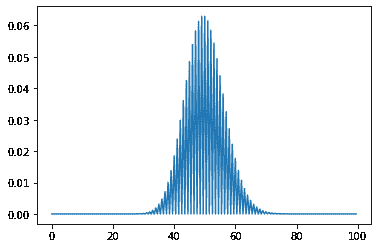
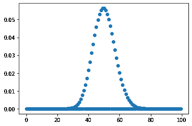

# 如何用 Python 创建泊松概率质量函数图？

> 原文:[https://www . geeksforgeeks . org/如何创建泊松概率质量函数 python 中的图/](https://www.geeksforgeeks.org/how-to-create-a-poisson-probability-mass-function-plot-in-python/)

在本文中，我们将看到如何在 Python 中创建泊松概率质量函数图。在概率论和统计学中，泊松分布是一种离散的概率分布，它表示给定数量的事件在固定的时间或空间间隔内发生的概率，如果这些事件以已知的恒定平均速率发生，并且与自上次事件以来的时间无关。泊松分布也可用于其他指定间隔内的事件数量，如距离、面积或体积。

为了绘制泊松分布，我们将使用 scipy 模块。 **SciPy** 是一个用于科学计算和技术计算的免费开源 Python 库。SciPy 包含用于优化、线性代数、积分、插值、特殊函数、FFT、信号和图像处理、ODE 求解器和其他科学和工程中常见任务的模块。

> 为了得到 python 中的泊松概率质量函数图，我们使用了 scipy 的泊松. pmf 方法。
> **语法:** poisson.pmf(k，mu，loc)
> **参数:**以 numpy 数组、形状参数、位置为参数
> **返回:**返回 numpy 数组

**例 1:**

## 蟒蛇 3

```
# importing poisson fro scipy
from scipy.stats import poisson

# importing numpy as np
import numpy as np

# importing matplotlib as plt
import matplotlib.pyplot as plt

# creating a numpy array for x-axis
x = np.arange(0, 100, 0.5)

# poisson distribution data for y-axis
y = poisson.pmf(x, mu=40, loc=10)

# plotting the graph
plt.plot(x, y)

# showing the graph
plt.show()
```

**输出:**



**示例 2:** 使用数据步长为 1

## 蟒蛇 3

```
# importing poisson fro scipy
from scipy.stats import poisson

# importing numpy as np
import numpy as np

# importing matplotlib as plt
import matplotlib.pyplot as plt

# creating a numpy array for x-axis
# using step size as 1
x = np.arange(0, 100, 1)

# poisson distribution data for y-axis
y = poisson.pmf(x, mu=10, loc=40)

# plotting the graph
plt.plot(x, y)

# showing the graph
plt.show()
```

**输出:**


**示例 3:** 绘制散点图以更好地查看数据点

## 蟒蛇 3

```
# importing poisson fro scipy
from scipy.stats import poisson

# importing numpy as np
import numpy as np

# importing matplotlib as plt
import matplotlib.pyplot as plt

# creating a numpy array for x-axis
x = np.arange(0, 100, 0.5)

# poisson distribution data for y-axis
y = poisson.pmf(x, mu=50, loc=0)

# plotting thescatter plot graph
plt.scatter(x, y)

# showing the graph
plt.show()
```

**输出:**

