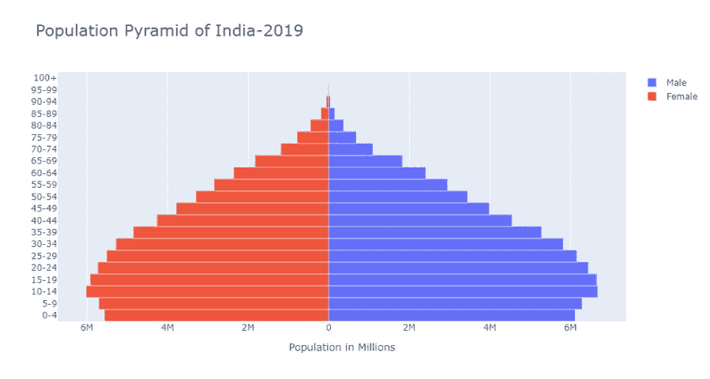

# 如何用 Python 中的 Plotly 创建人口金字塔？

> 原文:[https://www . geeksforgeeks . org/如何使用 python 中的 plotly 创建人口金字塔/](https://www.geeksforgeeks.org/how-to-create-a-population-pyramid-using-plotly-in-python/)

人口金字塔是数据的图形表示，包含两个实体，即特定人口的年龄和性别。它通常被人口学家用来研究人口。年龄值分为子类别，性别列包含属于该年龄组的特定性别的人口。

它被称为人口金字塔，因为它的图形形状类似于金字塔。其中属于最年轻年龄组的人被保持在图表的底部，最年长的人被保持在图表的顶部。

在本文中，我们将研究如何用 Python 创建人口金字塔。为了达到我们的目的，我们将使用两个额外的库**熊猫**和**来绘制我们的图表。如果您没有安装这些库，您可以通过 pip 命令安装它们。**

```py
pip install plotly
```

让我们看看如何使用 Python 中的 Plotly 库来制作人口金字塔

**步骤 1:** 我们将首先导入代码中的库。

## 计算机编程语言

```py
# Importing libraries
import pandas as pd
import plotly.graph_objects as gp
```

**第二步:**读取包含我们数据的 CSV 文件。

## 计算机编程语言

```py
data = pd.read_csv('India-2019.csv')
display(data)
```

**输出:**


我们的数据集

我们可以注意到我们的数据集包含三列，第一列是“年龄”，包含不同的年龄范围，第二列和第三列包含属于这些年龄组的男性和女性性别类别的人数。

**第三步:**数据准备

在 y 轴上，我们将绘制年龄，在 x 轴上，我们将绘制男性和女性的数字

## 计算机编程语言

```py
y_age = data['Age']
x_M = data['M']
x_F = data['F'] * -1
```

**第 4 步:**绘制图表

我们将创建一个已经导入的 graph_object 模块的实例，并使用这个实例，我们将使用 add_trace()方法将男性和女性数据逐个添加到图表中。

我们甚至可以根据我们的要求定制绘图布局，如果你注意到我已经为我的图形放置了一个标题，并将条形间隙设置为 0，这样我们的条形就没有任何间距。对于我们在 X 轴上的值，我们也可以自定义图表，比如在 X 轴上设置标题和刻度值。

## 计算机编程语言

```py
# Creating instance of the figure
fig = gp.Figure()

# Adding Male data to the figure
fig.add_trace(gp.Bar(y= y_age, x = x_M, 
                     name = 'Male', 
                     orientation = 'h'))

# Adding Female data to the figure
fig.add_trace(gp.Bar(y = y_age, x = x_F,
                     name = 'Female', orientation = 'h'))

# Updating the layout for our graph
fig.update_layout(title = 'Population Pyramid of India-2019',
                 title_font_size = 22, barmode = 'relative',
                 bargap = 0.0, bargroupgap = 0,
                 xaxis = dict(tickvals = [-60000000, -40000000, -20000000,
                                          0, 20000000, 40000000, 60000000],

                              ticktext = ['6M', '4M', '2M', '0', 
                                          '2M', '4M', '6M'],

                              title = 'Population in Millions',
                              title_font_size = 14)
                 )

fig.show()
```

**输出:**



2019 年印度人口金字塔