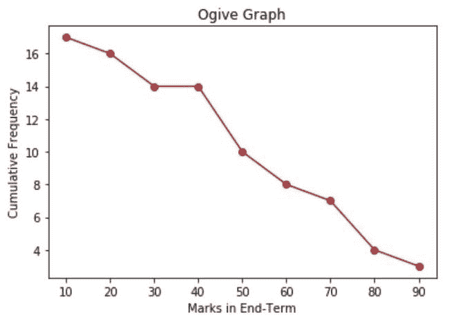

# 如何用 Python 创建一个 Ogive 图？

> 原文:[https://www . geeksforgeeks . org/如何用 python 创建 ogive-graph/](https://www.geeksforgeeks.org/how-to-create-an-ogive-graph-in-python/)

在本文中，我们将创建一个**卵形图。**卵形图也可以称为累积直方图，该图用于确定数据集中高于或低于特定值的值的数量。分类间隔绘制在 x 轴上，而累计频率绘制在 y 轴上。这些点画在图上，并用线连接起来。

NumPy 有一个名为**直方图()**的函数，以图形方式表示特定集合范围内的数据频率。直方图函数返回两个值，第一个是频率，存储在值中，第二个是 bin 值或数据集中数字之间的间隔，存储在基变量中。

之后，我们将计算累积和，这可以很容易地用 **cumsum()** 函数来完成，它返回沿着特定轴的累积和。最后，我们将使用 **plot()** 函数绘制该图，将 base 作为 x 轴值，将 cumsum 作为 y 轴值。我们可以使用标记、颜色和线条属性来格式化图形。

**例 1:(不止奥格夫图)**

“超过”图表显示了大于类间隔的值的数量。结果图显示了类间隔之间的值的数量。Eg- 0-10，10-20 等等。让我们取一个数据集，现在我们将绘制它的不止是 ogive 图- [22，87，5，43，56，73，55，54，11，20，51，5，79，31，27]。

**表示间隔、频率和累计频率的表(小于)-**

<figure class="table">

| **班级间隔** | **频率** | **累计频率** |
|      0-10 |       2 |                  2 |
|     10-20 | one | three |
|     20-30 | three | six |
|     30-40 | one | seven |
|     40-50 | one | eight |
|     50-60 | four |                 12 |
|     60-70 |       0 |                 12 |
|     70-80 |       2 |                 14 |
|     80-90 | one |                 15 |

</figure>

**进场:**

*   导入模块(matplotlib 和 numpy)。
*   计算数据的频率和累计频率。
*   使用 Plot()函数绘制它。

## 蟒蛇 3

```
# importing modules
import numpy as np
import matplotlib.pyplot as plt

# creating dataset
data = [22, 87, 5, 43, 56, 73, 55, 54, 11, 20, 51, 5, 79, 31, 27]

# creating class interval
classInterval = [0, 10, 20, 30, 40, 50, 60, 70, 80, 90]

# calculating frequency and class interval
values, base = np.histogram(data, bins=classInterval)

# calculating cumulative sum
cumsum = np.cumsum(values)

# plotting  the ogive graph
plt.plot(base[1:], cumsum, color='red', marker='o', linestyle='-')

# formatting
plt.title('Ogive Graph')
plt.xlabel('Marks in End-Term')
plt.ylabel('Cumulative Frequency')
```

**输出:**


**例 2:(小于卵形图)**

在本例中，我们将绘制小于奥格夫图，该图将显示类间隔的小于值。数据集:[44，27，5，2，43，56，77，53，89，54，11，23，51，5，79，25，39]

**表示间隔、频率和累计频率的表(大于)-**

<figure class="table">

| **班级间隔** | **频率** | **累计频率** |
|      0-10 | three |               17 |
|     10-20 | one |               16 |
|     20-30 | three |               14 |
|     30-40 | one |               14 |
|     40-50 |      2 |               10 |
|     50-60 | four | eight |
|     60-70 |      0 | seven |
|     70-80 |      2 | four |
|     80-90 | one | three |

</figure>

方法同上，只是我们将计算的累积和将使用 numpy 库中的 **flipud()** 函数反转。

## 蟒蛇 3

```
# importing modules
import numpy as np
import matplotlib.pyplot as plt

# creating dataset
data = [44, 27, 5, 2, 43, 56, 77, 53, 89, 54, 11, 23, 51, 5, 79, 25, 39]

# creating class interval
classInterval = [0, 10, 20, 30, 40, 50, 60, 70, 80, 90]

# calculating frequency and intervals
values, base = np.histogram(data, bins=classInterval)

# calculating cumulative frequency
cumsum = np.cumsum(values)

# reversing cumulative frequency
res = np.flipud(cumsum)

# plotting ogive
plt.plot(base[1:], res, color='brown', marker='o', linestyle='-')

# formatting the graph
plt.title('Ogive Graph')
plt.xlabel('Marks in End-Term')
plt.ylabel('Cumulative Frequency')
```

**输出:**

