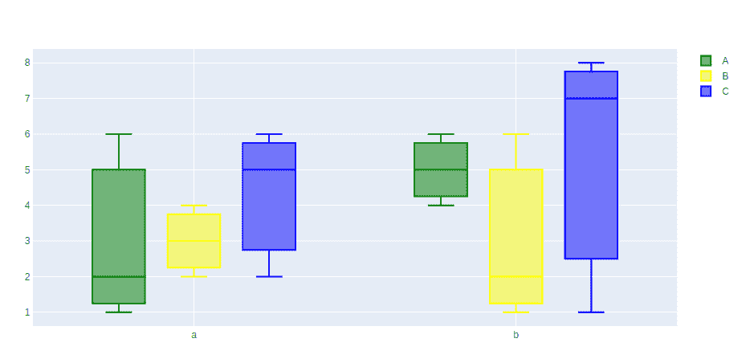
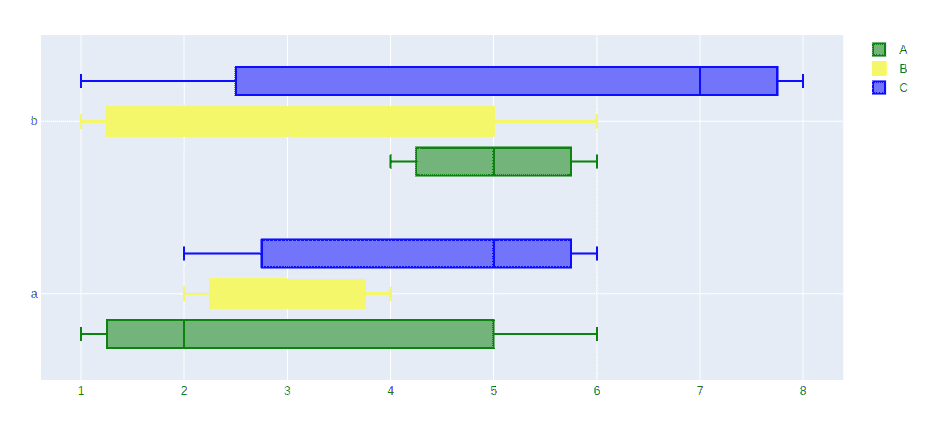

# 如何在 Plotly 中创建分组方块图？

> 原文:[https://www . geesforgeks . org/如何创建分组框-绘图中绘图/](https://www.geeksforgeeks.org/how-to-create-grouped-box-plot-in-plotly/)

[Plotly](https://www.geeksforgeeks.org/getting-started-with-plotly-python/) 是一个 Python 库，用来设计图形，尤其是交互图形。它可以绘制各种图形和图表，如直方图、条形图、箱线图、展开图等。它主要用于数据分析以及财务分析。plotly 是一个交互式可视化库。

## 什么是分组方框图？

分组箱线图是一种箱线图，其中分类数据按组和子组进行组织。Origin 支持根据索引数据或原始数据绘制分组箱线图。分组框图在表达上更容易理解，效率更高，在布局上占用的空间更少。

## 创建分组方框图

可以使用图形类的 **add_trace()** 方法创建。add_trace()方法允许我们在一个图中添加多个跟踪。让我们看看下面的例子

**示例 1:** 箱线图的垂直分组

## 蟒蛇 3

```py
import plotly.graph_objects as go

fig = go.Figure()

# Defining x axis
x = ['a', 'a', 'a', 'b', 'b', 'b']

fig.add_trace(go.Box(

    # defining y axis in corresponding
    # to x-axis
    y=[1, 2, 6, 4, 5, 6],
    x=x,
    name='A',
    marker_color='green'
))

fig.add_trace(go.Box(
    y=[2, 3, 4, 1, 2, 6],
    x=x,
    name='B',
    marker_color='yellow'
))

fig.add_trace(go.Box(
    y=[2, 5, 6, 7, 8, 1],
    x=x,
    name='C',
    marker_color='blue'
))

fig.update_layout(

    # group together boxes of the different
    # traces for each value of x
    boxmode='group'
)
fig.show()
```

**输出:**



**示例 2:** 箱线图的水平分组

## 蟒蛇 3

```py
import plotly.graph_objects as go

fig = go.Figure()

# Defining y axis
y = ['a', 'a', 'a', 'b', 'b', 'b']

fig.add_trace(go.Box(

    # defining x axis in corresponding
    # to y-axis
    y=y,
    x=[1, 2, 6, 4, 5, 6],
    name='A',
    marker_color='green'
))

fig.add_trace(go.Box(
    y=y,
    x=[2, 3, 4, 1, 2, 6],
    name='B',
    marker_color='yellow'
))

fig.add_trace(go.Box(
    y=y,
    x=[2, 5, 6, 7, 8, 1],
    name='C',
    marker_color='blue'
))

fig.update_layout(

    # group together boxes of the different
    # traces for each value of y
    boxmode='group'
)

# changing the orientation to horizontal
fig.update_traces(orientation='h')

fig.show()
```

**输出:**

