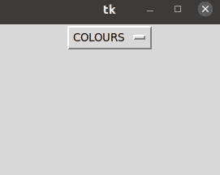

# 如何在 Tkinter 中创建选项菜单？

> 原文:[https://www . geesforgeks . org/how-create-option-menu-in-tkinter/](https://www.geeksforgeeks.org/how-to-create-option-menu-in-tkinter/)

[**Tkinter**](https://www.geeksforgeeks.org/python-gui-tkinter/) 包是 python 的标准 GUI(图形用户界面)，为 Tk GUI 工具包提供了强大的界面。在本教程中，我们希望读者了解 python 和 tkinter 模块的概念。

## 选项菜单

在本教程中，我们的主要重点是使用 python 中的 tkinter 创建选项菜单。顾名思义，选项菜单是用简单的语言为用户提供的选项列表。这可以通过使用选项菜单类来实现，该类创建一个弹出菜单，并显示用户可以使用的选项。

我们可以通过初始化该类的构造函数来创建一个选项菜单。

> **语法:**选项菜单(父项、变量、choice_1、choice_2、choice_3，…)
> 
> *   父对象——这是一个父对象，也称为主对象。它的主要作用是为图形用户界面创建窗口，并保留程序中使用的其他小部件。
> *   变量-这是应该显示在选项菜单中的默认名称。
> *   choice_1、choice_2、choice_3、…-这些是可供用户使用的选项的实际列表。

由于 OptionMenu 是一个类，所以显然里面会有一些方法。让我们一个一个地学习一些方法。

1.  get()方法——这个方法返回当前从选项菜单中选择的值。
2.  mainloop()方法——这个方法不仅是 OptionMenu 类的一部分，也是整个 tkinter 包的一部分。它的作用是在我们运行程序之前组合程序中的所有小部件，并因此在我们结束代码时使用。
3.  place()方法——这个方法将所有的小部件保持在程序员指定的位置。
4.  pack()方法-该方法有助于将选项菜单排列在特定位置。

现在让我们看一些例子，让我们的概念更加清晰。

这是一个创建简单选项菜单的基本示例。

**例 1:**

## 蟒蛇 3

```
# Importing the tkinter module using import keyword
from tkinter import *

# Initialize parent object or master object as "parent"
parent = Tk()

# passing master object as parameter and set "COLOURS" as
# the name of the OptionMenu using set() method.
variable = StringVar(parent)
variable.set("COLOURS")

# Constructor of OptionMenu class initialized by giving
# the parameters as master object, variable name and the
# list of options in the menu.
option_menu = OptionMenu(parent, variable, "Yellow",
                         "Blue", "Green", "Purple",
                         "Black", "White")

# Using pack() method in OptionMenu class to arrange the
# option menu.
option_menu.pack()

# Using mainloop() method from OptionMenu class before we
# run the code.
parent.mainloop()
```

**输出:**



**例 2:**

## 蟒蛇 3

```
# Import tkinter using import keyword
import tkinter as tk

# set the master object in parent variable
parent = tk.Tk()

# Title for our window
parent.title("Geeksforgeeks- OptionMenu")

# Creating a Option Menu for AGE
# Set the variable for AGE and create the list
# of options by initializing the constructor
# of class OptionMenu.
Age_Variable = tk.StringVar(parent)
Age_Variable.set("Age")
Age_Option = tk.OptionMenu(parent, Age_Variable,
                           "below 14", "15",
                           "16", "17",
                           "above 18")
Age_Option.pack()

# Creating a Option Menu for GENDER
# Set the variable for GENDER and create the list
# of options by initializing the constructor
# of class OptionMenu.
Gender_Variable = tk.StringVar(parent)
Gender_Variable.set("Gender")
Gender_Option = tk.OptionMenu(parent,
                              Gender_Variable,
                              "Male", "Female")
Gender_Option.pack()

# Creating a Option Menu for HOBBY
# Set the variable for HOBBY and create the list
# of options by initializing the constructor
# of class OptionMenu.
Hobby_Variable = tk.StringVar(parent)
Hobby_Variable.set("Hobby")
Hobby_Option = tk.OptionMenu(parent, Hobby_Variable,
                             "Dance", "Code", "Sing",
                             "Draw")
Hobby_Option.pack()

# Combining all the widgets used in the
# program before running it
parent.mainloop()
```

**输出:**

