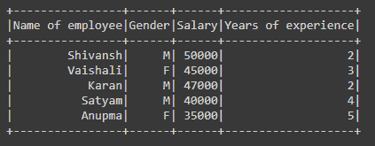
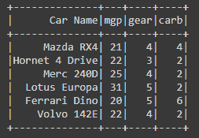

# 如何用模式创建 PySpark 数据帧？

> 原文:[https://www . geesforgeks . org/how-create-py spark-data frame-with-schema/](https://www.geeksforgeeks.org/how-to-create-pyspark-dataframe-with-schema/)

在本文中，我们将讨论如何使用 PySpark 创建带有模式的数据框架。简而言之，模式是数据集或数据框架的结构。

### 使用的功能:

<figure class="table">

| **功能** | **描述** |
| --- | --- |
| 迷你会话 | 火花 SQL 的入口点。 |
| SparkSession.builder() | 它提供了对我们用来配置会话的生成器应用编程接口的访问 |
| SparkSession.master(本地) | 它设置火花主网址连接到本地运行。 |
| SparkSession.appname（） | 设置应用程序的名称。 |
| SparkSession.getOrCreate（） | 如果没有现有的火花会话，则创建一个新的火花会话，否则使用现有的火花会话。 |

</figure>

为了用我们正在使用的模式创建数据帧:

> **语法:** spark.createDataframe(数据，模式)
> 
> **参数:**
> 
> *   数据–创建 dataframe 的值列表。
> *   模式——它是数据集的结构或列名列表。
> 
> 其中 spark 是 SparkSession 对象。

**例 1:**

*   在下面的代码中，我们正在创建一个名为“火花”的新火花会话对象。
*   然后，我们创建了数据值，并将它们存储在名为“data”的变量中，用于创建数据框。
*   然后，我们为数据帧定义了模式，并将其存储在名为“schm”的变量中。
*   然后，我们使用 createDataframe()函数创建了数据帧，在该函数中，我们传递了数据帧的数据和模式。
*   由于数据帧是为了可视化而创建的，我们使用了 show()函数。

## 计算机编程语言

```
# importing necessary libraries
from pyspark.sql import SparkSession

# function to create new SparkSession
def create_session():
  spk = SparkSession.builder \
      .master("local") \
      .appName("Geek_examples.com") \
      .getOrCreate()
  return spk

# main function
if __name__ == "__main__":

  # calling function to create SparkSession
  spark = create_session()

  #  creating data for creating dataframe 
  data = [
    ("Shivansh","M",50000,2),
    ("Vaishali","F",45000,3),
    ("Karan","M",47000,2),
    ("Satyam","M",40000,4),
    ("Anupma","F",35000,5)
  ]

  # giving schema
  schm=["Name of employee","Gender","Salary","Years of experience"]

  # creating dataframe using createDataFrame()
  # function in which pass data and schema
  df = spark.createDataFrame(data,schema=schm)

  # visualizing the dataframe using show() function
  df.show()
```

**输出:**



**例 2:**

在下面的代码中，我们通过直接在 createDataframe()函数中传递数据和模式来创建数据帧。

## 计算机编程语言

```
# importing necessary libraries
from pyspark.sql import SparkSession

# function to create new SparkSession
def create_session():
  spk = SparkSession.builder \
      .master("local") \
      .appName("Geek_examples.com") \
      .getOrCreate()
  return spk

# main function
if __name__ == "__main__":

  # calling function to create SparkSession
  spark = create_session()

  # creating dataframe using createDataFrame() 
  # function in which pass data and schema
  df = spark.createDataFrame([
    ("Mazda RX4",21,4,4),
    ("Hornet 4 Drive",22,3,2),
    ("Merc 240D",25,4,2),
    ("Lotus Europa",31,5,2),
    ("Ferrari Dino",20,5,6),
    ("Volvo 142E",22,4,2)
  ],["Car Name","mgp","gear","carb"])

  # visualizing the dataframe using show() function
  df.show()
```

**输出:**

