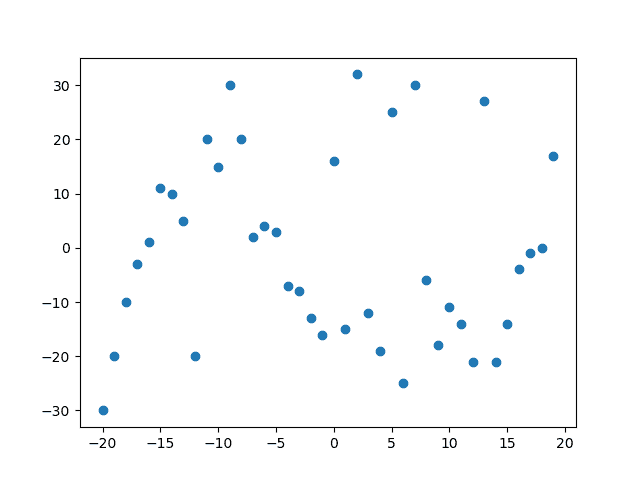
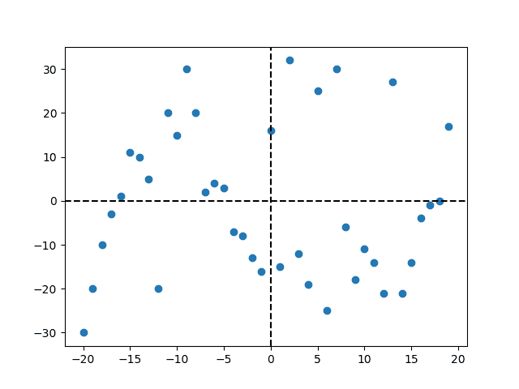
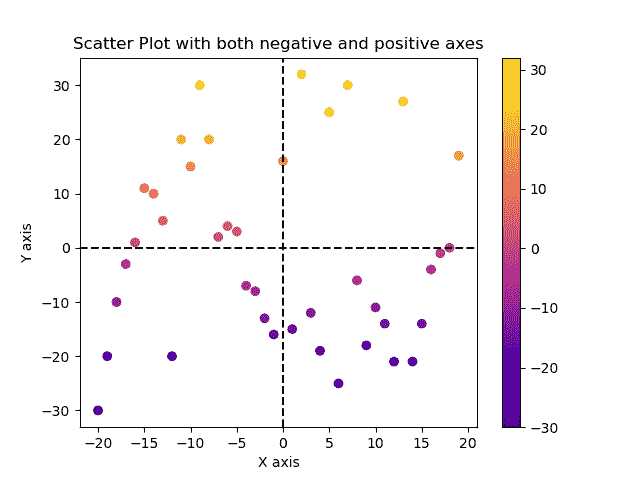
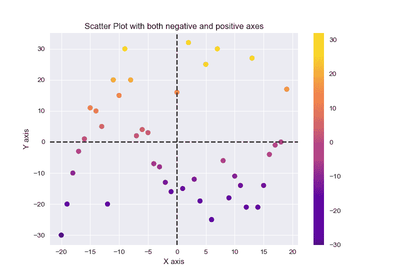

# 如何创建正负轴的散点图？

> 原文:[https://www . geeksforgeeks . org/如何用正负轴创建散点图/](https://www.geeksforgeeks.org/how-to-create-scatterplot-with-both-negative-and-positive-axes/)

**先决条件:** [**马特洛特利**](https://www.geeksforgeeks.org/python-introduction-matplotlib/#:~:text=Matplotlib%20is%20an%20amazing%20visualization,Hunter%20in%20the%20year%202002.)

在散点图中，两个不同数值变量的值用点或圆表示。它也被称为散点图或又名散点图。散点图中的单个数据点由水平轴和垂直轴上的每个点表示。

通常，散点图绘制在正值上，但是当数据集同时具有负值和正值时会发生什么。因此，在本文中，我们使用负轴和正轴创建散点图。

### 安装:

要安装 matplotlib 库，请在命令提示符下编写以下命令。

```
pip install matplotlib
```

借助于一些函数，我们可以绘制如下带有负轴和正轴的散点图:

```
 plt.scatter(x, y, c, cmap)
 plt.axvline(x, ymin, ymax, c, ls)
 plt.axhline(y, xmin, xmax, c, ls)
```

<figure class="table">

| **功能** | **描述** |
| 分散() | 在给定数据上创建散点图。 |
| axvline() | 在数据坐标中添加一条垂直线。 |
| axhline() | 在数据坐标中添加一条水平线。 |

</figure>

### 逐步方法:

*   导入必要的库。
*   创建或导入用于创建绘图的数据集。
*   使用 *plt.scatter()* 创建散点图，其中传递 x 和 y 作为参数。
*   由于图中有正负轴坐标，所以使用 *plt.axvline()* 和 *plt.axhline()* 功能在图中添加一条垂直和水平的线，并根据您和线条样式，即您想要的 ls，将原点作为 0 和颜色传递。
*   绘图现在分为正轴和负轴。
*   为了使情节更加吸引人和易于理解，请使用 *plt.xlabel()* 、 *plt.ylabel()* 和 *plt.title()* 函数为情节赋予 x 标签、y 标签和标题，其中将字符串作为参数传递。
*   如上所述，在散点图()函数中添加配色方案和网格样式传递颜色和 cmap，即 colormap，对于网格样式添加 *plt.style .在程序代码中创建散点图之前，使用()*并传递您想要的样式作为参数。
*   使用 *plt.colormap()* 函数添加一个颜色条，用于可视化数值到颜色的映射。
*   现在使用 *plt.show()* 函数来可视化该图。

**示例 1:使用 Matplotlib 库创建具有负轴和正轴的默认散点图。**

## 计算机编程语言

```
# importing libraries
import matplotlib.pyplot as plt
import numpy as np

# creating two array for plotting
x = np.arange(-20, 20, 1)
y = [-30, -20, -10, -3, 1, 11, 10, 5, -20, 20, 15,
     30, 20, 2, 4, 3, -7, -8, -13, -16, 16, -15, 32,
     -12, -19, 25, -25, 30, -6, -18, -11, -14, -21,
     27, -21, -14, -4, -1, 0, 17]

# creating scatter plot with both negative 
# and positive axes
plt.scatter(x, y)

# visualizing the plot using plt.show() function
plt.show()
```

**输出:**



上面的输出显示了具有负轴和正轴的散点图，但是在该图中，很难分析这些点，因为一些点在负轴上，一些点在正轴上。

所以让我们让这个情节更容易理解。

**示例 2:使用负轴和正轴创建散点图。**

## 计算机编程语言

```
# importing libraries
import matplotlib.pyplot as plt
import numpy as np

# creating two array for plotting
x = np.arange(-20, 20, 1)
y = [-30, -20, -10, -3, 1, 11, 10, 5, -20, 20, 15, 30, 20,
     2, 4, 3, -7, -8, -13, -16, 16, -15, 32, -12, -19, 25,
     -25, 30, -6, -18, -11, -14, -21, 27, -21, -14, -4, -1, 0, 17]

# creating scatter plot with both negative 
# and positive axes
plt.scatter(x, y)

# adding vertical line in data co-ordinates
plt.axvline(0, c='black', ls='--')

# adding horizontal line in data co-ordinates
plt.axhline(0, c='black', ls='--')

# visualizing the plot using plt.show() function
plt.show()
```

**输出:**



在上面的输出中，我们借助 *plt.axvline()* 函数和 *plt.axhline()* 函数，通过传递 0 作为参数，指定将在 0 坐标处绘制直线，颜色参数指定直线的颜色和 ls，即直线样式，从数据坐标的中心绘制了垂直和水平直线。

**示例 3:通过添加配色方案，创建具有负轴和正轴的散点图。**

## 计算机编程语言

```
# importing libraries
import matplotlib.pyplot as plt
import numpy as np

# creating two array for plotting
x = np.arange(-20, 20, 1)
y = [-30, -20, -10, -3, 1, 11, 10, 5, -20, 20,
     15, 30, 20, 2, 4, 3, -7, -8, -13, -16, 16,
     -15, 32, -12, -19, 25, -25, 30, -6, -18,
     -11, -14, -21, 27, -21, -14, -4, -1, 0, 17]

# creating scatter plot with both negative 
# and positive axes
plt.scatter(x, y, c=y, cmap='plasma')

# adding vertical line in data co-ordinates
plt.axvline(0, c='black', ls='--')

# adding horizontal line in data co-ordinates
plt.axhline(0, c='black', ls='--')

# giving X and Y label
plt.xlabel("X axis")
plt.ylabel("Y axis")

# giving title to the plot
plt.title("Scatter Plot with both negative and positive axes")

# visualizing the mapping from values to colors
plt.colorbar()

# visualizing the plot using plt.show() function
plt.show()
```

**输出:**



在上面的输出中，我们将配色方案添加到等离子体中，并给出了与 y 值相关的颜色，添加了颜色条来可视化从值到颜色的映射，并为绘图提供了 x 标签、y 标签和标题，以便绘图看起来更具交互性且易于理解。

对于添加配色方案，我们已经通过了参数 c，该参数指的是给定颜色，cmap 代表具有注册颜色映射列表的颜色映射，使用 *plt.colormap()* 函数添加了颜色映射，并分别使用 plt.xlabel()函数 plt.ylabel()函数和 plt.title()函数添加了 X 标签、Y 标签和标题。

**示例 4:通过添加主题创建具有负轴和正轴的散点图。**

## 计算机编程语言

```
# importing libraries
import matplotlib.pyplot as plt
import numpy as np

# creating two array for plotting
x = np.arange(-20, 20, 1)
y = [-30, -20, -10, -3, 1, 11, 10, 5, -20, 20,
     15, 30, 20, 2, 4, 3, -7, -8, -13, -16, 16,
     -15, 32, -12, -19, 25, -25, 30, -6, -18,
     -11, -14, -21, 27, -21, -14, -4, -1, 0, 17]

# adding style theme in scatter plot
plt.style.use('seaborn')

# creating scatter plot with both negative 
# and positive axes
plt.scatter(x, y, c=y, cmap='plasma')

# adding vertical line in data co-ordinates
plt.axvline(0, c='black', ls='--')

# adding horizontal line in data co-ordinates
plt.axhline(0, c='black', ls='--')

# giving x label to the plot
plt.xlabel("X axis")

# giving y label to the plot
plt.ylabel("Y axis")

# giving title to the plot
plt.title("Scatter Plot with both negative and positive axes")

# visualizing the mapping from values to colors
plt.colorbar()

# visualizing the plot using plt.show() function
plt.show()
```

**输出:**



在上面的输出中，我们在散点图中添加了类似网格的风格主题，这样剧情看起来更具互动性，也更容易理解。要添加风格主题，在程序代码中创建散点图之前，添加 *plt.style.use()* 函数。