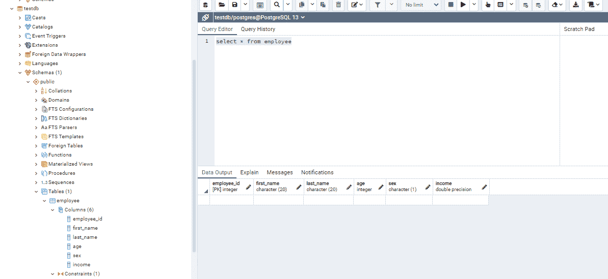
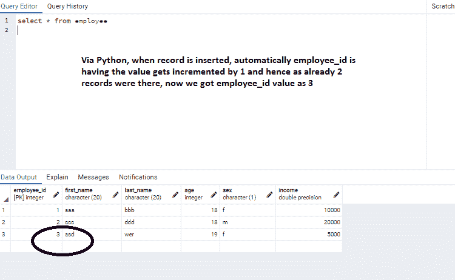

# 如何用 Python 在 PostgreSQL 中定义自动递增主键？

> 原文:[https://www . geesforgeks . org/如何使用-python 定义自动增量-主键-in-PostgreSQL/](https://www.geeksforgeeks.org/how-to-define-an-auto-increment-primary-key-in-postgresql-using-python/)

**先决条件** : [后置条件](https://www.geeksforgeeks.org/what-is-postgresql-introduction/)

Python 有各种 PostgreSQL 的数据库驱动程序。目前使用最多的版本是 psycopg2，因为它完全实现了 Python DB-API 2.0 规范。psycopg2 提供了许多有用的特性，如客户端和服务器端游标、异步通知和通信、复制命令支持等。

## 装置

可以使用以下命令像下载任何其他模块一样下载 psycopg2:

```py
pip install psycopg2
```

## 方法

PostgreSQL 使用自动增量功能创建主键的方式:

必须用**串行主键定义一列。**这里 SERIAL 不是真正的数据类型，只是一个简写符号，告诉 Postgres 为指定的列创建一个自动递增的唯一标识符。通过简单地将一个列设置为 SERIAL 并附加 PRIMARY KEY，Postgres 将处理所有复杂的幕后工作，并为每个 INSERT 用唯一的主键值自动递增指定的列。

### 数据库信息

**数据库名称:** testdb

**表名:**员工

在雇员表中，名为雇员标识的列将被实现为自动递增的主键列。

**语法:**

> 创建表格<table_name>(</table_name>
> 
> <column1_name>序列号不为空主键，</column1_name>
> 
> 。
> 
> 。
> 
> );

下面给出了用这种规范创建表的实现:

## 蟒蛇 3

```py
import psycopg2

def create_table():
    conn = None
    try:
        # connect to the PostgreSQL server
        conn = psycopg2.connect(database="testdb", user="postgres",
                                password="password", host="127.0.0.1", port="5432")
        print("Opened database successfully")
        # create a cursor
        cursor = conn.cursor()
        # Droping EMPLOYEE table if already exists.
        cursor.execute("DROP TABLE IF EXISTS EMPLOYEE")

        # Creating table as per requirement, let us have EMPLOYEE table
        # and in order to have auto increment primary key, EMPLOYEE_ID SERIAL PRIMARY KEY
        # is used and it is explained before code
        sql = '''CREATE TABLE EMPLOYEE(
           EMPLOYEE_ID SERIAL PRIMARY KEY,
           FIRST_NAME CHAR(20) NOT NULL,
           LAST_NAME CHAR(20),
           AGE INT,
           SEX CHAR(1),
           INCOME FLOAT
        )'''
        cursor.execute(sql)
        print("Table created successfully........")

        # close communication with the PostgreSQL database server
        cursor.close()

        # commit the changes
        conn.commit()

    except (Exception, psycopg2.DatabaseError) as error:
        print(error)
    finally:
        if conn is not None:
            conn.close()

if __name__ == '__main__':
    create_table()
```

我们可以看到使用 pgadmin 工具创建的表



现在，插入需要完成，看看我们的自动增量功能是否工作。这可以直接通过 pgadmin 或使用 python 代码来完成。

**pgadmin 方式:**

下面是显示插入查询和结果集执行情况的屏幕截图。


自动递增主键说明

**使用 python 代码:**

## 蟒蛇 3

```py
import psycopg2
try:
    connection = psycopg2.connect(user="postgres",
                                  password="password",
                                  host="127.0.0.1",
                                  port="5432",
                                  database="testdb")

    cursor = connection.cursor()

    # As Employee table is having auto incremented primary id column(employee_id), no need to specify about that value here
    postgres_insert_query = ''' INSERT INTO EMPLOYEE (FIRST_NAME, LAST_NAME, AGE,SEX,INCOME) VALUES (%s,%s,%s,%s,%s)'''
    record_to_insert = ('asd', 'wer', 19, 'f', 5000)
    cursor.execute(postgres_insert_query, record_to_insert)

    connection.commit()
    count = cursor.rowcount
    print(count, "Record inserted successfully into Employee table")

except (Exception, psycopg2.Error) as error:
    if(connection):
        print("Failed to insert record into Employee table", error)

finally:
    # closing database connection.
    if(connection):
        cursor.close()
        connection.close()
        print("PostgreSQL connection is closed")
```

执行上述程序后员工表的输出:

