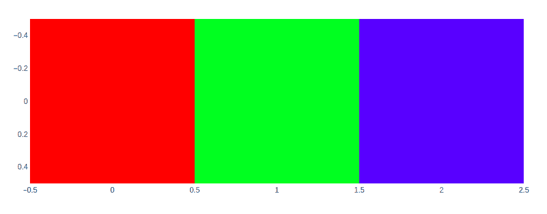

# 如何使用 Plotly 显示图像？

> 原文:[https://www . geeksforgeeks . org/如何使用 plotly 显示图像/](https://www.geeksforgeeks.org/how-to-display-image-using-plotly/)

Plotly 是一个 Python 库，用于设计图形，尤其是交互式图形。它可以绘制各种图形和图表，如直方图、条形图、箱线图、展开图等。它主要用于数据分析以及财务分析。plotly 是一个交互式可视化库。

## 显示图像

Imshow 方法是显示 2d 数据的最快方法。该方法用于从数值数据生成图像。数值数据可以是 NumPy 数组的形式。

> **语法:** imshow(标签={}，x =无，y =无，color _ continuous _ scale =无，color _ continuous _ 中点=无，range _ color =无，width =无，height =无)

### 将 RBG 数据显示为图像

该功能还可以将 RGB 数据显示为图像。数据以 NumPy 数组的格式提供。

**示例:**

## 蟒蛇 3

```py
import plotly.express as px
import numpy as np

# RGB Data as numpy array
img_rgb = np.array([[[255, 0, 0], [0, 255, 0], [0, 0, 255]],
                    ], dtype=np.uint8)

fig = px.imshow(img_rgb)
fig.show()
```

**输出:**



### 显示图像文件中的图像

可以像 PIL、scikit-image 或 OpenCV 一样使用第三方库来读取数组形式的图像。

**示例:**

**使用的图像:**


## 蟒蛇 3

```py
import plotly.express as px
import cv2 

# You can give path to the 
# image as first argument 
img = cv2.imread('GFG.png')

fig = px.imshow(img)
fig.show()
```

**输出:**

