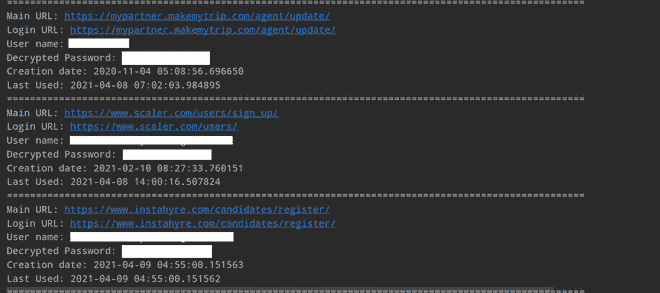

# 如何在 Python 中提取 Chrome 密码？

> 原文:[https://www . geesforgeks . org/如何提取-chrome-密码-python/](https://www.geeksforgeeks.org/how-to-extract-chrome-passwords-in-python/)

在本文中，我们将讨论如何提取 Chrome 浏览器中存储的所有密码。

**注:**本文针对在 Windows 上使用 Chrome 的用户。如果您是苹果或 Linux 用户，您可能需要对给定的路径进行一些更改，而 Python 程序的其余部分将保持不变。

### 安装:

现在，让我们安装一些重要的库，我们需要编写一个 python 程序，通过它我们可以提取 Chrome Passwords。

```
pip install pycryptodome
pip install pypiwin32
```

在我们直接从 Chrome 中提取密码之前，我们需要定义一些有用的函数来帮助我们的主要功能。

*   **第一功能**

```
def chrome_date_and_time(chrome_data):

    # Chrome_data format is 
    # year-month-date hr:mins:seconds.milliseconds
    # This will return datetime.datetime Object
    return datetime(1601, 1, 1) + timedelta(microseconds=chrome_data)
```

**chrome_date_and_time()** 功能负责将 chrome 的日期格式转换为人类可读的日期和时间格式。

Chrome 日期和时间格式如下所示:

```
'year-month-date hr:mins:seconds.milliseconds'
```

**例**:

```
2020-06-01 10:49:01.824691
```

*   **第二功能**

```
def fetching_encryption_key():

    # Local_computer_directory_path will
    # look like this below
    # C: => Users => <Your_Name> => AppData => 
    # Local => Google => Chrome => User Data => 
    # Local State

    local_computer_directory_path = os.path.join(
    os.environ["USERPROFILE"], "AppData", "Local", "Google",
    "Chrome", "User Data", "Local State")

    with open(local_computer_directory_path, "r", encoding="utf-8") as f:
        local_state_data = f.read()
        local_state_data = json.loads(local_state_data)

    # decoding the encryption key using base64
    encryption_key = base64.b64decode(
    local_state_data["os_crypt"]["encrypted_key"])

    # remove Windows Data Protection API (DPAPI) str
    encryption_key = encryption_key[5:]

    # return decrypted key
    return win32crypt.CryptUnprotectData(
    encryption_key, None, None, None, 0)[1]
```

**取数 _ 加密 _ 密钥()**功能获取并解码用于加密密码的 AES 密钥。在**“C:\ Users \<Your _ PC _ Name>\ AppData \ Local \ Google \ Chrome \ User Data \ Local State”中保存为 JSON 文件。**该功能对加密密钥有用。

*   **第三功能**

```
def password_decryption(password, encryption_key):

    try:
        iv = password[3:15]
        password = password[15:]

        # generate cipher
        cipher = AES.new(encryption_key, AES.MODE_GCM, iv)

        # decrypt password
        return cipher.decrypt(password)[:-16].decode()
    except:
        try:
            return str(win32crypt.CryptUnprotectData(password, None, None, None, 0)[1])
        except:
            return "No Passwords"
```

**password_decryption()** 以加密后的密码和 AES 密钥为参数，返回密码的解密版本或人类可读格式。

下面是实现。

## 蟒蛇 3

```
import os
import json
import base64
import sqlite3
import win32crypt
from Cryptodome.Cipher import AES
import shutil
from datetime import timezone, datetime, timedelta

def chrome_date_and_time(chrome_data):
    # Chrome_data format is 'year-month-date 
    # hr:mins:seconds.milliseconds
    # This will return datetime.datetime Object
    return datetime(1601, 1, 1) + timedelta(microseconds=chrome_data)

def fetching_encryption_key():
    # Local_computer_directory_path will look 
    # like this below
    # C: => Users => <Your_Name> => AppData =>
    # Local => Google => Chrome => User Data =>
    # Local State
    local_computer_directory_path = os.path.join(
      os.environ["USERPROFILE"], "AppData", "Local", "Google", "Chrome", 
      "User Data", "Local State")

    with open(local_computer_directory_path, "r", encoding="utf-8") as f:
        local_state_data = f.read()
        local_state_data = json.loads(local_state_data)

    # decoding the encryption key using base64
    encryption_key = base64.b64decode(
      local_state_data["os_crypt"]["encrypted_key"])

    # remove Windows Data Protection API (DPAPI) str
    encryption_key = encryption_key[5:]

    # return decrypted key
    return win32crypt.CryptUnprotectData(encryption_key, None, None, None, 0)[1]

def password_decryption(password, encryption_key):
    try:
        iv = password[3:15]
        password = password[15:]

        # generate cipher
        cipher = AES.new(encryption_key, AES.MODE_GCM, iv)

        # decrypt password
        return cipher.decrypt(password)[:-16].decode()
    except:

        try:
            return str(win32crypt.CryptUnprotectData(password, None, None, None, 0)[1])
        except:
            return "No Passwords"

def main():
    key = fetching_encryption_key()
    db_path = os.path.join(os.environ["USERPROFILE"], "AppData", "Local",
                           "Google", "Chrome", "User Data", "default", "Login Data")
    filename = "ChromePasswords.db"
    shutil.copyfile(db_path, filename)

    # connecting to the database
    db = sqlite3.connect(filename)
    cursor = db.cursor()

    # 'logins' table has the data
    cursor.execute(
        "select origin_url, action_url, username_value, password_value, date_created, date_last_used from logins "
        "order by date_last_used")

    # iterate over all rows
    for row in cursor.fetchall():
        main_url = row[0]
        login_page_url = row[1]
        user_name = row[2]
        decrypted_password = password_decryption(row[3], key)
        date_of_creation = row[4]
        last_usuage = row[5]

        if user_name or decrypted_password:
            print(f"Main URL: {main_url}")
            print(f"Login URL: {login_page_url}")
            print(f"User name: {user_name}")
            print(f"Decrypted Password: {decrypted_password}")

        else:
            continue

        if date_of_creation != 86400000000 and date_of_creation:
            print(f"Creation date: {str(chrome_date_and_time(date_of_creation))}")

        if last_usuage != 86400000000 and last_usuage:
            print(f"Last Used: {str(chrome_date_and_time(last_usuage))}")
        print("=" * 100)
    cursor.close()
    db.close()

    try:

        # trying to remove the copied db file as 
        # well from local computer
        os.remove(filename)
    except:
        pass

if __name__ == "__main__":
    main()
```

**输出:**



对于上面的代码，我们遵循以下步骤；

*   首先，我们使用前面定义的函数 fetching _ encryption _ key()来获取加密密钥
*   然后将保存密码数据的**C:\ Users \<Your _ PC _ Name>\ AppData \ Local \ Google \ Chrome \ User Data \ default \ log in Data**中的 SQLite 数据库复制到当前目录并与之建立连接。这是因为 Chrome 启动时原数据库文件被锁定了。
*   在游标对象的帮助下，我们将从**“登录”**表**按日期 _ 上次使用的顺序执行 SELECT SQL 查询。**
*   以可读性更强的格式遍历所有登录行，以获取每个密码的密码，并格式化创建日期和上次使用日期。
*   最后，在打印语句的帮助下，我们将打印从 Chrome 中提取的所有保存的凭证。
*   从当前目录中删除数据库副本。