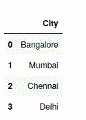
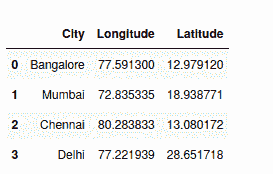

# 如何使用 Python 找到地区或国家列表的经度和纬度

> 原文:[https://www . geesforgeks . org/如何使用 python 查找地区或国家列表的经度和纬度/](https://www.geeksforgeeks.org/how-to-find-longitude-and-latitude-for-a-list-of-regions-or-country-using-python/)

**Geopy** 是 Python 2 和 3 客户端，用于几种流行的地理编码网络服务。地理编码是识别地理坐标的过程，例如给定城市/国家/地址的纬度和经度。这在数据可视化中标记地图上的位置时非常有用。我们在下面的代码中使用`geopy.exec`、`geocodertimedout`、`geolocators`、`geopy.geocoder`来获取结果

### 装置

这个模块没有内置 Python。要安装它，请在终端中键入以下命令。

```
pip install geopy 

```

**示例:让我们创建一个包含地区或国家列表的熊猫数据框。**

```
# Import pandas package  
import pandas as pd 
import numpy as np

# Define a dictionary containing  data 
data = {'City':['Bangalore', 'Mumbai', 'Chennai', 'Delhi']} 

# Convert the dictionary into DataFrame 
df = pd.DataFrame(data) 

# Observe the result 
df 
```

**输出:**



**现在我们来找出以下地区或国家的经纬度。**

```
from geopy.exc import GeocoderTimedOut
from geopy.geocoders import Nominatim

# declare an empty list to store
# latitude and longitude of values 
# of city column
longitude = []
latitude = []

# function to find the coordinate
# of a given city 
def findGeocode(city):

    # try and catch is used to overcome
    # the exception thrown by geolocator
    # using geocodertimedout  
    try:

        # Specify the user_agent as your
        # app name it should not be none
        geolocator = Nominatim(user_agent="your_app_name")

        return geolocator.geocode(city)

    except GeocoderTimedOut:

        return findGeocode(city)    

# each value from city column
# will be fetched and sent to
# function find_geocode   
for i in (df["City"]):

    if findGeocode(i) != None:

        loc = findGeocode(i)

        # coordinates returned from 
        # function is stored into
        # two separate list
        latitude.append(loc.latitude)
        longitude.append(loc.longitude)

    # if coordinate for a city not
    # found, insert "NaN" indicating 
    # missing value 
    else:
        latitude.append(np.nan)
        longitude.append(np.nan)
```

**显示作为数据帧产生的输出。**

```
# now add this column to dataframe
df["Longitude"] = longitude
df["Latitude"] = latitude

df
```

**输出:**

