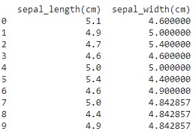

# 如何修复:值错误:所有数组的长度必须相同

> 原文:[https://www . geesforgeks . org/how-fix-value error-所有数组必须长度相同/](https://www.geeksforgeeks.org/how-to-fix-valueerror-all-arrays-must-be-of-the-same-length/)

在本文中，我们将修复这个错误:所有数组的长度必须相同。当我们用不同长度的列创建 pandas 数据框时，我们会得到这个错误，但是当我们创建 pandas 数据框时，列应该是相等的，相反，在列的缺陷单元格中可以有 NaN。

**错误:**

```
ValueError: All arrays must be of the same length
```

## **这种错误发生的情况举例:**

## 蟒蛇 3

```
# import pandas module
import pandas as pd

# consider the lists
sepal_length = [5.1, 4.9, 4.7, 4.6, 5.0, 5.4, 
                4.6, 5.0, 4.4, 4.9]
sepal_width = [4.6, 5.0, 5.4, 4.6, 5.0, 4.4, 4.9]

# DataFrame with two columns
df = pd.DataFrame({'sepal_length(cm)': sepal_length,
                   'sepal_width(cm)': sepal_width})
# display
print(df)
```

**输出:**

```
ValueError: arrays must all be same length
```

### **错误原因:**

将成为列的列表 sepal_length 的长度不等于列表 sepal _ witdth 列的长度。

```
len(sepal_length)!= len(sepal_width)
```

## **修正错误:**

可以通过将值添加到有缺陷的列表中，或者删除具有更大长度的列表(如果它有一些无用的值)，来修复该错误。根据对列表中剩余值的观察，可以将 NaN 或任何其他值添加到不足值中。

**语法:**

考虑两个列表列表 1 和列表 2:

```
if (len(list1) > len(list2)):
       list2 += (len(list1)-len(list2)) * [any_suitable_value]
elif (len(list1) < len(list2)):
        list1 += (len(list2)-len(list1)) * [any_suitable_value]
```

这里，**任意 _ 合适 _ 值**可以是列表的平均值，也可以是 0 或 NaN，视需求而定。

**例**:

## 蟒蛇 3

```
# importing pandas
import pandas as pd
# importing statistics
import statistics as st

# consider the lists
sepal_length = [5.1, 4.9, 4.7, 4.6, 5.0, 5.4,
                4.6, 5.0, 4.4, 4.9]
sepal_width = [4.6, 5.0, 5.4, 4.6, 5.0, 4.4, 4.9]

# if length are not equal
if len(sepal_length) != len(sepal_width):
    # Append mean values to the list with smaller length
    if len(sepal_length) > len(sepal_width):
        mean_width = st.mean(sepal_width)
        sepal_width += (len(sepal_length)-len(sepal_width)) * [mean_width]
    elif len(sepal_length) < len(sepal_width):
        mean_length = st.mean(sepal_length)
        sepal_length += (len(sepal_width)-len(sepal_length)) * [mean_length]

# DataFrame with 2 columns
df = pd.DataFrame({'sepal_length(cm)': sepal_length,
                   'sepal_width(cm)': sepal_width})
print(df)
```

**输出**:

